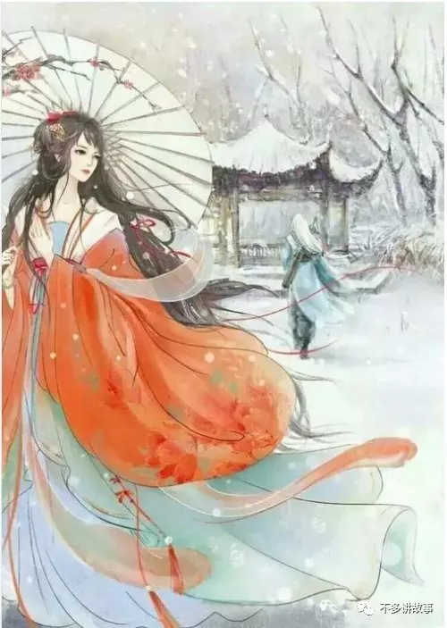

<b>
 前言
 </b>

十月初的某个早晨，胖仔扛着受伤的我在街头找诊所。偶遇高中同学载着她未婚夫夏栋洋路过。

 
她把小电驴停在经八路纬三路的斑马线上，脚尖点着地望着我和胖仔的狼狈模样。

 

夏栋洋顺着她的眼神看过来，他问：你们认识么？

 

她说：我的一个高中同学。

 

 

当时路边有家开门挺早的杂货店，干净的门面里歪着脑袋坐着一个老板娘。她摆弄着吧台上的小音箱放了一首与众不同的音乐。

那是一首我很喜欢的歌。它有个很怪诞的名字——《我的一个道姑朋友》。

当时我瘸着腿跟胖仔说了两句话。

第一句是重复她告诉夏栋洋的回答：我的一个高中同学。

第二句是：我要写一个故事，名字就叫——我的一个道姑朋友。

当时胖仔没听太懂我在逼逼什么，他在我的伤口摁了一下。然后说：什么J8玩意。

我当时就疼出了满脸泪花！心想着，我都交了些什么狗屁朋友。因为怕他再摁我的伤口，没敢多说什么。

<!--truncate-->

<b>
 1：我的一个道姑朋友 
 </b>

泽心和秀秀结婚后的七八年，他带着一把油纸伞去过一次纯阳教道观。

 

泽心问山门前的小道士，请问这里是否有一个叫佩玖的道姑。小道士带泽心去了道观外的后山，墓碑上刻着佩玖的名字。周围是半倾浓郁的草原。泽心想起很多年以前，佩玖曾在这里骑在马背上冲着自己招手，十几岁的年纪，笑靥如花，眉眼里都是温柔。

 

泽心把带来的那把伞摆在了坟头，摇摇晃晃地沿着茂密的树林走回华阴城。小道士警告过他，说是树林里有猛虎，会伤人。泽心不以为然，他说：不要担心，我带着这枚玉佩，念着这咒语，野兽就不会伤害自己。

 

泽心念着咒语走在蜿蜒的林间，想起几年前的婚礼上。自己和秀秀举杯敬宾客，佩玖走上来：是我很久以前爱慕的男子赠与我的。身上没有其他可以当礼物的东西，便把这送给你们。祝你们白头偕老。

 

 

秀秀顺着佩玖的目光看，那是自己相公眉清目秀的脸庞。秀秀问相公：你们认识？

泽心举起酒杯说：我的一个道姑朋友。

<b>
2：原你早与他人两心同，而我只是错付了情衷 
 </b>

纯阳道观的小道士泽心被安排在过年时候去华阴城采办年货，这是道观的修道人难得出去凑上的热闹。年少的泽心跳着下华山，捡着稀疏林木的阳光里走，想着华阴城里的热闹。

 

在华阴城的长街尽头，泽心立在门槛看屋里的老板娘，她打理着柜台上鲜艳的胭脂，几缕头发散下来，阳光斜斜地照进去，她的红色衣裳趁着明亮的光，漂亮且动人，脸上粉嫩嫩的，宛如仙子一样美丽。泽心有些悸动，大概这就是凡心初动的感受吧。

 

脚步迈过门槛，无形力量催着他靠近，一开口就有些结巴：我，买胭脂。

 

泽心随便挑了两盒，像个落魄的士兵，跌跌撞撞地往外走。

 

刚到门口，又回头望，泽心回首的一瞬间，老板娘正看向自己。

 

泽心像是自言自语，又像请求：请问，姑娘芳名？

 

老板娘微微一笑说：秀秀。

 

泽心想，这是自己听过最动听的名字了，这微微一笑，大抵是自己见过世间最美的风景了。

 

泽心回到纯阳道观时，新来修行的佩玖立在山门旁，地上的落叶被扫的一尘不染。

 

师父曾说：你与佩玖年纪相仿，就由你来带她修行吧。

 

泽心把两盒胭脂递给佩玖：华阴城热闹，随手买了礼物带给你。虽然出家，妆上胭脂也是极好看的。

  

小道姑笑的有些放肆，笑声随着一只冬日的麻雀飞翔了半个华山。

<b>
 3：你是无意穿堂风，偏偏孤倨引山洪 
 </b>

佩玖还未出家时，与年迈奶奶相依为命。生活过得有些拮据。

 

佩玖时常到华阴城外的山脚下采些草药拿给奶奶去换取铜钱，以此度日。

 

奶奶叮嘱过小姑娘，不要往深处树林走动，若是你遇到山禽野兽，无人护你周全。

 

那日的佩玖采得几枚好灵芝，开心地像只小兔子一样蹦着跳着往山林里去，渴望着能采到更值钱的草药来。

 

一只猛虎突然从树后绕出来，小佩玖吓坏了。抬头望见不远处的道观，一路狂奔去。

 

小姑娘终究脚力软弱，山门前瘫倒在石阶上，望着猛虎冲自己扑上来。

 

救下她的是一位白衣少年，束着道士的发髻。负手长剑立在身侧，精准投入虎口的药丸见效甚快。猛虎跌跌撞撞地离去，华山落着应景的雨，冲着佩玖的眼泪。

 

屋檐下躲雨，烟雨如梦。佩玖看向道士，脸上被猛虎的利爪擦伤，有些狼狈，又有些英俊。

 

泽心小道士从道观内取出一把油纸伞，送与小佩玖：山林里危险，姑娘怎能一个人擅闯？

 

后来小道士送小佩玖回去，路过山林时解下腰间玉佩挂在她胸前。告诉她一段咒语，希望可以保佑她平安。

 

泽心把伞向佩玖倾斜，微风吹雨，湿了半个肩头。山路难走，几个趔趄，拥姑娘入怀中，轻声道：当心脚下。

 

后来到了华阴城门，小道士把伞递给小佩玖：城内热闹，被人看了去，会讲闲话，这把伞且送你。

我跟在你身后，送你入了家门自归去。

当晚奶奶怜惜地搂着小佩玖，讲了许多忧心的话。奶奶问：倘若我哪天老去，你可要嫁个好人。你想嫁什么样的男人呢？

 

小佩玖在黑夜里伸出小手，对着华山的方向勾勒出了一个英俊模样。

 

那一年，佩玖十六岁。泽心十八岁。

<b>
 4：我是垂眉摆渡翁，独独箴言偏爱侬 
 </b>

半个月的光阴，小佩玖攒了十八枚铜钱，去买了一包桂花糕。捂在怀里沿着树林走了很远的路。

 

玉佩在胸前晃来晃去，她念着小道士教来的咒语，一路上竟也不曾遇到危险。

 

扣开山门时候，小佩玖说：你们这里有个叫泽心的道长。他曾救过我。奶奶说要知恩图报。我是来报恩的。

 

道士告诉她：泽心师弟上山砍柴了，我已叫了师兄去唤他。你且等一等。

 

佩玖捂着桂花糕看山，看树，看道观。

 

佩玖觉得这里风景极好。

 

泽心慌张跑来，见是前些时日救过的小姑娘，脸上都是笑容。

 

小佩玖从怀中取出桂花糕递给他：你趁热吃！

 

泽心夸佩玖买的桂花糕好吃，开心地跳脚，拉着佩玖去牵了马厩里的两匹马。

 

他们骑着马看山，看树，看道观。

 

情到浓时，泽心说：我愿这样的欢乐时光能足够长久，自生至死。

后来，奶奶死了。好心的邻居帮忙置办了后事。可怜着年幼的佩玖无家可归。

 

佩玖卖掉了所有的旧物，换来少许的银钱。去城东铁匠铺打了一套最中意的马具。

 

佩玖扣开山门时候，只带了一套马具和一把油纸伞。

 

马具送给了泽心。油纸伞自己留着。

 

从此道观里有了唯一的一个道姑。

 

师父说修道人清心寡欲，戒痴戒嗔，不染私情，戒荤茹素。

 

小道姑心里嘀咕：只要能每天见着他，怎样都好。

 

师父说：泽心与你年纪相仿。就由泽心师兄带你修行吧。

 

小道姑抬起头说：好。

 

那一年，佩玖十八岁，泽心二十岁。

<b>
5： 一厢情愿，有始无终 
 </b>

泽心师兄待自己极好，教自己练剑时候很温柔地握住自己的手。

 

泽心师兄时常偷偷溜下山去，带给自己两盒胭脂。

 

那晚，微风温柔，月光皎洁。佩玖望着泽心棱角分明的脸庞，手里握着两盒胭脂，一颗心砰砰跳个不安分。

 

泽心问她：你我虽是修道之人，倘若看着一个人，一颗心就砰砰跳个不安分，是不是爱上了她？

 

佩玖的一颗心更加不安分起来。

 

泽心只字未提我爱你，佩玖眼睛里句句都是我答应。

 

还没等她开口，泽心告诉她：我爱上了一个俗世女子，她是胭脂店的老板娘，有个委婉的名字，叫秀秀。明日我便还俗去。

 

佩玖的眼泪如山洪般奔涌而出，看着眼前的泽心，重重地摇头。

 

而泽心只是静静地望着皎洁的明月，未曾看她。

 

佩玖只好又重重地点了点头。

 
<b>
原来，世间事，大抵都是我本将心照明月，无奈明月照沟渠。

原来，世间情，大抵都是一厢情愿，有始无终。
</b>

其实，我本俗世而来，追寻你而入道。

如今，你却要因她人而还俗。

 

 

后来泽心还俗下山，她望着他下山的那条路，想起曾经自己也是踏着这条路而来，只为了他一人。如今他要踏过这路去寻别人了。

 

自此

一座山成了两种人生的分界线，一侧是寡淡的孤寂，另一侧是喧闹的繁华。

<b>
 6: 所幸经年漂浮红尘中，这颗心早已千疮百孔。不惧你喜宴正浓，多一道裂缝 
 </b>

这个叫佩玖的道姑，硕大斗篷遮盖面容，胸前挂着一块玉佩，背上斜插着一把油纸伞，手中负长剑。

 

她比肩着时间，用脚步丈量着天下，两年的春秋更迭，佩玖走遍了天下许多地方。行至华阴小城时，谁家喜宴正浓。

 

佩玖立在人群中看了一会，觉得此时的泽心愈发英俊，眉宇间多了几分硬朗。新娘小鸟依人，妆容精致。两人站在一起，无比般配。

 

佩玖恍惚了一下，仿佛看到一个画面，奶奶在身旁，看着眼前的男人和自己成婚。他回过神来，画面晃了晃，便化为泡影。

 

她看到他笑盈盈地接过宾客们的礼物，那些礼物一个个都用喜庆的红纸包好，精致的很。

她最后一个走上前，“<b> 我本是路过，看到你们家有喜事，没有厚礼相送，就把这雨伞和这枚玉佩赠与你们吧。</b>”

 

佩玖盯着新郎棱角分明的脸庞说：是我很久以前爱慕的男子赠与我的。身上没有其他可以当礼物的东西，便把这送给你们。祝你们白头偕老。

 

红妆新娘顺着她的视线看过去，是自己相公的脸庞。她问：你们认识？

 

新郎举起一杯酒说：从前修道时，<b>我的一个道姑朋友</b>。

<b>
 7：不如将往事埋在风中，长剑为碑，霜雪为冢 
 </b>

那天的佩玖没有再去看新郎的眼神，她怕自己会控制不住想要抱住他。

离开的一刹那，婚宴上人头攒动，新人忙着敬酒，没有一个人看到她转身后山洪般的泪如雨下。

遇见你的时候，你是四月檐上雨；放弃你的时候，你是人间惊鸿客。

她买了一包桂花糕，又回到了山上的纯阳道观。那天晚上她抱着那包桂花糕，泣不成声。

从那之后，她成了一个真正的道姑。像一个世外高人一样修道，不染尘俗，也不入世。

两年后，她便逝世了。她走得很安详，没有病痛折磨，身上也没有伤口，就像她的人生只允许她走到二十四岁一样，寿终正寝。

 

或许他们都不是虔诚的信徒，一个还俗，一个心里住着个放不下的人。

很多年以后，泽心带着一把油纸伞去祭拜过佩玖的坟墓。转身下山的时候，华山下了一场暴雨，像极了当年佩玖在他的婚宴上，转身离开时山洪般的眼泪。

<b>
 后记 
 </b>

当时我瘸着腿跟胖仔说了两句话。

 

第一句是重复文彤彤告诉夏栋洋的回答：<b>我的一个高中同学</b>。

 

第二句是：我要写一个故事，名字就叫——<b>我的一个道姑朋友</b>。

——2017年十一月