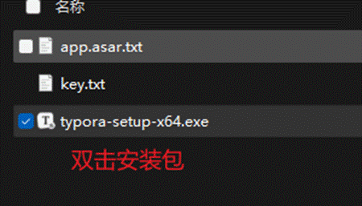
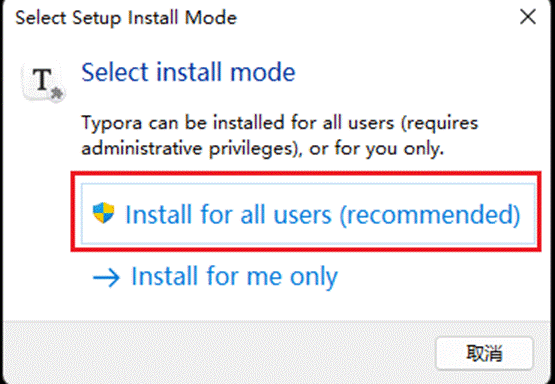
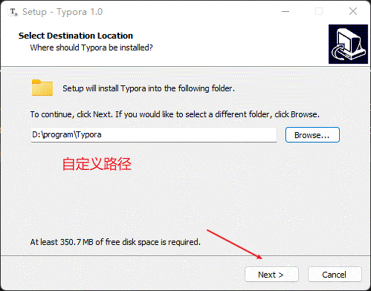
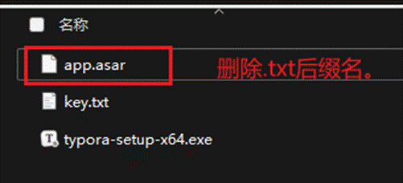
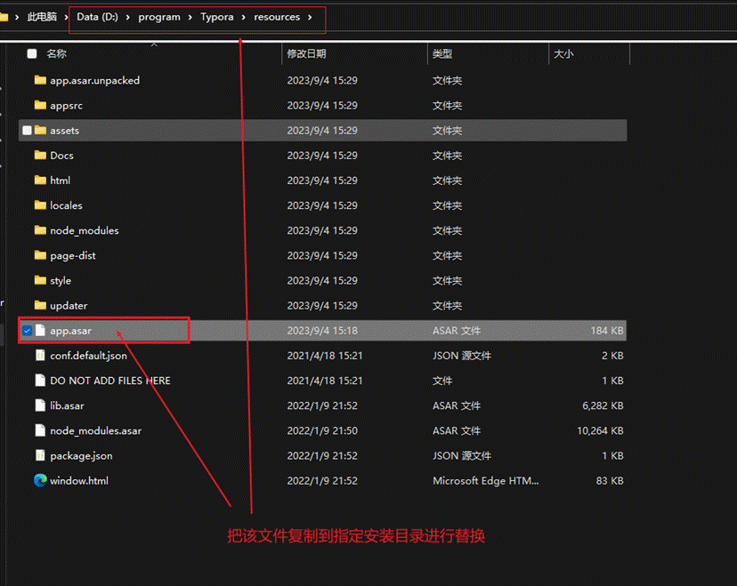

> Markdown格式文件的阅读和编写

---

# **typora**安装教程

## **获取资料**

1. 百度网盘：[链接](https://pan.baidu.com/s/1hF_H9uRSDSLQ2lfSIVnvHw)-提取码：mayw 

2. [123网盘](https://www.123pan.com/s/A7oDVv-ekn4H.html)

## **安装步骤：一路下一步**














# **激活**

使用以下任意序列号进行激活。邮箱随意填写即可。

```text
DZTX2H-6MCQZT-QL4GCT-5EBWFX
G7LPKN-HP4NLD-FA3BGF-6JDQ5R
3MH4Y8-YJWT37-G5JL9Y-UHNQDJ
85ZPHY-ELQ9FQ-94J3VP-D92YLU
VEZ7NV-USYN3G-8TL2N3-DADUG4
```


 