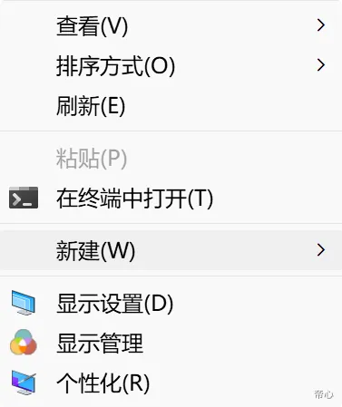

:::tip
   win11右键菜单默认展开效果
:::

> 如图所示，win11系统默认右键菜单将部分内容进行折叠。此设计堪称逆天，脑残到无语。


## 1 管理员身份运行命令提示符


## 2 输入如下命令
```
reg.exe add "HKCU\Software\Classes\CLSID\{86ca1aa0-34aa-4e8b-a509-50c905bae2a2}\InprocServer32" /f /ve
```

## 3重启`Windows资源管理器`
> `ctrl + shift +esc`打开任务管理器重启windows资源管理器




## 4 还原
> 如果你就是喜欢旧版本的。想要还原。
>
> 那你何必按照上面的方式设置呢。
```
reg.exe delete "HKCU\Software\Classes\CLSID\{86ca1aa0-34aa-4e8b-a509-50c905bae2a2}\InprocServer32" /va /f
```