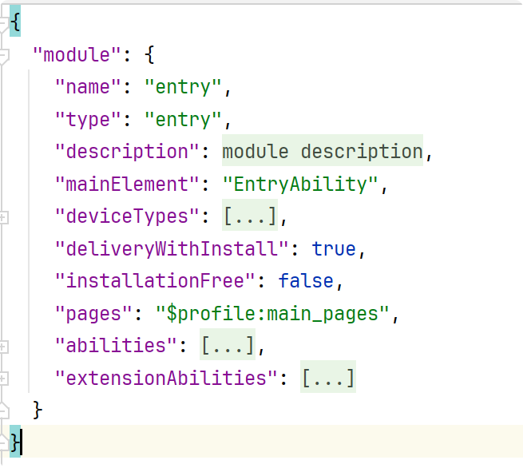
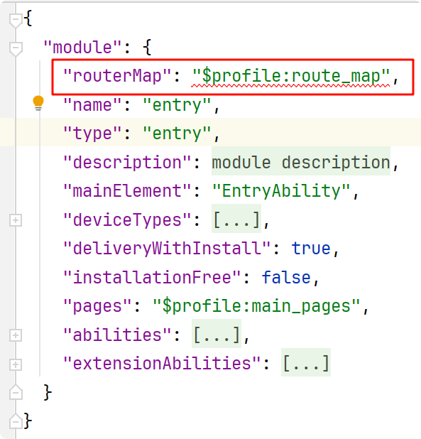
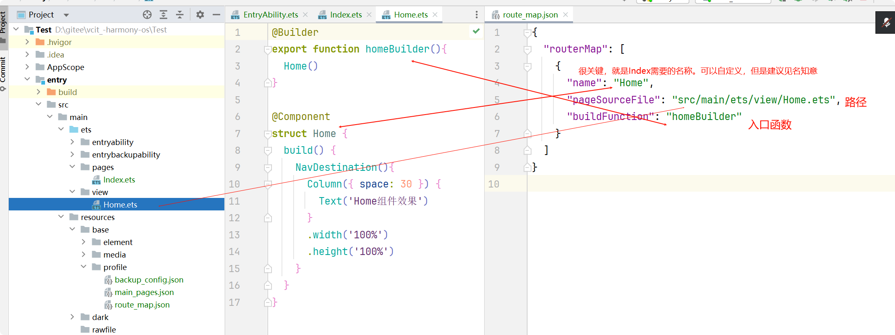

> Navigation跳转

>  需求：由`Index`页面跳转到`Home`页面/组件
>
> `bug`点：API19版本中，需要使用模拟器完成本案例。预览器不支持。其他版本同学们自行测试预览器是否支持。

## 跳转页`Index`（源页面）

### 1-`Navigation`组件

> 必须使用`Navigation`作为根容器组件。

```arkts
@Entry
@Component
struct Index {
  build() {
    Navigation() {
      Button('点击跳转Home组件')
    }
    .width('100%')
    .height('100%')
  }
}
```

### 2- `NavPathStack` 对象

> 需要在源页面中设置 `NavPathStack` 对象

```
  pagePath:NavPathStack = new NavPathStack()
```

### 3-关联

> 需要将该 `NavPathStack` 对象跟`Navigation`组件关联起来

```
 pagePath:NavPathStack = new NavPathStack()
 
 Navigation(this.pagePath){
      
    }
```

### 4-跳转页面

> 下面的跳转功能代码，`name`属性对应的配置值，还没写呢，此处是伪代码。

```
  Button('点击跳转Home组件')
        .onClick(() => {
          this.pagePath.pushPath({name:"目标页面的配置名称后续回来补上？？？？"})
        })
```


## 目标页面Home，

### 1-NavDestination组件

>  必须使用`NavDestination`作为根容器组件。

```
@Component
struct Home {
  build() {
    NavDestination(){
      Column({ space: 30 }) {
        Text('Home组件效果')
      }
      .width('100%')
      .height('100%')
    }
  }
}
```

### 	2-入口函数

> 需要一个入口函数，方便在后续的配置文件中使用。该函数在**组件之外**的位置。可以写在当前文件的第一行。

```
@Builder
export function homeBuilder(){
  Home()
}
```

----

## 配置文件

> 设置配置文件，源页面的`name`值和目标页面的路径，均需要由配置文件关联。

### 1 - `module.json5`配置文件

> 找到`src/main/module.json5`配置文件，未修改前的默认样子如下



### 2 - 添加 `routerMap`配置项

>  追加配置项：`"routerMap": "$profile:route_map"`。追加好后的样子如下图：



### 3 - 创建`route_map.json`

>  在`src/main/resources/base/profile`目录下创建`route_map.json`

### 4 - 在`route_map.json` 中添加配置项如下

```
{
  "routerMap": [
    {
      "name": "Home",
      "pageSourceFile": "src/main/ets/view/Home.ets",
      "buildFunction": "homeBuilder"
    }
  ]
}
```




----

## 页面文件代码最终效果

### 1 - `Index`完整代码

```
@Entry
@Component
struct Index {
  pagePath:NavPathStack = new NavPathStack()
  build() {
    Navigation(this.pagePath) {
      Button('点击跳转Home组件')
        .onClick(() => {
          this.pagePath.pushPath({name:"Home"})
        })
    }
    .width('100%')
    .height('100%')
  }
}
```


### 2 - `Home`完整代码

````
@Builder
export function homeBuilder(){
  Home()
}

@Component
struct Home {
  build() {
    NavDestination(){
      Column({ space: 30 }) {
        Text('Home组件效果')
      }
      .width('100%')
      .height('100%')
    }
    .hideBackButton(true)  // 取消 NavDestination 默认的返回箭头
  }
}
````

