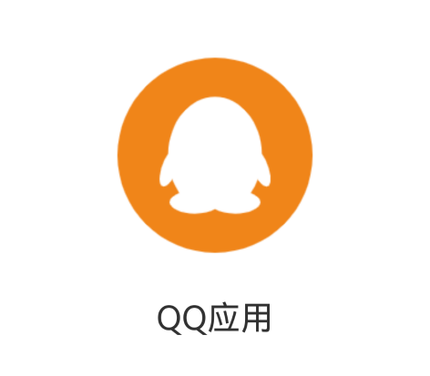

> HCIA实验。基于`API19`

---

# 程序框架服务实验
[本教程配套源码](https://gitee.com/mayuanwei/harmonyOS_bilibili/tree/master/HCIA/startAbility)


---

*	掌握如何启动应用内的 `UIAbility`；
*	掌握如何启动应用内的 `UIAbility` 并获取返回结果；
*	掌握 `UIAbility` 组件与 `UI` 的数据同步；
*	通过 `openLink` 和 `startAbility`实现应用间跳转。
---

## 任务一 ： 拉起指定 UIAbility
> 场景：在安卓系统的微信中，可点击小程序拉起第二个UIAbility，例如使用微信小程序`JJ象棋`。
>
> 将程序设计为多个Ability的方便之处在于，从底部上滑时，可以在一个应用里显示多个窗口模块，方便用户切换。
### 设计主程序`Ability`的`Index`界面和功能
> 两种拉起方式：`单纯拉起`/ `拉起并获取返回结果`

```arkts
import { common, OpenLinkOptions, Want } from '@kit.AbilityKit'

/**
 * 模拟微信主窗口拉起小程序效果
 */
@Entry
@Component
struct Index {
  wechatName:string = 'dxin'
  // 用来接受JJ象棋 Ability 的返回值
  @State jjName: string  = 'jj'

  build() {
    Column({ space: 30 }) {
      Text("微信主程序")
        .fontSize(30)
      Text('jj象棋用户名：' + this.jjName)
      Divider().color(Color.Red)

      Button('单纯拉起 JJ象棋小程序 无返回结果')
        .onClick(() => {
          this.startJJchessAbility()
        })
      Button('拉起 JJ象棋小程序 并获取返回结果')
        .onClick(() => {
          this.startJJchessAbilityGetResult()
        })
      Divider().color(Color.Red)
      // 拉起 另一个应用 qq
      Button('使用 startAbility 唤醒QQ')
        .onClick(() => {
            //...
        })
      Button('使用 openLink 唤醒QQ')
        .onClick(() => {
            //...
        })
    }
    .width('100%')
    .height('100%')
    .backgroundColor($r('app.color.theme_color'))
  }

  // 单纯的启动 JJchessAbility 无需获取返回结果
  startJJchessAbility(){
    // 在具体使用UIAbilityContext前进行变量定义。
    let context:common.UIAbilityContext  =this.getUIContext().getHostContext() as common.UIAbilityContext;
    let wantInfo: Want = {
      deviceId: '', // 本设备
      // bundleName:context.applicationInfo.name, //可动态获取
      bundleName: 'com.dxin.abilityexperiment', //也从AppScope/app.json5中查看
      moduleName: '', // 目标 模块目录名称 entry 默认同模块
      abilityName: 'JJchessAbility',
      parameters: {
        wechatName: this.wechatName// 参数可以省略
      }
    }
    context.startAbility(wantInfo)
  }

  // 启动 JJchessAbility 并获取返回结果进行使用
  async startJJchessAbilityGetResult(){
    let context:common.UIAbilityContext  =this.getUIContext().getHostContext() as common.UIAbilityContext;
    let wantInfo: Want = {
      deviceId: '', // 本设备
      // bundleName:context.applicationInfo.name, //可动态获取
      bundleName: 'com.dxin.abilityexperiment', //也从AppScope/app.json5中查看
      moduleName: '', // 目标 模块目录名称 entry 默认同模块
      abilityName: 'JJchessAbility',
      parameters: {
        wechatName: this.wechatName// 参数可以省略
      }
    }
   let data =  await context.startAbilityForResult(wantInfo)
    if (data?.resultCode === 1001) {
      // 解析 被调用方 JJchessAbility 返回的信息
      this.jjName = data.want?.parameters?.jjName as string
    }
  }

}
```

### 创建新Ability

1 在entry目录上右键新建 Ability。正常取名。例如：`JJchessAbility`

2 项目自动生成入口类文件：`src/main/ets/jjchessability/JJchessAbility.ets`

3 为该Ability配置启动页：`src/main/ets/pages/JJchess.ets`

4 获取主程序传递的参数并使用 `AppStorage` 全局存储

5 停止当前 `JJchessAbility` ,设计两种情况：`无返回结果`/`有返回结果`

---
> `src/main/ets/jjchessability/JJchessAbility.ets`
```arkts
import { AbilityConstant, UIAbility, Want } from '@kit.AbilityKit';
import { hilog } from '@kit.PerformanceAnalysisKit';
import { window } from '@kit.ArkUI';


export default class JJchessAbility extends UIAbility {
  onCreate(want: Want, launchParam: AbilityConstant.LaunchParam): void {
    // 拉起该 Ability 时获取 可获取传递过来的参数
    let wechatName = want?.parameters?.wechatName || '帝心' // 如果获取失败，给一个默认值 帝心
    AppStorage.setOrCreate("wechatName", wechatName)
  }

  onWindowStageCreate(windowStage: window.WindowStage): void {
    // 为该Ability配置启动页
    windowStage.loadContent('pages/JJchess', (err) => {
      if (err.code) {
        return;
      }
    });
  }

    // ...
}

```

> `src/main/ets/pages/JJchess.ets`
```arkts
import { common } from '@kit.AbilityKit'

/**
 * 模拟 JJ象棋小程序页面
 */
@Entry
@Component
struct JJchess {
  // 主程序传递过来的参数 wechatName
  @StorageProp("wechatName") wechatName: string = ''

  build() {
    Column({ space: 30 }) {
      Text("JJ象棋小程序")
        .fontSize(30)
      Text('微信ID：' + this.wechatName)
      Divider().color(Color.Red)

      Button('返回主程序')
        .onClick(() => {
          // this.stopJJchessAbility()
          this.stopJJchessAbilityReturnResult()
        })
    }
    .width('100%')
    .height('100%')
    .backgroundColor($r('app.color.theme_color'))
  }

  // 单纯的停止 JJchessAbility
  stopJJchessAbility() {
    let context: common.UIAbilityContext = this.getUIContext().getHostContext() as common.UIAbilityContext;
    context.terminateSelf((err) => {
      if (err.code) {
        // 停止失败
        console.log(`dxin => 停止 JJchessAbility失败了`)
        return
      }
    })
  }

  //停止 JJchessAbility 并携带返回结果
  stopJJchessAbilityReturnResult(){
    let context: common.UIAbilityContext = this.getUIContext().getHostContext() as common.UIAbilityContext;
    // 准备返回结果
    let abilityResult:common.AbilityResult  = {
      resultCode:1001,
      want:{
        bundleName: 'com.dxin.abilityexperiment', //也从AppScope/app.json5中查看
        moduleName: '', // 目标 模块目录名称 entry 默认同模块
        abilityName: 'EntryAbility',
        parameters:{
          jjName:"jj彭于晏"
        }
      }
    }
    context.terminateSelfWithResult(abilityResult, (err) => {
      if (err.code) {
        // 停止 JJchessAbility 并返回结果 失败
        console.log(`dxin =>停止 JJchessAbility 并返回结果 失败了`)
        return
      }
    })
  }
}
```

---
## 任务二 ： 拉起指定 UIAbility并获取返回结果


---
## 任务二 ： 拉起指定 应用
> 场景： 在微信中拉起QQ
### 新建项目 QQApplication
> 仅仅修改Index能够呈现UI即可。



> 为了能够支持被其他应用访问，目标应用需要在`module.json5`配置文件中声明`URLskill`。其中，`uri`字段的 `scheme` 的取值支持自定义，可以定义为任意不包含特殊字符、非`ohos` 开头的字符串。
```
  "skills": [
          {
            "entities": [
              // eentities须包含"entity.system.browsable"
              "entity.system.browsable"
            ],
            "actions": [
              // actions须包含"ohos.want.action.viewData"
              "ohos.want.action.viewData"
            ],
            "uris": [
              {
                //scheme 可以自定义
                "scheme": "http",
                //host须配置关联的域名
                "host": "www.dxin.com",
                "path": "qq"
              }
            ]
          }
        ]
```

### 拉起方应用使用 startAbility 实现应用跳转
> `startAbility`接口是将应用链接放入`want`中，通过调用隐式`wan`t匹配的方法触发应用跳转。
通过`startAbility`接口启动时，还需要自己传入待匹配的`action` 和`entity`。

```arkts
 // 拉起 另一个应用 qq
Button('使用 startAbility 唤醒QQ')
.onClick(() => {
    this.startAbilityQQApplication()
})
```
> 为了可读性，封装成`startAbilityQQApplication`函数
```arkts
  // 拉起方应用使用 startAbility 实现应用跳转 启动 QQApplication
  startAbilityQQApplication(){
    let context:common.UIAbilityContext  =this.getUIContext().getHostContext() as common.UIAbilityContext;
    let want:Want = {
      // QQApplication 中配置的 uris 数据
      uri:"http://www.dxin.com/qq"
    }
    context.startAbility(want)
      .then(() => {
        console.log(`dxin =>使用 startAbility  拉起QQ成功 `)
      })
      .catch(() => {
        console.log(`dxin =>使用 startAbility  拉起QQ失败 `)
      })
  }

```
---
### 拉起方应用使用 openLink 实现应用跳转
> 在`openLink`接口的`link`字段中传入目标应用的URL信息，并将`options`字段中的`appLinkingOnly`配置为`false`。

>为使得代码简洁易读，在拉起方应用将上述操作封装到自定义的`openLinkQQApplication()`方法
```arkts
Button('使用 openLink 唤醒QQ')
.onClick(() => {
    this.openLinkQQApplication()
})
```

```arkts
// 拉起方应用使用 openLink 实现应用跳转 启动 QQApplication
openLinkQQApplication(){
let context:common.UIAbilityContext  =this.getUIContext().getHostContext() as common.UIAbilityContext;
let link:string = "http://www.dxin.com/qq"
let openLinkOptions:OpenLinkOptions ={
    appLinkingOnly:false
}
context.openLink(link,openLinkOptions)
    .then(() => {
    console.log(`dxin =>使用 openLink  拉起QQ成功 `)
    })
    .catch(() => {
    console.log(`dxin =>使用 openLink  拉起QQ失败 `)
    })
}
```