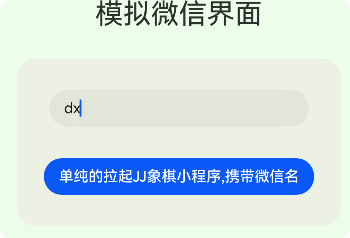
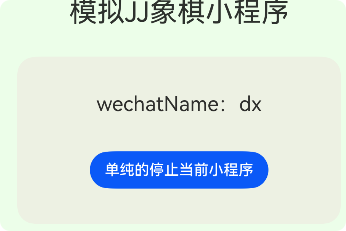

> HCIA实验。基于`API19`

---

## 程序框架服务实验
[本教程配套源码](https://gitee.com/mayuanwei/harmonyOS_bilibili/tree/master/HCIA/demoCollect/startAbility/example)


> 以多 `UIAbility`的微信软件为案例，创建小程序的 `UIAbility`。
>
> 模拟微信拉起小程序的效果，即：启动应用内的 `UIAbility`；
>
> 模拟在微信中拉起第三方应用如QQ软件，即：实现应用间跳转。

---

### 任务一：启动应用内的 `UIAbility`；

#### 创建项目`wechat`，并简单设置UI结构。

> 自行配置项目资源：颜色、图标、app名称、字符串等。


> `src/main/ets/pages/Index.ets`

```arkts
import { common, Want } from '@kit.AbilityKit'

@Entry
@Component
struct Index {
  // 设置微信名称 传递给 被拉起的 UIAbility
  wechatName: string = ""

  build() {
    Column({ space: 30 }) {
      Text("模拟微信界面").fontSize(30)
      // 启动应用内的 UIAbility；
      Column({ space: 10 }) {
        TextInput({
          placeholder: "请输入你的微信名",
          text: $$this.wechatName
        })
          .width("80%")
          .height(40)
        Button('单纯的拉起JJ象棋小程序,携带微信名')
          .onClick(() => {
           // 动态传入微信名，如果用户没输入。设置默认值。
            if (this.wechatName === "") {
              this.wechatName = "帝心1号"
            }
           // TODO:拉起小程序
           
          })
      }
      .ColumnAreaStyle('#51efd5d5')

    }
    .width('100%')
    .height('100%')
    .backgroundColor($r('app.color.theme_color'))
  }

}

@Extend(Column)
function ColumnAreaStyle(bgc: string) {
  .width("90%")
  .height(180)
  .borderRadius(20)
  .backgroundColor(bgc)
  .justifyContent(FlexAlign.SpaceEvenly)
}
```

---

#### 创建`象棋`小程序的 `UIAbility`。

1.  在`entry`目录上右键新建 `Ability`。正常取名。例如：`JJchessAbility`

2.  项目自动生成入口类文件：`src/main/ets/jjchessability/JJchessAbility.ets`

3.  为该Ability配置启动页：`src/main/ets/pages/JJchess.ets`

> `src/main/ets/jjchessability/JJchessAbility.ets`

```arkts
  onWindowStageCreate(windowStage: window.WindowStage): void {
    windowStage.loadContent("pages/JJchess", (err) => {
      if (err.code) {
        return;
      }
    });
  }
```

4. 设置`JJchess.ets`页面结构

>  `src/main/ets/pages/JJchess.ets`

```
import { common } from '@kit.AbilityKit'

@Entry
@Component
struct JJchess {

  build() {
    Column({ space: 30 }) {
      Text("模拟JJ象棋小程序").fontSize(30)

      Column() {
        Button('单纯的停止当前小程序')
          .onClick(() => {
            // TODO 停止当前 UIAbility
          
          })
      }
      .ColumnAreaStyle('#51efd5d5')
    }
    .width('100%')
    .height('100%')
    .backgroundColor($r('app.color.theme_color'))
  }

}

@Extend(Column)
function ColumnAreaStyle(bgc: string) {
  .width("90%")
  .height(180)
  .borderRadius(20)
  .backgroundColor(bgc)
  .justifyContent(FlexAlign.SpaceEvenly)
}

```

---

#### 拉起方启动 `UIAbility`并传递参数（用户输入的微信名）

> `src/main/ets/pages/Index.ets`

1. 封装功能函数

```
  // 拉起 JJchessAbility
  startJJchessAbility(wechatName: string) {
    // 拉起指定的 JJchessAbility  需要一个哥们 Context 帮我在两个 Ability 之间 共享
    let context: common.UIAbilityContext = this.getUIContext().getHostContext() as common.UIAbilityContext;
    // 需要want对象 说清楚目标是谁
    let wantInfo: Want = {
      deviceId: '', // 本设备
      // bundleName:context.applicationInfo.name, //可动态获取
      bundleName: 'com.dxin.wechat', //也从AppScope/app.json5中查看
      moduleName: '', // 目标 模块目录名称 entry 默认同模块
      abilityName: 'JJchessAbility',
      parameters: {
        // wechatName: wechatName
        wechatName
      }
    }
    context.startAbility(wantInfo)
  }
```

2. 在按钮点击事件中调用功能函数

```
 Button('单纯的拉起JJ象棋小程序,携带微信名')
          .onClick(() => {
            // 动态传入微信名，如果用户没输入。设置默认值。
            if (this.wechatName === "") {
              this.wechatName = "帝心1号"
            }
            this.startJJchessAbility(this.wechatName)
          })
```

---

#### 被拉起方停止当前`UIAbility`

> `src/main/ets/pages/JJchess.ets`

1. 定义停止自身`UIAbility`的功能函数

```
  // 单纯的停止 JJchessAbility
  stopJJchessAbility() {
    let context: common.UIAbilityContext = this.getUIContext().getHostContext() as common.UIAbilityContext;
    context.terminateSelf() // 停止当前的自己
  }
```

2. 在按钮点击事件中调用功能函数

```
Button('单纯的停止当前小程序')
    .onClick(() => {
        // TODO 停止当前 UIAbility
        this.stopJJchessAbility()
    })
```


----

### 任务二：`UIAbility` 与 `UI` 的数据同步；

> 以上仅仅完成了拉起和停止功能。在拉起时还传递了参数（微信名）。可在被拉起方的入口类中获取参数并同步给UI

1. 获取拉起方携带的参数并存储

> `src/main/ets/jjchessability/JJchessAbility.ets`

```
  onCreate(want: Want, launchParam: AbilityConstant.LaunchParam): void {
    //   如果来访有携带数据 可以在此处接受
    let wechatName: string = want?.parameters?.wechatName as string || '帝心2号'
    //   使用 AppStorage 和 @StorageProp（页面）进行数据同步
    AppStorage.setOrCreate("wechatName",wechatName)
  }
```

2. 在UI界面上同步数据并使用

> 在`src/main/ets/pages/JJchess.ets`页面中同步数据

```
  // 从全局的数据中心AppStorage 取出关联 wechatName 数据
  @StorageProp("wechatName") wechatName: string = "帝心3号"
```

> 在页面中进行使用

```
 Column() {
        Text('wechatName：' + this.wechatName).fontSize(22)
        Button('单纯的停止当前小程序')
          .onClick(() => {
            // TODO 停止当前 UIAbility
            this.stopJJchessAbility()
          })
      }
      .ColumnAreaStyle('#51efd5d5')
```

|                        拉起方录入数据                        |                    被拉起方获取数据并使用                    |
| :----------------------------------------------------------: | :----------------------------------------------------------: |
|  |  |

---

### 任务三：启动应用内的 `UIAbility`并获取返回结果；

#### 被拉起方

设计UI布局，用户可输入小程序用户名，作为返回微信传递的结果参数

> `src/main/ets/pages/JJchess.ets`

```
  // 用户动态设置当前 小程序的用户名 返回时传递给微信主界面
  JJname: string = ''
```

```
     Column({ space: 10 }) {
        TextInput({
          placeholder: "请设置你的jjName",
          text: $$this.JJname
        })
          .width("80%")
          .height(40)
        Button('停止当前小程序并且返回结果')
          .onClick(() => {
            if (this.JJname === "") {
              this.JJname = '当头炮'
            }
            // TODO 停止当前 UIAbility 并携带JJname作为参数
            this.stopJJchessAbilityReturnResult(this.JJname)
          })
      }
      .ColumnAreaStyle('#6f98f1d2')
```

```
  stopJJchessAbilityReturnResult(JJname: string) {
    // 拉起指定的 JJchessAbility
    let context: common.UIAbilityContext = this.getUIContext().getHostContext() as common.UIAbilityContext
    // 准备返回结果
    let abilityResult: common.AbilityResult = {
      resultCode: 1001, //必传参数
      want: {
        bundleName: 'com.dxin.wechat', //也从AppScope/app.json5中查看
        moduleName: '', // 目标 模块目录名称 entry 默认同模块
        abilityName: 'EntryAbility',
        parameters: {
          // JJname:JJname
          JJname
        }
      }
    }
    context.terminateSelfWithResult(abilityResult)
  }
```

---

#### 拉起方

> `src/main/ets/pages/Index.ets`

准备变量数据`JJname`接收被拉起方返回的结果数据。当该变量数据被结果数据覆盖时，渲染UI更新。所以需要状态装饰。

```
  // 接受 被拉起方返回的数据
  @State JJname: string = '待拉起'
```

设计UI效果，呈现`JJname`和点击按钮拉起小程序

```
    // 启动应用内的 UIAbility 并获取返回结果；
      Column() {
        Text('jj象棋中注册的名字：' + this.JJname)
        Button('拉起jj象棋并且获取返回结果')
          .onClick(() => {
            this.startJJchessAbilityithResult()
          })
      }
      .ColumnAreaStyle('#6f98f1d2')
```

封装功能函数

```
// 拉起jj象棋并且获取返回结果
  async startJJchessAbilityithResult() {
    let context: common.UIAbilityContext = this.getUIContext().getHostContext() as common.UIAbilityContext;
    // 需要want对象 说清楚目标是谁
    let wantInfo: Want = {
      deviceId: '', // 本设备
      // bundleName:context.applicationInfo.name, //可动态获取
      bundleName: 'com.dxin.wechat', //也从AppScope/app.json5中查看
      moduleName: '', // 目标 模块目录名称 entry 默认同模块
      abilityName: 'JJchessAbility'
    }
    // 拉起jj象棋后，要等待拉起方停止后才会返回数据 所以是异步任务 使用 await async语法等待返回结果。
    let data = await context.startAbilityForResult(wantInfo)
    if (data.resultCode === 1001) {
      this.JJname = data.want?.parameters?.JJname as string
    }
  }
```

----

### 任务四：应用间跳转。


> 假设被拉起方为QQ，即：在微信中点击按钮拉起QQ。
>
> 先创建QQ项目，作为被拉起的应用app，设计简单UI即可。

##### QQ项目页面

> QQ项目中的`src/main/ets/pages/Index.ets`

```
@Entry
@Component
struct Index {

  build() {
    Column({ space: 30 }) {
      Image($r('app.media.qq'))
        .width(200)
      Text('QQ应用')
        .fontSize(30)
    }
    .width('100%')
    .height('100%')
    .justifyContent(FlexAlign.Center)
  }
}
```

##### QQ配置

> 为了能够支持被其他应用访问，目标应用需要在`module.json5`配置文件中声明`URLskill`。其中，`uri`字段的 `scheme` 的取值支持自定义，可以定义为任意不包含特殊字符、非`ohos` 开头的字符串。
>
> 经测试，配置后无法主动自启该app，需要被拉起。

```
 "skills": [
          {
            "entities": [
              // eentities须包含"entity.system.browsable"
              "entity.system.browsable"
            ],
            "actions": [
              // actions须包含"ohos.want.action.viewData"
              "ohos.want.action.viewData"
            ],
            "uris": [
              {
                //scheme 可以自定义
                "scheme": "http",
                //host须配置关联的域名
                "host": "www.dxin.com",
                "path": "qq"
              }
            ]
          }
        ]
```

##### 拉起方设计UI界面，点击按钮拉起QQ

> 微信项目的`src/main/ets/pages/Index.ets`

```
     // 拉起第三方应用 QQ
      Column(){
        Button('使用 startAbility 唤醒QQ')
          .onClick(() => {
            this.startAbilityQQApplication()
          })

        Button('使用 openLink 唤醒QQ')
          .onClick(() => {
            this.openLinkQQApplication()
          })
      }
      .ColumnAreaStyle('#6ae7d398')
```

---

#### `openLink`方式实现应用间跳转

> 在`openLink`接口的`link`字段中传入目标应用的URL信息，并将`options`字段中的`appLinkingOnly`配置为`false`。

```
  // 拉起方应用使用 openLink 实现应用跳转 启动 QQApplication
  openLinkQQApplication(){
    let context:common.UIAbilityContext  =this.getUIContext().getHostContext() as common.UIAbilityContext;
    let link:string = "http://www.dxin.com/qq"
    let openLinkOptions:OpenLinkOptions ={
      appLinkingOnly:false
    }
    context.openLink(link,openLinkOptions)
      .then(() => {
        console.log(`dxin =>使用 openLink  拉起QQ成功 `)
      })
      .catch(() => {
        console.log(`dxin =>使用 openLink  拉起QQ失败 `)
      })
  }
```

----

#### `startAbility`方式实现应用间跳转

> `startAbility`接口是将应用链接放入`want`中，通过调用隐式`wan`t匹配的方法触发应用跳转。 通过`startAbility`接口启动时，还需要自己传入待匹配的`action` 和`entity`。

```
// 拉起方应用使用 startAbility 实现应用跳转 启动 QQApplication
  startAbilityQQApplication(){
    let context:common.UIAbilityContext  =this.getUIContext().getHostContext() as common.UIAbilityContext;
    let want:Want = {
      // QQApplication 中配置的 uris 数据
      uri:"http://www.dxin.com/qq"
    }
    context.startAbility(want)
      .then(() => {
        console.log(`dxin =>使用 startAbility  拉起QQ成功 `)
      })
      .catch(() => {
        console.log(`dxin =>使用 startAbility  拉起QQ失败 `)
      })
  }
```
---
## ArkUI
### [开发应用沉浸式效果](https://hm.codefe.cn/docs/tutorial/NEXT/06%E5%BC%80%E5%8F%91%E5%BA%94%E7%94%A8%E6%B2%89%E6%B5%B8%E5%BC%8F%E6%95%88%E6%9E%9C/)

----
### 弹窗使用


### 窗口管理


