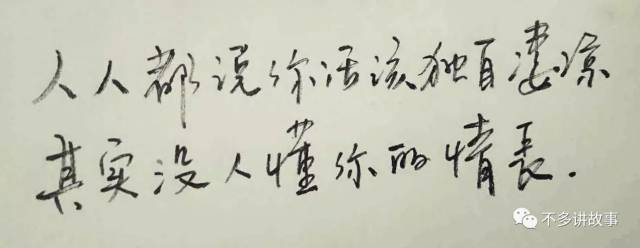

我生平第一次喝酒与抽烟都是在十年之前，我记得那晚的月亮硕大且明亮。

并不是因为少年时代的装逼与自我陶醉，只是木易大哥带我去泌水西流的南河边时，他的神情和言辞都太过深情，我无法拒绝。

 

当然，木易并不是对我深情，他此生唯独深情过的一个人是玉今姐姐。

 

整个中学时代，木易都是老师眼中的优等生，父母口中的金宝贝。他拥尽彼时我所羡慕的一切，偏偏他并不孤傲，乐于和我做朋友，对我向来照顾。

整个中学时代，我都叫他哥哥。在烈士陵园的墓地里几次都要歃血为盟，义结金兰。因为怕疼，最终作罢。

 

我生平第一次喝酒是这样的：

木易拿满瓶的勇闯天涯和我碰杯。我记得那晚的情形，他有些张扬，也有些惆怅。

他说：

玉今在人群中对我微微一笑

因为这个微笑

我已经等了好久

等待是一生中最初的苍老

是令人日渐消瘦的心事

是举箸前莫名的悲伤

是记忆里一场不散席的筵席

是不能饮不可饮，也要拼却的一醉。

 

我记得那时的木易，正年轻，有些激动，又有些彷徨。

 

我一度觉得木易哥哥为了尝试一次醉酒所找来的噱头有些矫情。但那次我吹着泌阳县南河北岸的风有种要飞起来的爽快。

就在即将飞起来的时候，木易递给我一支细长细长的香烟。

木易说：抽烟只抽煊赫门，一生只爱一个人。

我抽了一口说：呛死劳资了，咳咳咳。

 

第一次喝酒与抽烟的情形就是如此。

后来我们喝过很多种类的酒，也确实行过许多地方的桥。

我说我只看过那一晚的满月。

木易说他只爱过一个正当年龄的人。

 

整个中学时代，木易和玉今都是朋友中最羡慕的一对。玉今抱着木易的胳膊走在街头的法国梧桐树下，侧着脸听木易唱张国荣的歌，我跟在身后，觉得成年之后，如果木易结婚了，新娘一定是玉今。

 

一首《至少还有你》唱完，玉今问木易：你的一生，只爱我一个对不对？

木易说：我这人向来不信来生，但是我希望今生今世，来生来世，都爱你一个。

玉今仰着头微笑：我是幸运且幸福的。

我觉得大家这么年轻，动辄讲什么一生一世，太过遥远和渺茫。弯下腰，捡起散落一地的梧桐叶和狗粮。

 

如果新娘不是玉今姐姐，那我就不去喝木易哥哥的喜酒了。

后来这句话我当着木易哥哥的面说过很多次，木易觉得我们关系这么铁，如果他结婚我不到场，太特么不仗义了。

 

木易告诉我：如果结婚的时候当真不是她，你来，我们大醉一场，你不来，也好。

 

看过故事的人，熟识木易的人，都知道，他们并没有一生一世在一起。

 

年轻时候，我们总把三年五年当做一辈子。错过几个人，年龄到了三十上下的节骨点，才发现，十年八年也不过是指缝间的事情。

 

木易和玉今分手是在高三那年，说来也没什么可描述的。不过是老师眼中的优等生，父母眼中的金宝贝，七大姑八大姨口中的家族希望。严令禁止木易早恋，为了高考必须放弃一起。其实在此之前的高中时光里，木易一直负重前行，每次从县城回家，母亲都会做满满一桌子好吃的，都是木易从前最爱的鸡鸭鱼肉。可是木易每次都吃得难以下咽。无非就是吃完这顿饭，要被旁敲侧击地逼分手。胖仔勇和我也时常在木易家蹭饭，被阿姨私下里叮嘱我们要好好学习，而后便是希望我们劝诫木易哥哥赶紧分手，学业为重。

 

我和胖仔勇跟在木易和玉今的身后，看玉今姐姐抱着木易哥哥的胳膊走在街头，吟着动听的歌，踩碎一地梧桐叶，阳光打在肩头，像一幅美妙的油画。

彼时我尚未恋爱，不懂爱情，满脑子只记得化学方程式和阿姨给的使命。

我和胖仔勇想劝诫他们分手，话到嘴边就走了味。

我酝酿着开场白：那个。。。。

木易回头问我：什么？

我说：高锰酸钾加热后生成锰酸钾，二氧化锰，还有什么来着？

木易扭着头鄙夷我：氧气！

木易回过头告诉玉今姐姐：你就是我的氧气。

 

我低下头捡起一片梧桐叶和满地狗粮。

 

胖仔看我出师不利，拍了拍自己彼时尚未肥胖起来的肚腩劝诫木易：那个。。。。

木易回头问胖仔：什么？

胖仔便秘一样憋地脸颊通红只说了两个字：加油！

木易一脸懵逼：什么J8玩意！

玉今就仰着头痴痴笑。

 

玉今姐姐时常说：只要和你在一起，听你唱歌是开心的，看你给路边商贩讨价还价是开心的，背靠背坐在灯光球场前的草地上晒太阳是开心的，即便听你骂脏话，也是开心的。

 

那时候我对这直白无文采的话的理解就是：玉今姐姐只要和木易在一起就是开心的。不论他优秀或者平凡，只要是你，就好。

 

许多年过去了，我才明白这句直白无文采的话，是我听过最动人的情话了。

许多年过去了，我看过了许多爱情，再也不曾见到那种只要是你，就好。

后来的爱情，大抵关于外貌，家庭条件，工作条件之类的。没什么不好，却也不见得有什么好。

 

他们分手的那天，告别的仪式有些狗血，如青春剧里的桥段一样，小城的夏天难得来一场暴雨，回镇上的巴士停在泌阳县二高门前的烈士陵园旁，木易坐在靠窗的位置往外看，玉今站在陵园门前广场边的石墩上垫着脚把手上拍在车窗上，他伸出手掌，隔着凉凉的玻璃，双手印在一起。

 

车子开走了。木易和玉今分手了。

那时候，我们高三。

那时候，我们青春年少。

那时候，我们把三年五载当成一生来过。

那时候，我们把生命献给爱情，后来我们都没死，年轻替我们抵了命。

 

整个高三，我都没有回去过镇上。

所以他们分手的那天，我就在小城里，就在烈士陵园的广场上。

玉今看着巴士的后尾灯发了一会呆，她转过身看到我，微微一笑。

我不知怎么安慰她，本想学着她的样子微微一笑，可是我还没来得及笑，她就哭了。后来我们立在广场上，淋湿了很久。

 

玉今姐姐告诉我：小元子，帮我个忙吧。

是的，我曾有过很多名字，小元子就是玉今姐姐给我取的。

 

也算不上什么帮忙，不过是些力气活，扛着她所有的教科书和行李卖给收废品的老头。她拿了微薄的钱退了学。去了一个不为人知的地方。

她走的时候告诉我：小元子，高考在即，不要告诉他我去了哪里。

 

木易过完高考前的最后一个小假期回来的时候，整个人颓然了不少，那时候他还没长出胡子，可是我觉得他有些苍老。

 

高考后我的朋友都选择了复读，只有我去了相隔四个省份的北国之北读书。

木易哥哥第一年高考发挥失常。家人都说是早恋耽误了学习。他却始终坚持认为，遇到对的人谈一场恋爱，不论什么年纪，都不算早恋。

 

木易哥哥第二年高考过了二本线。家人还说他是因为早恋耽误了学习，本应第一年就考上211的。其实我知道，木易整个高四都在醉酒和游戏中度过，勉强考过二本，还是依仗了他的天资聪颖。

 

木易哥哥考大学的那一年，教育体制已经改革，先知成绩后报学校。郑州有个轻工业学院，勉强算得一个差不多的二本院校。家人为其规划好了专业，离家近，最好的选择。

 

彼时我已经大二，木易问我：玉今退学后，你有没有她的消息，她到底去了哪里？

我骗她说：她去了远方，一个叫牡丹江的城市。

其实，玉今退学后，朋友们都断了联系，有人猜测她去了南方，有人猜测她去当了兵。大多是捕风捉影，无从考证。

当年，我只知道她去了远方，给了我一个方向，并不清楚具体是哪个城市。关于牡丹江，是我临时胡诌的。

 

木易不顾所有人的反对，去读了牡丹江师范学院。

 

2013年的冬天，木易邀我去牡丹江师范学院看妹子。他说师范学院的男女比例是7比1，满校园的漂亮妞，激动地我连夜买了绿皮火车赶过去。凌晨四点钟在牡丹江火车站等他来接我，冻成了一条土家狗。

 

那次我去牡丹江并没有见到满校园的妹子，零下二十多度的气温，整个校园空无一人。

不过他确实打电话叫来了一个女孩给我认识，说是他的女朋友。打游戏认识的，刀塔玩的好。

 

那个女孩叫杭弟，是个落落大方的妹子，我不知道她玩刀塔是否过了白金段位，我甚至不知道刀塔有没有段位晋级的机制。

我唯一记得的是，她那张脸还真特么像我一个旧朋友，那个旧朋友在高考临近的时候退了学，去了远方。

 

木易哥哥的大学恋情不足两个月就分了手。据木易哥哥自己说是因为他开始玩英雄联盟了，不想和玩刀塔的妹子继续勾搭了。

 

现在，木易哥哥在浙江温州的一家皮革厂里做运维，朝九晚五地过日子，薪资不高不低地混着，周末了就约着我们打联盟，开着视频打配合，他在电话那头叼着万宝路喊着德玛西亚，还一边骂我意识太差，操作太坑。

 

木易哥哥是从三年前开始抽万宝路的。

那天他从牡丹江跑到齐齐哈尔来找我，说是带我去一个厉害的地方。害的我翘了整整一周的课。期末考试挂了科，我把账都赖在他头上。虽然平时我也总翘课。

 

他说的厉害的地方竟然是回到故乡。

那个厉害的地方锣鼓喧天，鞭炮声噼里啪啦地响，农村人传统，放震耳欲聋的音乐。我仔细听了一会，竟然是单曲循环的一首《至少还有你》，嗯，张国荣版的。

一对新人交换戒指的时候，宾客都很默契地禁了声。

新娘在人群中扫视了一圈，盯着我的方向看了三秒钟。她说：你的一生，只爱我一个对不对？

新郎眼睛里都是温柔，扯着嗓子回应她：对！我爱你！

新娘继续盯着我看，我听到身后的木易有些抽泣：今生今世，来生来世，都爱你一个。

新娘说：我是幸运且幸福的。

新娘哇一声感动地哭出声来。新郎开心地满面红光。继而掌声雷动。

 

木易和我在人群最外层靠着彼此的肩膀站着，他把最后两支煊赫门拿出来，扔掉扁窄的烟盒。分我一支，点上火。

我抽了一口，问他：你还记得么？抽烟只抽煊赫门，一生只爱一个人。

他抽了一口，抬着头看天空，他说：呛死劳资了，咳咳咳。

他没有回答我是否记得，但是这两句话，是我第一次喝酒与抽烟时候的对白。

 

他一会看云，一会看新娘，一会又看云。

他看云的时候仿佛近，他看新娘的时候仿佛很远。

他一会看云，一会看新娘，一会又看云。

他仿佛又什么都没看，眼神空洞，表情木讷。

 

那个新郎叫章卫君。是邻村的一个帅气男生，退伍军人。那个新娘叫玉今。

 

木易从牡丹江到齐齐哈尔找我的时候，说是带我去一个厉害的地方。他说包吃包住包来回车票。我就很没志气地跟他走了。我还意淫着他要带我去海拉尔旅行呢。毕竟当时我特想去看一眼草原。

 

木易的手机号用了七年都没换，收到短信的时候很没志气的就从牡丹江来齐齐哈尔找我，买好了车票奔赴千里之外。

那条短信说：你已经错过了我，请不要错过我的婚礼。

那条短信未署名。只讲了地点。但是木易知道，一定是她。

 

那天他把最后两支煊赫门分我一支，从此再也没抽煊赫门。

我有问过，是因为煊赫门太贵，所以才抽万宝路么？

木易哥哥告诉我：去你妈的，万宝路更贵。

 

那天的喜酒我们都没喝，喜宴也没吃。我们回到故乡看了一场声势浩大的婚礼，听了一首单曲循环的歌，抽了两支香烟，又坐了二十几个小时的火车回到齐齐哈尔。

我从床底下翻出一个盒子来，告诉他有个厉害的东西给他看。

盒子里是72片法国梧桐叶。我这人怀旧，叶子夹在大大的笔记本里，被压了好几年，平平整整，没有一丝褶皱。

当年我跟在木易哥哥和玉今姐姐的身后，她抱着她的胳膊，他唱歌给她听。

歌声动情处，我就弯下腰捡起一片法国梧桐叶。

还有满地的狗粮。

现在，我把这狗粮都还给木易了。

 

 

现在，我们都是奔三的人了。

木易又像少年时候一样承担着家人的逼迫。物色好的姑娘排成队，然而木易一次相亲都没去过。催婚这件小事被父母发动了七大姑八大姨来游说他。他都不置可否，任谁谁，我只想一个人过。

 

现在，木易哥哥大概又在哼着那首张国荣版的《至少还有你》，走在浙江温州的街头，指尖夹着万宝路，踩着满地的落叶独自散步，背影阑珊，风景婆娑。

 

 

 

后记：

后来的这几年，木易不论坐客车还是火车，都喜欢靠窗的位置，把手掌贴在玻璃上。

时而手掌并拢，时而手指撑开。

他透过指缝往外看，浮光掠影倒退的，是自己的青春年华。

他再也不曾看到窗外有人把手掌贴上来，透着玻璃和他印在一起。

你听，他又在唱歌了。

我怕来不及

我要抱着你

原文链接：[知君何事泪纵横](https://mp.weixin.qq.com/s?__biz=MzI0NDQ4MjE4MQ==&mid=2247484334&idx=1&sn=768107a3295b9b2ce469ed4e0be88d62&scene=19#wechat_redirect) 