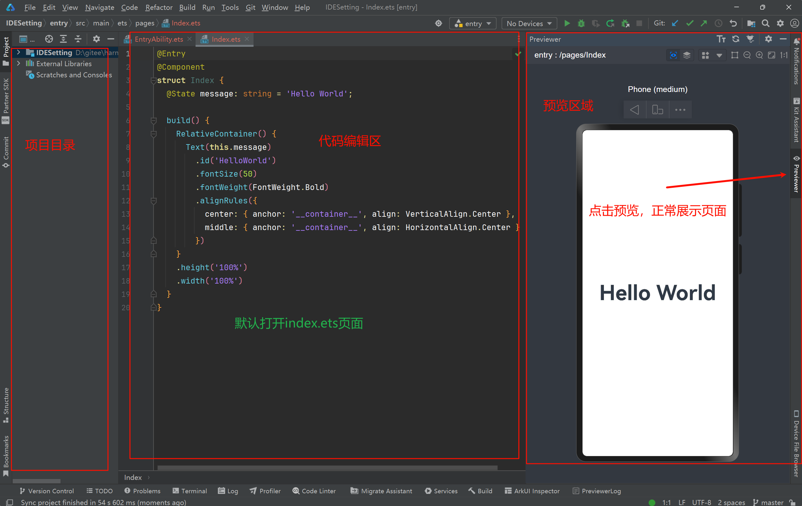
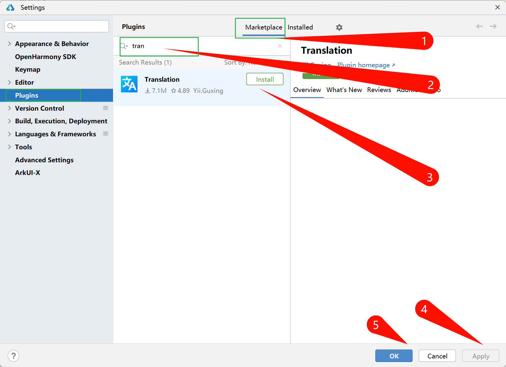
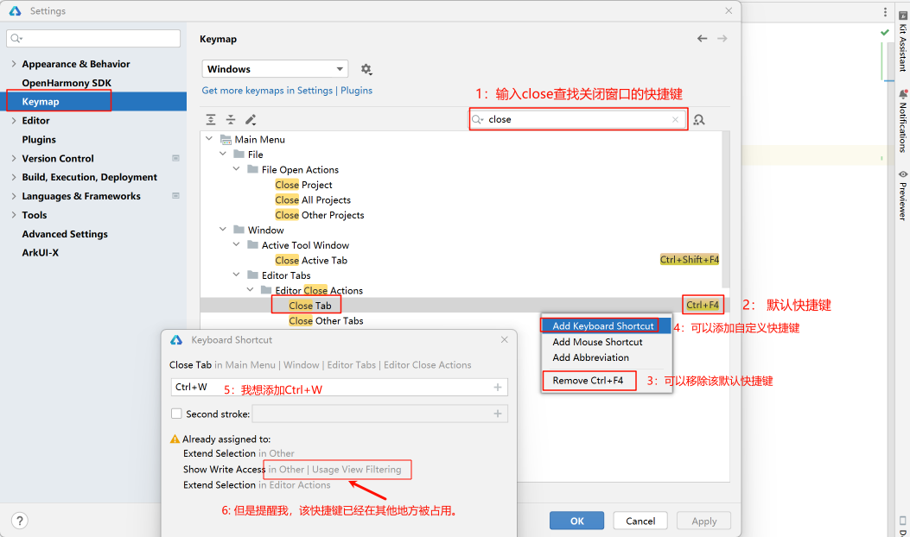
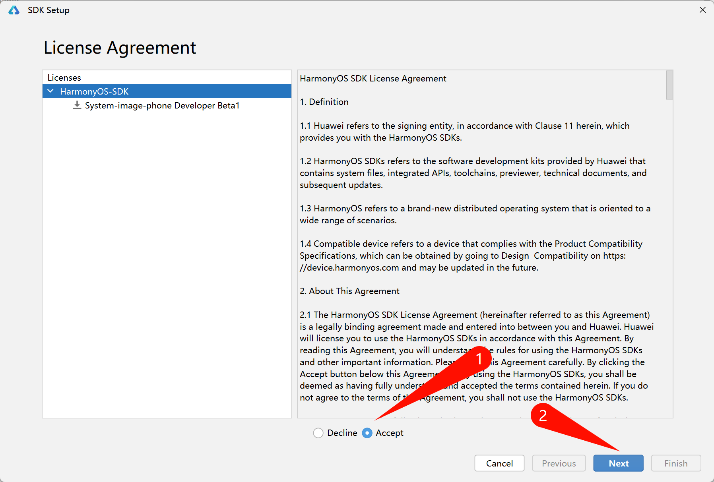

#  HarmonyNEXT 环境搭建
>  HarmonyOS-NEXT-环境搭建


## 01 下载安装

### IDE下载安装

> 安装任何软件，建议不要放在C盘，不要有中文目录，不要有特殊符号或者花里胡哨的东西。听不懂的可以去刷抖音打联盟了。

1. [官网下载安装包](https://developer.huawei.com/consumer/cn/download/)
2. 解压安装包
3. 双节安装包
4. 一路next


### 环境校验

1. 双击桌面图片启动`IDE`
2. 第一次启动，展示相关条款。点击 `Argee` ，同意条款，进入`IDE`
3. 校验环境


> 如果有`ohpm`提示报错：
>
> 可能是网络原因。叉掉该窗口，切换网络。重新打开。
>
> 如果还不能解决，可能是代理问题。根据提示，点击蓝色链接，参考官方资料进行处理。

---

## 02 创建项目

### 1 创建项目


### 2 选择模板


### 3 项目配置


### 4 预览器运行项目




---

## 03 基础配置

### 基础配置

#### 主题色


---

#### 背景图


---

#### 字体大小和行高

`Settings` > `Editor`  > `Font`  >  `Size`  

`Settings` > `Editor`  > `Font`  >  `Line height`  

---

#### 项目启动

​	IDE默认启动时会打开上一次展示的项目。而有时候我们想在启动页面进行项目创建或者选择曾经的项目列表。可以在`Appearance & Behavior` > `System Settings` > `Project` **取消勾选**  `Reopen projects on startup` 

----

#### 禁用 `shift-shift`

​	在代码编辑过程中，可能会频繁使用 `shift` 键切换输入法。而有些笨蛋可能会手误连续按下两次 `shift` 键，则会弹出全局搜索弹窗。很影响编程效率。可以禁用该功能。 `Advanced Settings` > `User Interface` > **勾选** `Disable double modifier key shortcuts` 

---

#### 自定义注释颜色

`Editor` > `Color Scheme` > `JavaScript` > `Comment`  可以设置 `Foreground`的值来自定义注释颜色。同理，设置 `Background` 设置注释背景色

---

### 插件

#### 中文插件


> 有些同学喜欢用中文编辑器，降低使用成本。但是建议大家还是使用英文。提高自己对编辑器的熟悉程度。
>
> 重新进入该配置项，取消该插件勾选，重启编辑器即可恢复到英文状态。

#### 翻译插件



> 在编辑器中使用快捷键 `ctrl+shift+o` 调出翻译窗口。如果有快捷键冲突，自行处理一下。
>
> 如果安装失败，可能是网络问题或者插件方问题。

---

## 04 自定义快捷键

​	有很多人从其他赛道入鸿蒙赛道，导致编辑器快捷键不同而难受的雅痞。例如，在`vscode`中，格式化代码快捷键为 `alt+shift+f`，而重命名文件则使用快捷键 `f2`。而使用`JetBrain`旗下`IDE`的同学使用`DevEco Studio`时，则平滑很多。那么，我们是否可以根据自己的需求，自定义快捷键呢。此处授人以渔，更多配置方式，请举一反三。

### 关闭当前tab：`ctrl+w`

#### 1 去设置关闭窗口快捷键



> 默认的 Ctrl + W 快捷键冲突的地方有两处，上图截图第6步框选不准确。这两处分别在
>
> 1.  `Other` > `Usage View Filtering` > `Show Write Access`
> 2.  `Editor Actions` > `Extend Selection`
>
> 解决冲突方式见下图

#### 2 解决冲突


#### 3 重新设置关闭窗口快捷键

> 第一步操作

### 文件重命名

> 在`windows`系统或者很多`IDE`中，F2都可以对文件进行重命名。而`DevEco Studio`的重命名快捷键为 `Shift+F6`。设置方式与上文关闭窗口相同。


### 其他快捷键设置

> 自己举一反三去

## 05 常用快捷键列表

- `Crtl+Y` ： 删除当前行


-  `Crtl+Alt+O`：清除多余导包

  > 有些时候因为代码调整或者重构，当前文件曾导入的包不需要再使用。可快速清理。

- `Shift+Entry`：切换下一行

  > 光标在任何位置，无需在当前行末尾

- `Ctrl+D` ：  复制当前行

- 复制、粘贴、剪切、回退：`不知道这几个快捷键的同学活该用鼠标费劲操作。`
- `Crtl+Alt+L` ：格式化代码
- `Crtl+J` ：插入自定义动态代码模板
- `Crtl+B` / `Ctrl+左键`： 进入方法/变量/的接口或者定义处
- `Crtl+ +` ：展开代码
- `Crtl+ - `：收缩代码
- `Crtl+ 鼠标滚轮推动 ` ：缩放代码
- `Crtl+ [` ：移动光标到当前所在代码的花括号开始位置
- `Crtl+ ]` ：移动光标到当前所在代码的花括号结束位置
- `Crtl+ F12` ：弹出当前文件结构层，可以在弹出层上直接输入或者点击进行筛选或者跳转

- `Crtl+F` ：在当前文件进行文本查找
- `Crtl+R` ： 在当前文件进行文本替换
- `Shift + F6` ：（选中文件）修改文件名

- `Crtl+Alt+S`：  打开设置
- `Crtl+Alt+Shift+S`  ：项目结构（签名配置）

---

## 06 实时模板

> 在 `Editor` > `Live Templates`中配置代码片段。代码片段中可以使用 `$END$` 设置光标位置。也可以自定义其他变量名进行设计。

### 1 todo

​		在编写代码时，通常会有不同的业务逻辑待完成。暂时使用`todo`注释标注。可在 `TODO` 窗口中查看和定位。


可以配置代码片段，快速生成 `todo` 格式。

```typescript
// TODO $FILE_NAME$ 待完成: $END$
```


---

### 2 点击事件&箭头函数

> 在编写代码过程中，会频繁使用点击事件和箭头函数。配置成代码片段，可以提高开发效率。

- 点击事件

```typescript
// 自定义快捷键，例如：ock
.onClick(() => {
    $END$
})
```

- 箭头函数

```
// 自定义快捷键，例如：jt
($END$) => {
          
}
```

### 3 诗词数组

马老师在授课过程中，可能会用到很多诗词。整理成数组，避免每次准备，以提高效率。

```
// 自定义快捷键：pmarr
  pmArr: string [] = [
    `我醉欲眠卿且去 明朝有意抱琴来`,
    `卡布奇诺今犹在 不见当年倒茶人`,
    `时来运转皆同力 运去英雄不自由`,
    `堪笑一场梦颠倒 元来此生恰浮云`,
    `再见少年拉满弓 不惧岁月不俱风`,
    `我今因病魂颠倒 唯梦闲人不梦君`,
    `君埋泉下泥削骨 我寄人间雪满头`,
    `南来北往徒自老 故人稀`,
    `日拱一卒无有尽 功不唐捐终入海`,
    `何事人间频乞食 此心已是负彩霞`,
    `峨眉山月半轮秋 影入平羌江水流`,
    `天生我才必有用 千金散尽还复来`,
    `垂杨紫陌洛城东 今年花胜去年红`,
    `劝君莫负艳阳天 恩爱欢愉趁少年`,
    `何须浅碧深红色 自是花中第一流`,
    `我醉欲眠卿且去 明朝有意抱琴来`,
    `山有木兮木有枝 心悦君兮君不知`,
    `曾经沧海难为水 除却巫山不是云`,
    `玲珑骰子安红豆 入骨相思知不知`,
    `直道相思了无益 未妨惆怅是清狂`,
    `金风玉露一相逢 便胜却人间无数`,
    `从此无心爱良夜 任他明月下西楼`,
    `欲寄彩笺兼尺素 山长水阔知何处`,
    `若似月轮终皎洁 不辞冰雪为卿热`,
    `得成比目何辞死 愿作鸳鸯不羡仙`,
  ]
```

### 4 初始化背景

NEXT版本中默认初始化页面结构为 相对布局 `RelativeContainer`。相对页面布局喜欢，我更乐意使用列布局。配置默认代码片段

```typescript
   // 自定义初始化背景快捷键，例如：bj
	Column({ space: 30 }) {
      $END$
    }
    .width('100%')
    .height('100%')
    .backgroundColor($r('app.color.theme_color'))
    .justifyContent(FlexAlign.Center)
```

> 注意，此处背景颜色引用了资源文件。应先去资源文件中设置该颜色值。

### 5 外部暴露子组件

开发中经常抽取自定义子组件到指定目录中进行结构分离。此时需要使用`export default`关键字。避免重复编写。定义代码片段如下

```typescript
// 自定义外部暴露子组件快捷键，例如：zj
@Component
export default struct $END$ {
  build() {
    
  }
}
```

### 6 路由跳转

```typescript
// 自定义 路由跳转 快捷键，例如：rp 意思是：router.pushUrl
router.pushUrl({
    url:"$END$"
})
```

### 7 配置文件导出

​		更多实时模板代码片段大家根据需求自行配置。如果编辑器卸载重装，或者个人更换电脑。重新配置习惯的代码片段是很劳心费力的事情。可以将配置文件导入以备后用，同学们如果想要使用帝心的快捷键，亦可直接导入使用。

- 导出配置文件：`File` > `Manage IDE Settings` > `Import Setting...`

- 导入配置文件：`File` > `Manage IDE Settings` > `Export Settings...`
- 恢复默认配置：`File` > `Manage IDE Settings` > `Restore Default Settings..`

> 

---

## 07  模拟器

### 1 打开设备管理界面并登录


### 2 登录华为账号并授权

> 如果没有账号，自行注册。如果提示权限问题。等官方完全放开。


### 3 新建模拟器


### 4 下载镜像文件


### 5 同意条款



### 6 下载进度加载


### 7 创建模拟器


### 8 启动模拟器


### 9 模拟器运行效果


