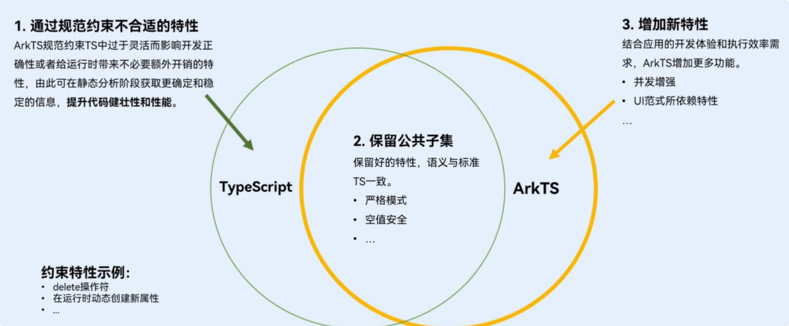

#  ArkTS
>  HarmonyOS-NEXT-ArkTS
> 本文档基于NEXT版本DevEco Studio5.0API12
---

## ArkTS基础语法

### 编程语言介绍

#### 什么是ArkTS?

ArkTS是HarmonyOS生态的应用开发语言。

* ArkTS提供了声明式UI范式、状态管理支持等相应的能力，让开发者可以以更简洁、更自然的方式开发应用
* 同时，它在保持TypeScript（简称TS）基本语法风格的基础上，进一步通过规范强化静态检查和分析，使得在程序运行之前的开发期能检测更多错误，提升代码健壮性，并实现更好的运行性能。
* 针对JS/TS并发能力支持有限的问题，ArkTS对并发编程API和能力进行了增强。
* ArkTS支持与TS/JS高效互操作，兼容TS/JS生态。
* API10/11及其以上逐渐演进，扩展现代语言特性，新增了`静态类型`、`并发增强`、`空值安全`等机制

#### ArkTS基于TypeScript的增强

​	ArkTS基于TypeScript的增强：**规范的代码更好地保证正确性和性能**



##### ArkTS相对TS的约束示例：

###### 1、强化静态类型检查：

​	**ArkTS要求所有类型在程序实际运行前都是已知的，减少运行时的类型检测，提升性能**

* 如下ts正常的代码，在arkts中则会报错。编译器不知道变量`area`的类型，也无法很好优化

```typescript
//ArkTS相对TS的约束示例：
// TypeScript
const area = { // ArkTS中会报错
  pixels: new ArrayBuffer(8),
  offset: 0,
  stride: 8,
  region: {
    size: {
      height: 1,
      width: 2
    },
    x: 0,
    y: 0
  }
}
```

* 在arkts中，应给出名确类型

```typescript
//ArkTS相对TS的约束示例：
import { image } from '@kit.ImageKit'

// ArkTS
const area:image.PositionArea = {
  pixels: new ArrayBuffer(8),
  offset: 0,
  stride: 8,
  region: {
    size: {
      height: 1,
      width: 2
    },
    x: 0,
    y: 0
  }
}
```

###### 2、限制在运行时改变对象布局：

​	**为实现最大性能，ArkTS要求在程序执行期间不能更改对象布局。**

* TS代码

```typescript
class User{
  name:string = ''
  age:number = 20
}
let user = new User()
(user as any).department = 'XX'
delete (user as any).department
```

* ArkTS代码

```typescript
// 2、限制在运行时改变对象布局：为实现最大性能，ArkTS要求在程序执行期间不能更改对象布局。
class User{
  name:string = ''
  age:number = 20
  department?:string   // 初始声明为可选
}
let user = new User()
user.department = 'XX'    // 为可选属性复制
user.department = undefined // 置空可选属性
```

#### ArkTS基于TypeScript的拓展

##### ArkTS的对UI的拓展

######  1、UI描述：

​		UI描述语法提供了各种装饰器、自定义组件和UI描述机制，再配合UI开发框架中的UI内置组件事件方法、属性方法等共同构成了应用开发的主体。

###### 2、状态管理：

​		状态管理语法实现UI相关联的数据在组件内、组件间、页面间、应用内以及跨设备传递


----

### 基本知识

#### 声明

ArkTS中可以通过关键字let声明变量，使用const声明一个常量，并通过类型注释指定类型

##### 变量声明

```typescript
let count:number = 0;
count = 40;
```

##### 常量声明

```typescript
const MAX_COUNT: number = 100;
```

#### 类型

##### **基本类型 ：`string`、`number`、`boolean`、`enum`**

```typescript
// 基本类型 ：`string`、`number`、`boolean`、`enum`
let name: string = '帝心';
let age: number = 32;
let isMale: boolean = true;
console.log(name);  //输出: 帝心
console.log(age.toString()); // 输出: 32
console.log(` My name is ${name}, and I am ${age} years old`) // 输出： My name is 帝心 , and I am 32 years old
enum Color{
  Red,
  Blue,
  Green
}
let favouriteColor: Color = Color.Red;
```

##### **引用类型：`Array`、`自定义类`**

```typescript
//引用类型：Array、自定义class类
let students1: Array<string> = ['帝心', '鸿蒙诗人', '不多先生', '鸿蒙之父']
let students2: string[] = ['帝心', '鸿蒙诗人','不多先生','鸿蒙之父']
class User {
  // ...
};
let user: User = new User();
```

##### **联合类型：Union**

```typescript
// 联合类型：Union 允许变量的值为多个类型
let LuckyNum:number|string = 7
LuckyNum = 'seven'
```

**类型别名：`Aliases`**

```typescript
// 类型别名：Aliases 允许给一个类型取一个别名，方便理解和复用
type Matrix = number[][];
type NullableObject = Object | null;
```

#### **空安全**

```typescript
//变量声明时可为空值
let name: string | null = null;
//console. log(name.length.toString()); // Error Message:Cannot read property length of nul
// 空值安全判断
// 1、使用if/else 进行判空
if (name != null) {
  /* do something */
}
// 2、使用空值合并表达式，?? 左边的值为null时会返回表达式右边的值
const res = name ?? '';
// 3、 在NEXT之前： 使用 ?. 可选链，如果是 null，运算符会返回 undefined。 在后续的演化中，null不能调用属性。?.运算符也不能
// let len = name?.length

```

>  在NEXT之前： 使用 `?.` 可选链，如果是 `null`，运算符会返回 `undefined`。 在后续的演化中，`null`不能调用属性。`?.`运算符也不能
>
> 但是，如果是直接给变量赋值了确定的`null`或者`undefined`。那么就会识别到。如果是动态赋值。那么就识别不到该变量是不是`null`或者`undefined`，就可以使用`?.`操作

##### **类型安全与类型推断**

ArkTS是类型安全的语言，编辑器会进行类型检查，实时提示错误信息

```typescript
let name : string = '帝心'
//name = 20 //Type 'number' is not assignable to type 'string'. <ArkTSCheck>
```

ArkTS支持自动类型推导，没有指定类型时，ArkTS支持使用类型推断自动选择合适的类型

```typescript
let meaning0fLife = 42; // meaningofLife 会被推测为 number类型
```

#### **语句**

##### 条件语句

用于基于不同的条件来执行不同的动作，根据判断条件的执行结果（true或false）来决定执行的代码块。

```typescript
let isValid1: Boolean = false;
if (Math.random() > 0.5) { //生成 0-1  随机数
  isValid1 = true
} else {
  isValid1 = false;
}
```

##### 条件表达式  三目运算

```typescript
let isValid2 = Math.random() > 0.5 ? true : false;
```

##### 循环语句

用于重复执行相同的一组语句，提高效率、简化代码

```typescript
let students: Array<string> = ['帝心', '鸿蒙诗人', '不多先生', '鸿蒙之父']
// for 循环语句
for (let i = 0; i < students.length; i++) {
  console.log(students[i])
}
// while 虚幻语句
let index = 0
while (index < students.length) {
  console.log(students[index])
  index++
}
// for...of 循环语句
for(let student of students){
  console.log(student)
}
```

---

### 函数声明和使用

函数是一组一起执行多条语句的组合，形成可重用的代码块。通过function关键字声明要告诉编译器函数的名称、返回类型和参数以及执行的内容；


```typescript
function printStudentsInfo(students: string[]): void {
  for (let student of students) {
    console.log(student);
  }
}
printStudentsInfo(['帝心', '鸿蒙诗人', '不多先生', '鸿蒙之父'])
printStudentsInfo(['帝心', '鸿蒙诗人', '不多先生'])
```

#### 箭头函数 / lambda表达式

简化函数声明，通常用于需要一个简单函数的地方


箭头函数的返回类型可以省略，省略时，返回类型通过函数体推断

```typescript
(name: string): void => { console.log(name) };
```

函数体只有一行的情况下可以省略花括号

```typescript
const printInfo = (name: string) => console.log(name);
printInfo('帝心');
```

箭头函数常用于作为回调函数

```typescript
let students: string[] = ['帝心', '鸿蒙诗人', '不多先生', '鸿蒙之父']
students.forEach((student: string) => console.log(student));
```

#### 闭包函数

 一个函数可以将另一个函数当做返回值，保留对内部作用域的访问。

```
function outerFunc(): () => string {
  let count = 0
  return (): string => {
    count++;
    return count.toString() //返回一个函数
  }
}

let invoker = outerFunc()
console.log(invoker()) // 输出:1
console.log(invoker()) // 输出:2
```

#### 函数类型 

>  将一个函数声明定义为一个类型，函数参数或者返回值

```typescript
type returnType = () => string;

// 声明一个函数类型
function outerFunc(): returnType { //使用该类型作为返回类型
  let count = 0
  return (): string => {
    count++;
    return count.toString()
  }
}

let invoker = outerFunc()
console.log(invoker()) // 输出:1
console.log(invoker()) // 输出:2
```

----

### 类的声明和使用

#### 类的声明

ArkTS支持基于类的面向对象的编程方式，定义类的关键字为class，后面紧跟类名。类的声明描述了所创建的对象共同的属性和方法。

```typescript
class Person {
  name: string = '帝心';
  age: number = 20;
  isMale: boolean = true;
}
```

#### 类的创建

```typescript
const person1 = new Person();    // new实例创建
console.log(person1.name) 			// 输出: 帝心

const person2: Person = { name: '帝心', age: 29, isMale: true} // 字面量创建
console.log(person2.name)		 // 输出: 帝心
```

#### 构造器

constructor用于实例化时进行初始化操作

```typescript
class Person {
  name = 'Xiaoming'
  age: number = 20
  isMale: boolean = true

  constructor(name: string, age: number, isMale: boolean) {
    this.name = name;
    this.age = age;
    this.isMale = isMale;
  }
}

const person = new Person('帝心', 32, false);      //通过传入参数实例化
console.log(person.name) // 输出：帝心
```

#### 方法

用于描述定义类的实例对象具有的行为

```typescript
class Person {
  name: string = '帝心';
  age: number = 20;
  isMale: boolean = true;

  constructor(name: string, age: number, isMale: boolean) {
    this.name = name;
    this.age = age;
    this.isMale = isMale;
  }

  printInfo() {
    if (this.isMale) {
      console.log(`${this.name}is a boy, and he is ${this.age}years old`);
    }else {
      console.log( `${this.name}is a girl, and she is ${this.age}years old`);
    }
  }
}
const person: Person = new Person('帝心',28,true);
person.printInfo() // 帝心 is a boy, and he is 28 years old
```

#### 封装

将数据隐藏起来，只对外部提供必要的接口来访问和操作数据，确保数据的一致性和安全性。

> 注意下划线的使用

```typescript

class Person {
  // 可见性修饰符包括：private、protected和public默认可见性为public
  public name: string = '帝心';
  private _age: number = 20;
  isMale: boolean = true;

  constructor(name: string, age: number, isMale: boolean) {
    this.name = name;
    this.age = age;
    this.isMale = isMale;
  }

  // 私有变量通过getter和setter进行访问控制
  get age(): number {
    return this._age
  }

  set age(age: number) {
    this._age = age
  }
}

const person: Person = new Person('帝心', 28, true);
// console.log(person._age.toString()) // 无法直接访问私有属性
console.log(person.age.toString()) // 无法直接访问私有属性
```

#### 继承

子类继承父类的特征和行为，使得子类具有父类相同的行为。ArkTS中允许使用继承来扩展现有的类，对应的关键字为extends。

> 被继承的`Person`类使用前文：`方法`小节中的`Person`

```typescript
class Employee extends Person {
  // 在演化版本中要求属性给初始化值。否则用 ? 表示可空
  department: string = '教学部'

  constructor(name:string,age:number,isMale:boolean,department:string) {
    super(name,age,isMale)
    this.department = department
  }
}
const employee:Employee = new Employee('帝心',32,true,'鸿蒙教研组')
employee.printInfo() // 出: 帝心 is a boy, and he is 32 years old
```

#### 多态

子类继承父类，并可以重写父类方法，使不同的实例对象对同一行为有不同的表现

```typescript

class Employee extends Person {
  // 在演化版本中要求属性给初始化值。否则用 ? 表示可空
  department: string = '教学部'

  constructor(name:string,age:number,isMale:boolean,department:string) {
    super(name,age,isMale)
    this.department = department
  }

  // 重写父类方法
  public printInfo(): void {
    super.printInfo()
    console.log(`working in ${this.department}`)
  }
}

const person: Person = new Person('帝心', 28, true)
// 父类行为
person.printInfo(); // 输出: 帝心 is a boy, and he is 28 years old

const employee:Employee = new Employee('帝心',32,true,'鸿蒙教研组')
//子类行为  与父类相同的行为 有不同的表现
employee.printInfo() // 输出： 帝心 is a boy, and he is 32 years old working in 鸿蒙教研组
```

---

### 模块导入与导出

#### 模块的定义

* 一个ArkTS文件的作用域是独立的


* 通过export导出一个文件的变量、函数、类等

```typescript
export class Person {
  name: string = '帝心';
  age: number = 20;
  isMale: boolean = true;

  //省略构造器内容
  printInfo() {
    if (this.isMale) {
      console.log(`${this.name}is a boy, and he is ${this.age}years old`);
    } else {
      console.log(`${this.name}is a girl, and she is ${this.age}years old`);
    }
  }
}
```

* 通过import导入另一个文件的变量、函数、类等

```typescript
//***.ets
import { Person } from'./Person';
const person = new Person('帝心',20,true)
person.printInfo()// 输出: 帝心 is a boy ,and he is 20 years old
```

---

## 声明式UI语法

### 声明式UI的特征

* 声明式描述

* 状态驱动视图更新


在ArkTS中 ，状态是驱动应用变化的数据，视图则是与状态相关联的UI内容。当状态改变时，框架会自动更新与状态相关联的视图实现内容的动态。 


### 创建自定义组件

> 尤雨溪：看文档！

### 配置属性与布局

>  尤雨溪：很多人就是不看文档！

### 改变组件的状态

> 尤雨溪：看文档！

### 渲染列表数据

> 尤雨溪：看文档！


