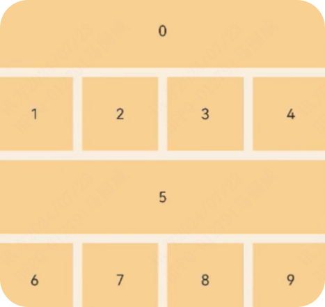

---
sidebar_position: 101
---

# 开发者认证题库版本2


> [本题库源md文件](https://gitee.com/mayuanwei/harmonyOS_bilibili/blob/master/website/docs/tutorial/resources/tiku.md)
>
> > 题库逐渐更新，右上角gitee的star请三联一下，方便后期找到该仓库。
> >
> > 参考于网友，博客，视频等。对贡献者表示感谢。

### 单选

---

应用发生崩溃，（）接口可以获取到崩溃时调用栈

A、`hiLog`

B、`hiTraceMeter`

C、`hiDebug`

**D、`hiAppEvent`**

---

AppEvent +提供的watcher接口，需要订阅到OS的崩溃事件，正确的实现方式()

**A**

```
hiAppEvent.addwatcher({
    name: "watcher",
    appEventFilters: [
        {
            domain: hiAppEvent.domain.oS,
            names: [hiAppEvent.eVent.APP_CRASH]
        }
    ]，
    onReceive: (domain: string, appEventGroups:Array<hiAppEvent.AppEventGroup>) => {}
})
```

B

```
hiAppEvent.addwatcher({
    name:"watcher"，
    onReceive: (domain: string, appEventGroups:Array<hiAppEvent.AppEventGroup>) => {}
})
```

C

```
hiAppEvent.addwatcher({
    name:"watcher"，
    appEventFilters:[
        {
            names:[hiAppEvent.eVent.APP_FREEZE]
        }
    ]，
    onReceive:(domain: string, aappEventGroups:Array<hiAppEvent.AppEventGroup>)=>{}
})
```

D

```
hiAppEvent.addwatcher({
    name:"watcher"，
    appEventFilters:[
        {
            domain: hiAppEvent.domain.oS,
            names:[hiAppEvent.eVent.APP_CRASH]
        }
    ]
})
```

---

在`UIAbility`的`onCreate`生命周期中通过`EventHub`的on注册"`event1`"和"`event2`"事件。

```
import{hilog}from'@kit.PerformanceAnalysisKit';
import{UIAbility,Want,AbilityConstant} from'@kit.AbilityKit';

const DOMAIN_NUMBER:number = 0xFF00;
const TAG: string ='[EventAbility]';
export default class EntryAbility extends UIAbility{
  onCreate(want:Want,launchParam:AbilityConstant.LaunchParam):void{
    //获取UIAbility实例的上下文
    let context  = this.context;
    //获取eventHub
    let eventhub=this.context.eventHub;
    //执行订阅操作
    eventhub.on('event1',this.eventFunc);
    eventhub.on('event2',this.eventFunc);

    hilog.info(DOMAIN_NUMBER,TAG,'%{public}s','AbilityonCreate');

  }

  eventFunc(argOne:Context,argTwo:Context):void{
    hilog.info(DOMAIN_NUMBER,TAG,'receive.'+${argOne},${argTwo});
    return;
  }
}
```

在Ul组件的click处理事件中调用如下的`eventHubFunc`，连续点击2次该控件后，运行日志输出是什么：

```
import common from '@kit.AbilityKit';
import{promptAction} from '@kit.ArkUI'

@Entry
@Component
struct Page_EventHub {
  private context=getContext(this) as common.UIAbilityContext;
  eventHubFunc():void{
    this.context.eventHub.emit('event1');
    this.context.eventHub.emit('event2',2,'test2');
    this.context.eventHub.off('event1');
  }
  build() {
    Column(){
      // ...
      List({initialIndex:0}){
        ListItem(){
          Row(){
            // ...
          }
          .onClick(() => {
            this.eventHubFunc()
            promptAction.showToast({
              message:$r('app.string.EventHubFuncA')
            })
          })
        }
      }
    }
  }
}
```

**A、**

```
**[Example].[Entry].[EntryAbility]receive.[]**

**[Example].[Entry].[EntryAbility] receive.[2,"test2"]**

**[Example].[Entry].[EntryAbility] receive. [2,"test2"]**
```

B、

```
[Example].[Entry].[EntryAbility]receive.[]

[Example].[Entry].[EntryAbility]receive.[2,"test2"]

[Example].[Entry].[EntryAbility]receive.[]
```

C、

```
[Example].[Entry].[EntryAbility]receive.[]

[Example].[Entry].[EntryAbility] receive. [2,"test2"] 
```

D、

```
[Example].[Entry].[EntryAbility]receive.[]

[Example].[Entry].[EntryAbility]]receive.[2,"test2"]

[Example].[Entry].[EntryAbility]receive.[]

[Example].[Entry].[EntryAbility]]receive.[2,"test2"]
```


---

在方舟字节码的函数调用规范中，前三个参数表示的含义分别是

A.`new.Target`、函数对象本身、`this`

B．`this`、函数对象本身、`new.Target`

**C.  函数对象本身、\`new.Target`，`this`** 

D. `new.Target`、`this`、函数对象本身

---

下关于Taskpool和worker的描述正确的是

A. 开发者需要自行管理taskpool的数量及生命周期

**B. TaskPool支持任务延时执行**

C. Worker自行管理生命周期，开发者无需关心任务负载高低

D. TaskPool和Worker的任务执行时长上限都是无限制

---

如果要实现Row组件内的子元素均匀排列，且第一个元素与行首对齐，最后一个元素与行尾对齐，需要使用justifycontent的哪个枚举值

**A.`SpaceBetween`**

B.`SpaceEvenly`

C.`Start`

D.`End`

---

下面哪种转场效果在入场动画时，表现为从透明度为0、相对于组件正常显示位置×方向平移100vp的状态，到默认的透明度为1、相对于组件不平移的状态，且透明度动画和平移动画的动画时长均为2000ms

A.`TransitionEffect.translate(( x:100 ).combine(TransitionEffect.OPACITY.animation(({duration: 2000} )`

**B.`TransitionEffect.OPACITY.animation(( duration: 2000 ).combine(TransitionEffect.translate( x:100 )`**

C.`TransitionEffect.OPACiTY.combine(TransitionEffect.translate({x:100}).animation((duration:2000})`

D. `TransitionEffect.asymmetric(TransitionEffect.OPACITY.animation(t duration:2000 ), TransitionEffectranslate(f x:100).animation(( duration:2000 })`

如果想让`router` `button`响应事件，`hitTestBehavior`该怎么配

A.`HitTestMode.None`

B.`HitTestMode.Default`

**C.`HitTestMode.Transparent`**

D.`HitTestMode.Block`

依次点击A、B、C、D四个按钮，其中不会触发UI刷新的是

```
class Info {
    name: string;
    constructor(name: string) {
        this.name = name;
    }
 }
 ...
```

**A. C**

B.B

C. D

D.A

---

下关于ArkUI NavDestination组件的生命周期执行顺序中正确的是

**A. `onWillappear->onAppear->onWillShow->onShow->onWillHide->onHidden->onWilIDisappear->onDisappear`** 

B. `onWillappear->onAppear->onWillShow->onShow->onWillHide->onWillDisappear->onHiden->onDisappear`

C.`onWillappear->onWillShow->onShow->onAppear->onWillHide->onHidden->onWillDisappear->onDisappear` 

D. `onWillappear->onAppear->onWilShow->onShow->onWilIDisappear->onWillHide->onHidden->onDisappear`

---

开发者小李遇到了一个复杂的问题，该问题仅在特定的代码执行路径上出现，且难以复现。他使用的是c++进行核心算法开发，代码的逻辑密集且对性能要求极高，DevEcostudio为c/C++开发者提供的高级调试能力，以下哪个能力可以帮助小李查看代码历史执行路径，回溯到关键的变量状态

A.实时代码修改与运行时效果查看：支持在调试过程中修改代码并立即查看修改效果，适用于快速迭代，但不聚焦于问题追溯

**B.反向调试能力：允许开发者在调试过程中回退回到之前的代码行或\****断点，不仅查看过去的堆栈信息，还能重现历史的全局、静态和局部变量状态，帮助深入理解代码历史行为，特别是对于复杂逻辑和难以复现的bug定位至关重要**

C.代码静态分析：提供静态代码检查工具，通过语法和逻辑分析帮助预防潜在错误，但不涉及运行时问题定位

D.传统调试模式：仅允许在当前断点暂停代码执行，查看调用堆栈和当前变量信息，但无法追溯历史执行状态

目前您在开发一个`ArkTS`、`Stage` 模型的 `Harmonyos`工程，关于当前`ArkTs` 工程目录结构，下列选项说法错误的是？

A.`oh-packagejson5`:描述依赖配置，如:依赖覆盖盖(`overides`)、依赖关系重写(`overideDependencyMap`)和参数化配置(`parameterFle`)等

**B.`build-profilejson5`:应用级编译构建任务脚本。**

C.`AppScope>appjson5`:应用的全局配置信息。

D.`entry> src> main >moduejson5`：Stage 模型模块配置文件，主要包含 HAP 的配置信息、应用在具体设备上的配置信息以及应用的全局配置信息

---

`EcoStudio`提供`Harmonyos`应用/服务的ui预览界面与源代码文件间的双向预览功能，支持ets文件与预览器界面的双向预览。关于双向预览，下列选项说法错误的是

A.选中预览器ui界面中的组件，则组件树上对应的组件将被选中，同时代码编辑器中的布局文件中对应的代码块高亮显示。

**B.双向预览不支持通过组件的属性面板实时修改属性或样式。**

C.选中布局文件中的代码块，则在u界面会高亮显示，组件树上的组件节点也会呈现被选中的状态

D.选中组件树中的组件，则对应的代码块和u界面也会高亮显示。

HAR(Harmony Archive)是Harmonyos提供的共享包，以下关于 HAR的描述错误的是

**A.HAR 不支持使用 page 页面。**

B.HAR 不支持引用 AppScope 目录中的资源。在编译构建时,AppScope中的内容不会打包到HAR 中，因此会导致HAR 资源引I用失败。

C.HAR可以作为二方库和三方库提供给其他应用使用，如果需要对代码资产进行保护时，建议开启混淆能力。

D.HAR不支持在设备上单独安装/运行，只能作为应用模块的依赖项被引用。

---

want参数的entities匹配规则错误的是

**A、调用方传入的want参数的entities为空，待匹配应用组件的skills配置中的entities不为空，则entities匹配失败。**

B、调用方传入的want参数的entities为空，待匹配应用组件的skills配置中的entities为空，则entities匹配成功。

C、调用方传入的want参数的entities不为空，待匹配应用组件的skills配置中的entities为空，则entities匹配失败。

D、调用方传入的want参数的entities不为空，待匹配应用组件的skills配置中的entities不为空且包含调用方传入的want参数的entities，则entities匹配成功。

---

作为一个应用开发者，想搭建运维平台，想在应用内定时读取当前的内存信息，可以通过（）接口来实现。

A. hiChecker

**B. hiDebug**

C. hiAppEvent

D.hiLog

---

关于ArkUI的ForEach和LazyForEach，下列说法错误的是？

A、LazyForEach需要配合cachedCount和组件复用一起使用，以达到性能的最优表现。

B、ForEach和LazyForEach会根据定义的键值生成规则为数据源的每个数组项生成唯一键值，并创建相应的组件。

**C、长列表滚动场景，优先使用\****ForEach。**

D、当在滚动容器中使用了LazyForEach，框架会根据滚动容器可视区域按需创建组件，当组件滑出可视区域外时，框架会进行组件销毁回收以降低内存占用。

---

根据上面代码，以下解释正确的是

```
enum Mode{
    fullScreen,
    halfScreen
}

@Entry
@Component
struct Page {
  @State title:string  = ""
  @State mode:Mode  = Mode.fullScreen

  isShownTitle():boolean {
    if (this.mode == Mode.fullScreen) {
      this.title = "Title"
      return true
    }else {
      this.title= "Section"
      return false
    }
  }
  build() {
    Column(){
      if (this.isShownTitle()){
        Text(${this.title})
      }else {
        Text(${this.title})
      }
      ChangeMode({mode:this.mode})
    }
  }
}

@Component
struct ChangeMode {
  @Prop mode:Mode;
  build() {
    Row({space:20}){
      Button('full screen')
        .onClick(() => {
          this.mode = Mode.fullScreen
        })
      Button('half scrtten')
        .onClick(() => {
          this.mode = Mode.halfScreen
        })
    }
  }
}
```

> 本道题目A确实没毛病。也有人选C。

**A、本例子可以运行起来，所以代码没有问题。**

B、为了避免`@Prop`的拷贝，可以优化使用`@Lin`k，在该例子中行为和`@Prop`一样。

C、在自定义组件`Page`的`build`方法里改变状态变量是非法操作，可能导致未定义的异常UI行为

D、在`ChangeMode`里改变`mode`的值，会触发其父组件`Page`的Title`内容`的切换。

---

下示例代码中可以进行动画的属性有哪些？

```
@component
struct Mycomponent{
    @state compwidth:number = 100;
    @stalecompHeight: number = 100;
    @state compRadius: number = 32;
    build() {
        Column(){}.width(this.compwidth)//1
        .height(this.compHeight)//2
        .animation({curve:Curve.Ease，duration: 200 })
        .borderRadius(this.compRadius)//3
        .onclick(O=>{
            this.compwidth+=10;   
            this.compHeightt += 10;
            this.compRadius5+=4；
        })
    }
}
```

A.1、3

B.2、3

**C.1、2、3**

D.1、2

----

以下哪些赋值语句在ArkTS中是合法

```
classc{}
let valuel: number= null;
let value2:string | null = nul1;
let value3: string | undefined= null;
let value4:C =  nul1;
```

A. value3

**B. value2**

C. value1

D.value4

----

以下哪些赋值语句在ArkTS中是合法的

```
class A {
    V: number = 0;
}
class B extendsA{
    u: string = '' 
 }
class c{
    v: number = 0;
}
let al: A = new C();
let a2: A = new B();
let a3: B = new A();
let a4: C = new B();
```

**A. a2**

B. a1

C. a4

D. a3

---

singleton模式的ulAbility，在冷启动时生命周期的执行顺序是：

A. `onCreate -> onForeground -> onWindowStageCreate`

B. `onCreate -> onBackground -> onForeground`

C. `onCreate -> onBackground -> onWindowStageCreate`

**D. `onCreate -> onWindowStageCreate -> onForeground`**

---

以通过下面那个接口拉起导航类的垂域面板

A. startAbility

**B. startAbilityByType**

C.startAbilityForResult

D. startAbilityByCall

---

为了提高性能，所以List组件支持懒加载，可以通过配置cachedCount属性设置缓存列表项的数量。当我们不设置List的属性生cachedcount时，该属性的默认值是？

A.3

B.0

C.2

**D.1**

---

应用程序开发调试过程中经常需要安装新应用进行调测，下面安装应用操作错误的是+

**A. `hdc install -p ohosapp.hap**` 

B. `bm install -p /data/app/`

C. `bm install -p ohosapp.hap`

D. `bm install -p ohosapp.hap -r`

---

关于短时任务开发使用的接口是

A.使用 startWork 申请任务，使用 stopWork取消任务，使用getWorkStatus 获取任务状态

**B.使用requestSuspendDelay申请任务，使用 getRemainingDelayTime 获取任务剩余时间**

C.使用publishReminder发布一个提醒类通知，使用cancelReminder取消一个指定的提醒类通知

D.使用 startBackgrcondRunning 申请任务，使用 stopBackgroundRunning取消任务

---

list组件onScrolllndex事件触发时机是

**A.List组件首次加载完成时触发**

B.List组件列表滚动时每帧触发

C.List组件滚动停止时触发

D.List组件显示区域内第一个子组件或最后一个子组件或中间位置子组件索引值变化时触发

---

---

下关于垂直滚动Grid组件使用cachedCount属性的说明正确的是

**A.设置cachedCount为1，则\****Grid在显示范围上下各缓存1个Gridltem**

B.设置cachedCount为1，则Grid在显示范围上下各缓存1行Gridltem

C.设置cachedCount为1，则Grid在显示范围下方缓存1个Gridltem

D.设置cachedCount为1，则Grid在显示范围下方缓存1行Gridltem

---

下哪份代码可以实现下图Grid布局



A.通过设置Gridltem的columnStart和columnEnd

**B.通过GridLayoutOptions**

C.通过设置不同Gridltem的宽度

---

开发者小林正在使用DevEcoStudio开发一款Harmonyos应用，并在真机上进行调试。他在运行应用的过程中突然发现一处ui布局需要微调，希望在不中断当前应用运行的情况下看到调整效果，基于DevEcoStudio提供的Hot Reload（热重载）能力，以下哪种做法能让小林最有效地实现他的需求

**A.在不关闭应用的情况下，直接修改代码并保存，借助HotReload功能在真机上实时查看布局调整的效果**

B.使用模拟器替代真机进行调试，因为HotReload仅在模拟器上支持代码改动的即时生效

C.继续运行应用，手动重启应用后检查布局是否符合预期

D.立即停止应用、修改代码后重新编译并部署到真机上

---

小华正在使用DevEco studio开发一款基于Harmonyos的Arkun应用，该应用需要实现一个功能，即当用户点击按钮时，通过ArkTS/JSAPI调用系统的分享功能。小华对具体的Api调用细节不太熟悉，如何通过DevEcoStudio快速查阅相关的API文档。

A.小华在代码编辑区直接键入分享功能相关的APi调用代码，如 arkuilgetShareO，然后按F1键，期望编辑器能自动跳转到该API的文档页面。

B.小华右键点击代码编辑区，选择“Find Usages"选项，试图从其他地放引l用该API的实例中学习如何使用分享功能

C.小华应该先停止编码工作，打开浏览器，手动搜索关键词“HarmonyOs ArkUI分享AP"，，在官方网站的文档页面中寻找相关API的使用方法。

**D.小华将鼠标悬停在编辑器中已经键入或打算键入的API调用（例如@system.router.push )上等待编辑器自动弹出悬浮提示框，显示该API的简要信息和不同版本参数说明。随后，点击提示框右下角的“ShowinAPI Reference”链接。直接跳转到详尽的API参考文档页面。**

---

用DevEcoStudio进行复杂的跨设备功能开发与调试工作，_期间频繁依赖本地模拟器来模拟多样化的设备环境。在这样的背景下，以下关于DevEcoStudio本地模拟器所支持的规格与功能，哪一项描述是准确的

A.本地模拟器当前不支持单元测试框架和UI测试框架的运行

**B.本地模拟器上运行的应用无需进行签名，简化了调试过程**

C.本地模拟器和真机的能力没有任何差异，真机上可以支持的能力在模拟器上都可以

D.本地模拟器当前不支持查看HiLog以及FaultLog

---

### 多选

---

以下代码片段哪几处违反了ArkTS语法规范

```
function foo(valuel:number, value2?：number){
return valuel + value2;
}
foo();
foo(1, 2);
foo(1,2,3);
foo(1,2,3,4) ;
```

**A. fo0(1,2,3,4);** 

**B.foo();**

C.foo(1,2);

**D.foo(1,2,3);** 

---

下面关于Node-API数据类型描述正确的是

**A、`napi_env`:用于表示Node-API执行时的上下文**

**B、`napi_status`:是一个枚举数据类型，表示Node-APl接口返回的状态信息**

C、`napi_threadsafe_function_call_mode`：该枚举类型定义了两个常量，用于指定在何时释放线程安全函数的回调函数

D、napi_threadsafe_function_release_mode：该枚举类型定义了两个常量，用于指定线程安全函数的调用模式

---

ArkTS是鸿蒙生态的应用开发语言。下列说法正确的是

**A.ArKTS提供了声明式\****UI范式、状态管理支持等相应的能力，让开发者可以以更简洁、更自然的方式开发应用。**

**B.ArKTS在保持TypeScrpt(简称TS)基本语法风格的基础上，进一步通过规范强化静态检查和分析，使得在程序运行之前的开发期能检测更多错误，提升代码健壮性，并实现更好的运行性能。**

C.TS/JS代码支持import ArkTS代码。

**D.针对JavaScript(简称JS)/TS并发能力支持有限的问题，ArkTS对并发编程API和能力进行了**

---

关于动态import描述正确的是

**A.动态import根据入参是否为常量字符串分为常量动态import和变量动态import两种**

**B.动态导入import(是个异步接口，调用后将返回一个promise**

**C.HAR模块间只有变量动态import时可以进行模块\****解耦**

D.常量动态import也必须配置runtimeOnly选项

---

hiAPPEvent提供Watcher接口，订阅到的系统事件，那些包含HiLog日志

**A.卡死事件**

**B.崩溃事件**

**C.启动耗时事件**

**D.CPU高负载事件**

---

用户购买商品后，你需要及时发放相关权益。但实际应用场景中，若出现异常将导致应用无法知道用户实际是否支付成功，从而无法及时发放权益，即出现调单情况，为了确保权益发放，你需要在以下那些场景检查用户是否存在已购未发货商品：

A. finishPurchase请求返回1001860052-由于未拥有该商品，发货失败时

**B. createPurchase请求返回1001860051-由于已经拥有该商品，购买失败时**

**C. 应用启动时**

**D createPurchase请求返回1001860001-内部错误时**

---

以下哪些方式可以实现ArkWeb同层渲染能力

A、

```
Web(...).enableNativeEmbedMode(true)
<object id="view" type="native/contents" width="100%" height="100%" style="background-color:red"/>
```

B、

```
Web(...).enableNativeEmbedMode(true).registerNativeEmbedRule('object','test')
<object id="view" type="test/contents" width="100%" height="100%" style="background-color:red"/>
```

**C、**

```
Web(...).enableNativeEmbedMode(true).registerNativeEmbedRule('native','test')
  <object id="view" type="native/contents" width="100%" height="100%" style="background-color:red"/>
```

**D、**

```
Web(...).enableNativeEmbedMode(true)
<embed id="view" type="native/contents" width="100%" height="100%" style="background-color:red"/>
```

---

以下关于Taskpool和Worker的描述正确的是

A.Worker支持取消已发起的任务

**B.Worker的任务执行时长上限是无限制**

C.TaskPool不支持线程复用

**D.TaskPool支持设置任务的优先级**

---

ArkTS是鸿蒙生态的应用开发语言。以下哪些选项是ArkTs的设计理念

A.ArkTS不支持null-satety特性。

**B.通过规范强化静态检查和分析，减少运行时的类型检查，从而降低了运行时负载，提升执行性能。**

**C.通过规范强化静态检查和分析，使得许多错误在编译时可以被检测出来，降低代码运行错误的风险。**

**D .ArkTS保留了\****TS大部分的语法特性，帮助开发者更容易上手ArkTS。**

---


## 待校验答案

---

### 单选题

---

1. ArkTS支持以下哪些函数

A、`Object.isPrototypeOf();`

B、`Object.getOwnPropertySymbols()`

**C、 `Object.keys();`**

D、`Object.isExtensible();`

---

2. 以下哪个装饰器用来表示并发共享对象

A、`@Shared`

**B、`@Sendable`**

C、`@Style`

D、`@State`

---

3. ArkTS支持以下哪个函数？

A、`Object.getOwnPropertyDescriptors();`

**B、`Object.values();`**

C、`Object.hasOwnProperty();`

D、`Object.getOwnPropertyDescriptor();`

---

4. 下面关于方舟字节码格式IMM16_ID16_IMM8描述正确的是

**A、8位操作码，16位立即数，16位id，8位立即数**

B、8位操作码，16位立即数，2个8位寄存器

C、8位操作码，16位立即数，16位id，8位寄存器

D、16位前缀操作码，16位立即数，8位寄存器


5. 下面关于方舟字节码格式`PREF_IMM16_V8_V8`描述正确的是

A、16位前缀操作码，16位立即数，8位寄存器

**B、16位前缀操作码，16位立即数，2个8位寄存器**

C、8位操作码，8位立即数，16位id，8位寄存器

D、8位操作码，8位立即数，2个8位寄存器

---

6. 已知下列代码`PageOne`页面为`navigation`中的某一子页面，依次点击`PageOne`页面中`toPageTwo`按钮，`PageTwo`页面中`toPageOne`按钮，此时点击`get`按钮获取全部名为`name`的`NavDestination`页面的位置索引为

```typescript
@Component
export struct PageOneTmp {
  @Consume('pageInfos') pageInfos:NavPathStack;
  build() {
    NavDestination(){
      Column(){
        Button('toPageTwo',{stateEffect:true,type:ButtonType.Capsule })
          .width('80%')
          .height(40)
          .margin(20)
          .onClick( ()=>{
            this.pageInfos.pushPathByName('pageTwo',"")
          })
        Button('get',{stateEffect:true,type:ButtonType.Capsule})
          .width('80%')
          .height(40)
          .margin(20)
          .onClick(() => {
            console.log('取全部名为name的NavDestination页面的位置索',JSON.stringify(this.pageInfos))
          })
      }.width('100%').height('100%')
    }
    .title('pageOne')
    .onBackPressed(() => {
      const popDestinationInfo = this.pageInfos.pop()
      console.log('pop'+'返回值'+JSON.stringify(popDestinationInfo))
      return true
    })
  }
}
//PageTwo.ets
export class Pages{
  name:string = ""
  values:NavPathStack | null = null
}

@Builder
export function pageTwoTmp(info:Pages){
  NavDestination(){
    Column(){
      Button('toPageOne',{stateEffect:true,type:ButtonType.Capsule })
        .width('80%')
        .height(40)
        .margin(20)
        .onClick( ()=>{
         (info.values as NavPathStack).pushPathByName('pageOne',"")
        })
    }.width('100%').height('100%')
  }
  .onBackPressed(() => {
    (info.values as NavPathStack).pop()
    return true
  })
}
```

A、[1,2]

B、[0,2]

C、[2,1]    

D、[0,1]

---

7. 根据上面代码，以下解释正确的是

```
enum Mode{
	fullScreen,
	halfScreen
}

@Entry
@Component
struct Page {
  @State title:string  = ""
  @State mode:Mode  = Mode.fullScreen

  isShownTitle():boolean {
    if (this.mode == Mode.fullScreen) {
      this.title = "Title"
      return true
    }else {
      this.title= "Section"
      return false
    }
  }
  build() {
    Column(){
      if (this.isShownTitle()){
        Text(`${this.title}`)
      }else {
        Text(`${this.title}`)
      }
      ChangeMode({mode:this.mode})
    }
  }
}

@Component
struct ChangeMode {
  @Prop mode:Mode;
  build() {
    Row({space:20}){
      Button('full screen')
        .onClick(() => {
          this.mode = Mode.fullScreen
        })
      Button('half scrtten')
        .onClick(() => {
          this.mode = Mode.halfScreen
        })
    }
  }
}
```

A、本例子可以运行起来，所以代码没有问题。

B、为了避免`@Prop`的拷贝，可以优化使用`@Lin`k，在该例子中行为和`@Prop`一样。

**C、在自定义组件`Page`的`build`方法里改变状态变量是非法操作，可能导致未定义的异常UI行为**

D、在`ChangeMode`里改变`mode`的值，会触发其父组件`Page`的Title`内容`的切换。

---

8. 使用promptAction.showToast如何设置显示在其他应用之上？

A、ToastShowMode.DEFAULT

B、ToastShowMode.SYSTEM_TOP_MOST

C、无需配置，默认显示在其他应用之上

**D、ToastShowMode.TOP_MOAST**

---

9. Text组件不支持以下哪种使用方式？

A、

```typescript
@Entry
@Component
struct styledStringDemo {
  scroll: Scroller = new Scroller();
  mutableStyledString: MutableStyledString = new MutableStyledString("test",[{
    start:0,
    length:5,
    styledKey:StyledStringKey.FONT,
    styledValue:new TextStyle({fontColor:Color.Pink})
  }])
  controller1:TextController=new TextController();
  async onPageShow() {
    this.controller1.setStyledString(this.mutableStyledString)
  }
  build() {
    Column(){
      Text(undefined,{controller:this.controller1})
    }.width('100%')
  }
}
```

B、

```typescript
@Entry
@Component
struct SpanExample {
  build() {
    Flex({ direction: FlexDirection.Column, alignItems: ItemAlign.Start, justifyContent:FlexAlign.Start}){
      Text(){
        Span('In line')
        Span('Component')
        Span('!')
      }
    }.width('100%').height(250).padding({left:35,right:35,top:35 })
  }
}
```

C、

```typescript
@Entry
@Component
struct styledStringDemo {
  scroll: Scroller = new Scroller();
  layout: TextLayoutManager = new  TextLayoutManager()

  controller1: TextController = new TextController()

  async onPageShow() {
    this.controller1.setLayout(this.layout)
  }

  build() {
    Column(){
      Text(undefined,{ controller:this.controller1 })
    }.width('100%')
  }
}
```

D、

```typescript
@Entry
@Component
struct TextExample{
  build() {
    Column({space:8}){
      Text('textShadow').fontSize(9).fontColor(0xcccccc).margin(15).width('95%')
    }
  }
}
```

---

10. 已知下列代码PageOne页面为navigation中的某一子页面，依次点击PageOne页面中toPageTwo按钮，PageTwo页面中toPageOne按钮，此时获取当前页面的路由栈数量为多少

```typescript
// PageOne.ets
@Component
struct PageOneTmp {
  @Consume('pageInfos') pageInfos: NavPathStack;

  build() {
    NavDestination() {
      Column(){
        Button('toPageTwo', { stateEffect: true, type: ButtonType.Capsule })
          .width('80%')
          .height(40)
          .margin(20)
          .onClick(() => {
            this.pageInfos.pushPathByName("pageTwo", "")
          })
      } .width('100%').height("100%")
    }.title('pageOne')
    .onBackPressed(() => {
      const popDestinationInfo = this.pageInfos.pop()
      console.log('pop'+'返回值'+JSON.stringify(proDestinationInfo))
      return true
    })
  }
}

// PageTwo.ets
export class Pages{
  names:string =''
  values:NavPathStack | null = null
}
@Builder
export function pageTwoTmp(info: Pages){
  NavDestination() {
    Column(){
      Button('toPageOne', { stateEffect: true, type: ButtonType.Capsule })
        .width('80%')
        .height(40)
        .margin(20)
        .onClick(() => {
          (info.values as NavPathStack).pushPathByName("pageOne", null)
        })
    } .width('100%').height("100%")
  }.title('pageTwo')
  .onBackPressed(() => {
    (info.values as NavPathStack).pop()
    return true
  })
}
```

A、4

B、2 

C、3

D、1

---

11. 为了使`isShow`参数值与半模态界面的状态同步，可以使用下列那种方式双向绑定`isShow`参数？

A、`&&`

```typescript
@Entry
@Component
struct SheetTransitionExample {
  @State isShow: boolean = false
  @State isShow2: boolean = false
  @State sheetHeight: number = 300;

  @Builder
  myBuilder() {
    Column() {
      Button("change height")
        .margin(10)
        .fontSize(20)
        .onClick(() => {
          this.sheetHeight = 500
        })
    }
    .width('100%')
    .height('100%')
  }

  build() {
    Column() {
      Button("transition modal 1")
        .onClick(() => {
          this.isShow = true
        })
        .fontSize(20)
        .margin(10)
        .bindSheet(&&this.isShow,this.myBuilder(),{
          height:this.sheetHeight
      })
    }
    .justifyContent(FlexAlign.Center)
    .width('100%')
    .height('100%')
  }
}
```

B、`@@`

```typescript
@Entry
@Component
struct SheetTransitionExample {
  @State isShow: boolean = false
  @State isShow2: boolean = false
  @State sheetHeight: number = 300;

  @Builder
  myBuilder() {
    Column() {
      Button("change height")
        .margin(10)
        .fontSize(20)
        .onClick(() => {
          this.sheetHeight = 500
        })
    }
    .width('100%')
    .height('100%')
  }

  build() {
    Column() {
      Button("transition modal 1")
        .onClick(() => {
          this.isShow = true
        })
        .fontSize(20)
        .margin(10)
        .bindSheet(@@this.isShow,this.myBuilder(),{
          height:this.sheetHeight
      })
    }
    .justifyContent(FlexAlign.Center)
    .width('100%')
    .height('100%')
  }
}
```

**C、正确`$$`**

```typescript
// xxx.ets
@Entry
@Component
struct SheetTransitionExample {
  @State isShow: boolean = false
  @State isShow2: boolean = false
  @State sheetHeight: number = 300;

  @Builder
  myBuilder() {
    Column() {
      Button("change height")
        .margin(10)
        .fontSize(20)
        .onClick(() => {
          this.sheetHeight = 500
        })
    }
    .width('100%')
    .height('100%')
  }

  build() {
    Column() {
      Button("transition modal 1")
        .onClick(() => {
          this.isShow = true
        })
        .fontSize(20)
        .margin(10)
        .bindSheet($$this.isShow,this.myBuilder(),{
          height:this.sheetHeight
      })
    }
    .justifyContent(FlexAlign.Center)
    .width('100%')
    .height('100%')
  }
}
```

D、

```typescript
// xxx.ets
@Entry
@Component
struct SheetTransitionExample {
  @State isShow: boolean = false
  @State isShow2: boolean = false
  @State sheetHeight: number = 300;

  @Builder
  myBuilder() {
    Column() {
      Button("change height")
        .margin(10)
        .fontSize(20)
        .onClick(() => {
          this.sheetHeight = 500
        })
    }
    .width('100%')
    .height('100%')
  }

  build() {
    Column() {
      Button("transition modal 1")
        .onClick(() => {
          this.isShow = true
        })
        .fontSize(20)
        .margin(10)
        .bindSheet(this.isShow,this.myBuilder(),{
          height:this.sheetHeight
      })
    }
    .justifyContent(FlexAlign.Center)
    .width('100%')
    .height('100%')
  }
}
```

---

12. 现有一个宽高分别为200px的`xcomponent`组件，其绑定了一个`xComponentController（xcController）`，依次进行如下操作：

1、`xcController.setxComponentSurfaceRect( {surfaceWidth:150,surfaceHeight:500})`

2、设置`xcomponent`组件的`padding`为 `{top：5px，left：10px，bottom:15px,right:20px}`

3、将`xComponent`组件大小改为300px x 300px

4、给`xComponent`组件设置一个宽度为2px的边框

5、`xcController.setxcomponentSurfaceRect({offsetx:-20,offsetY:50,surfaceWidth:200,surfaceHeight:-100})`

    之后，调用xcController·getXComponentSurfaceRect（)的返回值为

**A、`{offsetX:75,offsetY:-100,surfaceWidth:150,surfaceHeight:500}`**

B、`{offsetX:81,offsetY:-89,surfaceWidth:150,surfaceHeight:500}`

C、 `{offsetX:81,offsetY:-89,surfaceWidth:200,surfaceHeight:0}`

D、`{offsetX:-20,offsetY:50,surfaceWidth:200,surfaceHeight:500}`


---

13. 从桌面冷启动如下应用代码，点击`Change`按钮`5`次，整个过程中，代码中的2条`log`依次出现的次数是：

    ```typescript
    class Data{
      num:number
      type: string
      constructor(num: number, type: string) {
        this.num = num;
        this.type = type;
      }
    }
    
    @Reusable
    @Component
    struct Item{
      @State data:Data | undefined =undefined;
      aboutToAppear():void {
        console.log("Demo log1");
      }
      aboutToReuse(params: ESObject): void {
        console.log("Demo log2")
        this.data = params.data
      }
    
      build() {
        Text("num = " + this.data?.num + ", type = " + this.data?.type)
      }
    }
    
    @Entry
    @Component
    struct Index {
      data1: Data = new Data(1, "type1");
      data2: Data = new Data(2, "type2");
      @State data:Data  = this.data1
      build() {
        Column(){
          if (this.data.type == "type1"){
            Item({ data: this.data }).reuseId(this.data.type)
          }else{
            Item({ data: this.data }).reuseId(this.data.type)
          }
          Button('Change').onClick(() =>{
            if(this.data === this.data1){
              this.data = this.data2
            }else {
              this.data = this.data1
            }
          })
        }
      }
    }
    
    ```

A、1,5

**B、1,0**

C、2,4

D、6,0

---

14. 小李正在使用DevEco Studio进行Harmonyos应用的开发工作，他需要对一个频繁被调用的函数calculateData()进行重构，为了帮助小李高效地找到calculateData（)函数的所有引用位置，并确保重构时考虑周全，以下哪个步骤是正确的使用DevEcoStudio的"FindUsages"功能的操作方法

**A、小李只需将光标定位在calculateData()函数名上，右键点击并选择“Find Usages”，或者直接使用快捷键Alt+F7（macOS为Option+F7），DevEco Studio会自动列出该函数在项目中的所有引用位置。**

B、小李应该在菜单栏中选择“Navigate”>“Class"来打开类浏览器，从中找到calculateData()函数，并在此界面中手动检查所有引用。

C、小李应将光标置于calculateDataO函数的名称上，按下Ctrl+Shift+F（macOS为Command+Shift+F）全局搜索该函数名，然后在搜索结果中筛选出真正的调用位置。

D、小李应当在项目目录树中找到calculateDataO函数所在的文件，直接双击打开文件然后逐行扫描代码以手动查找该函数的所有调用位置。

---

15.   项目中包含多个模块和数千行代码。随着开发的深入，项目中的ArkTS源代码文件逐渐积累了大量import语句，其中不乏未使用的import以及不规范的排序情况，关于DevEcoStudio的编辑器的“optimizeImports”，以下说法正确的是

A、在DevEcoStudio中，没有直接的“OptimizeImports"功能，需要安装第三方插件来实现这个需求。

**B、可以在菜单栏中依次点击“Code”>“ReformatCode”来达到优化import的目的，因为“OptimizeImports”功能已整合进“ReformatCode”中。**

C、应该手动遍历每个ArkTS文件，逐一检查并删除未使用的import语句，然后按照字母顺序手动排序剩余的import。

D、为了快速清理未使用的import，可以选中项目根目录，按下快捷键Ctrl+Alt+O（在macOS上为Control+Option+O），让DevEcoStudio自动识别并移除所有未使用的impor，并自动按照预设规则排序和合并import。

---

16. 在一个包含多个模块（如entry、feature、har、hsp等）的大型Harmonyos应用项目中，如果要对某个静态共享模块构建出静态构建包产物，如何通过DevEcoStudio进行构建

A、选中hsp模块，点击通过菜单栏`make module 'hsp'`

B、选中hap模块，点击通过菜单栏`make module 'hsp'`

C、选中har模块，点击build菜单栏`build hap（s）`

**D、选中har模块，点击build菜单栏`make module 'har'`**

---

17. 在Harmonyos应用开发中，当开发者遇到需要分析Release版本应用的崩溃或异常堆栈信息时，为了准确地将堆栈追踪信息对应到源代码的具体位置，以下哪个描述是正确的做法或理解

**A、DevEcoStudio提供的Release应用堆栈解析功能，要求开发者在遇到问题时，需上传构建产物中的特定文件（如so、sourcemap、nameCache等）到指定工具或界面，借助这些文件辅助解析堆栈信息，实现从Release堆栈到源码的映射，便于快速定位问题**

B、开发者需手动将Release构建生成的so文件与源代码进行映射，配合第三方工具进行堆栈信息还原，虽然过程繁琐，但最终能定位到问题代码位置

C、DevEcoStudio通过集成的Release应用堆栈解析功能，自动利用构建时产生的so文件、sourcemap文件、nameCache文件等，无需额外操作即可直接在Release应用中提供详细的源码级堆栈追踪信息

D、因为Release应用经过优化和去除Debug信息，直接从堆栈跟踪到源代码行号是不可能的，开发者只能依靠日志信息手工推测问题所在

---

18. Harmonyos应用开发团队正着手优化一款面向全球市场的在线教育应用，该应用在特定课程直播环节出现了性能波动和响应延迟的问题，严重影响用户体验。打算利用DevEco Profiler来进行性能优化。DevEco Profiler其设计核心和主要优势是什么

A、DevEco Profiler主要是一个自动化修复工具，能自动检测并解决所有HarmonyOS应用的性能问题

B、DevEco Profiler专注于用户界面设计的美化，使开发者操作更为直观

C、DevEco Profiler采用Bottom-Up设计原则，从底层代码细节开始逐步构建性能模型

**D、DevEco Profiler依据Top-Down设计理念，通过高度整合的数据展示范式，提供从宏观到微观的性能数据分析，加速开发者定位和解决问题的过程**

---

19. 在一个包含多个模块（如`entry`、`feature`、`service`、`library`等）的大型Harmonyos应用项目中，如果某个模块`feature`对另外一个公共库模块`library`有依赖，如何通过`DevEcoStudio`正确配置项目依赖关系

A、在library的oh-package.json5文件的dependencies字段中配置feature的依赖

**B、在`feature`的`oh-package.json5`文件的`dependencies`字段中配置`library`的依赖**

C、在feature的build-profile.json5文件的dependencies字段中配置library的依赖

D、无需配置，直接在代码中编写importxxxfrom 'library'

---

20. 在使用DevEcoStudio的Profiler进行Harmonyos应用性能优化的流程中，以下哪个步骤最恰当地描述了开发者利用Profiler工具进行性能问题识别、定位、优化及验证的完整过程

**A、利用“Realtime Monitor”初步识别性能瓶颈，创建深度分析任务定位根因，根据分析结果优化代码，再用“RealtimeMmmor”验证优化效果**

B、首先使用“RealtimeMonitor"实时监控，观察应用资源消耗，一旦发现CPU或内存异常，直接修改代码并重新编译

C、仅通过创建深度分析任务，利用perf数据详细分析性能瓶颈，修改代码后，不需再进行验证直接发布应用

D、在发现应用性能不佳时，直接查看代码逻辑，凭经验修改后，利用Profiler的“RealtimeMonitor”确认资源消耗是否降低

---

21. 开发者在编写ArkUI代码时，想要提前预览下所编写的
21. ，下述哪个组件可以使用`DevEcoStudio Previewer`正常预览？

A、`@Preview @Component struct TitleSample{@StorageProp('title）)title: string =PlaceHolder';buildO{Text（this.title）}}`

B、`@Preview@Component structLinkSample{@Linkmessage:string;build0{Text(this.message)}}`

C、`@Preview@Component struct ConsumeSample{@Consume name:string;build0{Text(this.name)}}`

D、`import{add}fromlibnative.so';@Preview@ComponentstructNativeSample{count:number=add（1,2);build0{Text（current count is${this.count}）}}`

---

22. 下面的配置存在有几处错误

    ```json
    {
      "module": {
        "name": "entry",
        // ...
        "abilities": [
          {
            "name": "EntryAbility",
            "srcEntry": "./ets/entryability/EntryAbility.ets",
              // ...
            "skills": [
              {
                "entities": [
                  "entity.system.home"
                ],
                "actions": [
                  "action.want.action.home"
                ]
              }
            ],
            "metadata": [
              {
                "name":"ohos.entry.shortcuts",
                "resource":"$profile:shortcuts_config"
              }
            ]
          }
        ]
      }
    }
    ```

    在/resources/base/profile/目录下配置shortcuts_config·json配置文件：

    ```json
    {
      "shortcuts":[
        {
          "shortcutId":"id_test1",
          "label":"shortcutLabel",
          "icon":"$media:shortcutIcon",
          "wants": [
            {
              "bundleName":"com.ohos.hello",
              "moduleName":"entry",
              "abilityName":"EntryAbility"
            }
          ]
        }
      ]
    }
    ```

A、3

**B、1**  

C、4

D、2

---

23. want参数的entities匹配规则错误的是

**A、调用方传入的want参数的entities为空，待匹配应用组件的skills配置中的entities不为空，则entities匹配失败。**

B、调用方传入的want参数的entities为空，待匹配应用组件的skills配置中的entities为空，则entities匹配成功。

C、调用方传入的want参数的entities不为空，待匹配应用组件的skills配置中的entities为空，则entities匹配失败。

D、调用方传入的want参数的entities不为空，待匹配应用组件的skills配置中的entities不为空且包含调用方传入的want参数的entities，则entities匹配成功。

---

24. 应用开发中使用的各类资源文件，需要放入特定子目录中存储管理，以下关于资源说法错误的是

A、base目录是默认存在的目录，二级子目录element用于存放字符串、颜色、布尔值等基础元素，media、profile存放媒体、动画、布局等资源文件。

B、resfile目录，应用安装后，resfile资源会被解压到应用沙箱路径，通过Context属性resourceDir获取到resfile资源目录后，可通过文件路径访问。

**C、rawfile目录，支持创建多层子目录，子目录名称可以自定义，文件夹内可以自由放置各类资源文件。目录中的资源文件会被编译成二进制文件，并赋予资源文件ID。**

D、D.stage模型多工程情况下，共有的资源文件放到AppScope下的resources目录。

---

25. 在组件中，经常需要使用字符串、图片等资源。HSP中的组件需要使用资源时，一般将其所用资源放在HSP包内，而非放在HSP的使用方处，以符合高内聚低耦合的原则。下面访问HSP资源错误的是

A、使用相对路径的方式，访问HSP中的资源。`Image("././resources/base/media/example.png").id('example).borderRadius(48px)`

B、通过$r访问HSP中的资源。`Image（$r（app.media.example).id（example).borderRadius("48px")`

C、跨包访问HSP内资源时，推荐实现一个资源管理类，以封装对外导出的资源。将需要对外提供的资源封装为一个资源管理类：

```typescript
export class ResManager{
  staticgetPic():Resource{
    return $r('app.media.pic');
  }
  staticgetDesc():Resource{
    return $r('app.string.shared_desc');
  }
}
```

对外暴露的接口，需要在入口文件`index.ets`中声明：

```ty
//library/index.ets
export{ResManager}from'/src/main/ets/ResManager'
```

---

26. ```
    通过aa工具拉起com.example.test的EntryAbility，并传参给EntryAbility，
    具体参数是number类型的[key1,1][key2,2]和string类型的[key3,testString][key4,''],
    
    那边下面那个aa命令是正确的：（AB选项重复了）
    ```

答案：**`aa start -b com.example.test -a EntryAbility --pi key1 1 --pi key2 2 --ps key3 testString – psn key4`**

---

27.  在`UIAbility`的`onCreate`生命周期中通过`EventHub`的on注册"`event1`"和"`event2`"事件。

    ```typescript
    import{hilog}from'@kit.PerformanceAnalysisKit';
    import{UIAbility,Want,AbilityConstant} from'@kit.AbilityKit';
    
    const DOMAIN_NUMBER:number = 0xFF00;
    const TAG: string ='[EventAbility]';
    export default class EntryAbility extends UIAbility{
      onCreate(want:Want,launchParam:AbilityConstant.LaunchParam):void{
        //获取UIAbility实例的上下文
        let context  = this.context;
        //获取eventHub
        let eventhub=this.context.eventHub;
        //执行订阅操作
        eventhub.on('event1',this.eventFunc);
        eventhub.on('event2',this.eventFunc);
    
        hilog.info(DOMAIN_NUMBER,TAG,'%{public}s','AbilityonCreate');
    
      }
    
      eventFunc(argOne:Context,argTwo:Context):void{
        hilog.info(DOMAIN_NUMBER,TAG,'receive.'+`${argOne},${argTwo}`);
        return;
      }
    }
    ```

    在Ul组件的click处理事件中调用如下的`eventHubFunc`，连续点击2次该控件后，运行日志输出是什么：

    ```typescript
    import common from '@kit.AbilityKit';
    import{promptAction} from '@kit.ArkUI'
    
    @Entry
    @Component
    struct Page_EventHub {
      private context=getContext(this) as common.UIAbilityContext;
      eventHubFunc():void{
        this.context.eventHub.emit('event1');
        this.context.eventHub.emit('event2',2,'test2');
        this.context.eventHub.off('event1');
      }
      build() {
        Column(){
          // ...
          List({initialIndex:0}){
            ListItem(){
              Row(){
                // ...
              }
              .onClick(() => {
                this.eventHubFunc()
                promptAction.showToast({
                  message:$r('app.string.EventHubFuncA')
                })
              })
            }
          }
        }
      }
    }
    ```

A、

```
[Example].[Entry].[EntryAbility]receive.[]
[Example].[Entry].[EntryAbility] receive.[2,"test2"]
[Example].[Entry].[EntryAbility] receive. [2,"test2"]
```

B、

```
[Example].[Entry].[EntryAbility]receive.[]
[Example].[Entry].[EntryAbility]receive.[2,"test2"]
[Example].[Entry].[EntryAbility]receive.[]
```

C、

```
[Example].[Entry].[EntryAbility]receive.[]
[Example].[Entry].[EntryAbility] receive. [2,"test2"] 
```

D、

```
[Example].[Entry].[EntryAbility]receive.[]
[Example].[Entry].[EntryAbility]]receive.[2,"test2"]
[Example].[Entry].[EntryAbility]receive.[]
[Example].[Entry].[EntryAbility]]receive.[2,"test2"]
```

---

28. 某个应用开发了一个UIAbilityA，其启动模式是specified，并且对应的AbilityStage的实现如下：

```typescript
import AbilityStage from'@ohos.app.ability.AbilityStage';
import type Want from '@ohos.app.ability.Want';
import { hilog } from '@kit.PerformanceAnalysisKit';
import { BusinessError } from '@kit.BasicServicesKit';

export default class MyAbilityStage extends AbilityStage{
  this.instanceIndex= 0;
  onAcceptWant(want: Want): string {
      if (want.abilityName === 'UIAbilityA'){
        if(want.parameters && want.parameters.instancekey ==='test'){
          return `test_instance_`+this.instanceIndex++;
        }else {
          return 'test_instance'
        }
      }
    return 'MyAbilityStage'
  }
}
```

```
依次调用如下方法4次启动uIAbilityA，value分别是"test”“test”“testA”“testA"，则当前运行
```

```typescript
function testSpecified(context,value){
  let want:Want = {
    deviceId:'',
    bundleName:'com.samples.stagemodelabilitydevelop',
    abilityName:'UIAbilityA',moduleName:'entry',
    parameters:{
      instanceKey : value
    }
  }
  context.startAbility(want)
    .then(()=>{
    // hilog.info(DOMAIN_NUMBER,TAG,'Succeeded in starting UIAbilityA.');
  })
    .catch((err:BusinessError) => {
      hilog.error(DOMAIN_NUMBER, TAG,`Failed to start UIAbilityA.Code is ${err.code}`)
    })
}
```

A、2个

B、1个

**C、3个**

D、4个

---

30. 应用发生崩溃，（）接口可以获取到崩溃时调用栈

A、hiLog

B、hiTraceMeter

C、hiDebug

**D、hiAppEvent**

---

31. hiAppEvent提供的watcher接口，（）属性不配置，会导致编译报错，产生"ArkTS Compiler Error"

A、onTrigger

**B、name**

C、triggerCondition

D、onReceive

---

32. 当使用状态变量进行ArkUI组件间数据通信的时候，如果两个组件间没有直接的嵌套关系（非父子和祖孙关系组件），但是他们又属于同一页面，最佳的装饰器应该选用哪个？

**A、@Provide+@Consume**

B、@State+@Link

C、LocalStorage

D、AppStorage

---

33. 关于ArkUI的ForEach和LazyForEach，下列说法错误的是？

A、LazyForEach需要配合cachedCount和组件复用一起使用，以达到性能的最优表现。

B、ForEach和LazyForEach会根据定义的键值生成规则为数据源的每个数组项生成唯一键值，并创建相应的组件。

C、长列表滚动场景，优先使用ForEach。

D、当在滚动容器中使用了LazyForEach，框架会根据滚动容器可视区域按需创建组件，当组件滑出可视区域外时，框架会进行组件销毁回收以降低内存占用。

---

34. 我们需要避免在逐帧调用的接口中执行耗时操作，下面哪个选项不属于上述的接口？

**A、aboutToReuse**

B、onAreaChange

C、onScroll

D、onTouch

---

35. 下面持续交付&持续部署描述哪个是正确的：

A、持续交付（CD，ContinuousDelivery)：指的是，频繁的将软件的新版本，交付给质量团队或者用户，以供评审。如果评审通过，代码就进入生产阶段。它强调的是，不管怎么更新，软件是随时随地可以交付的。

B、持续交付可以随时随地部署到生产环境

**C、在持续交付实践中，要考虑处理故障回滚和紧急修复，以确保系统在出现问题时能够快速恢复和修复。**

D、持续部署是将代码库中的任何更改都应该自动且快速地投入生产环境。持续部署等同于持续交付。

---

36. 在moduleA（HAP类型）中有一个图片名为image.png，在moduleB（HAR类型）也存在一个图片名为image.png，而moduleA依赖于moduleB，那么在moduleA的编译产物hap包中，image.png存在情况是：

A、两者都存在

B、仅存在moduleA的image.png

C、两者都不存在

**D、仅存在moduleB的image.png**

---

37. 某App依赖了3个ohpm库，这3个库占用的体积都比较大。在App的技术架构中，有多个hap和多个hsp均依赖这3个库，为了减少app的首包大小，以下哪些做法是无效的？

A、将这3个ohpm库封装到har包中，并对外提供必要的接口。

B、将某些特性做成按需加载模块，若这3个ohpm仅在按需加载模块里面使用，则将其打包在按需加载模块中。

C、将3个ohpm库分别封装成3个hsp，并对外提供必要的接口。

D、将3个ohpm库封装成1个hsp，并对外提供必要的接口。

---

38. 以下关于HAP（HarmonyAbilityPackage）说法正确的是（）

A、DevEcoStudio会在编译构建时，不需要对HAP进行一致性校验。

**B、应用工程如果包含多个Module，在应用市场上架时，会将多个.hap文件打包成一个.app文件。**

C、HAP是应用安装和运行的基本单位，在DevEcoStudio工程目录中，一个HAP对应一个Module。应用打包时，所有的Module都只能生成.hap文件。

D、应用工程编出的app文件中，只能包含一个hap文件。

---

39. 以下关于应用架构技术选型说法不正确的是（)

A、一些应用的扩展能力，比如备份、服务卡片，可以采用ExtensionAbility做成单独的featureHAP包，独立分发。

**B、随着业务的发展，应用功能会越来越多，某些功能可以做成动态加载，动态加载的模块采用HAR工程来构建，方便复用和共享。**

C、对于初始版本的应用，功能比较简单，可以考虑采用单HAP加上多个HAR工程构建代码工程。

D、元服务和应用可以共用一个代码工程，采用多目标产物构建方式，构建出应用和元服务两个产物，用于上架。

---

40. 关于代理提醒开发使用的接口是

A、使用startWork申请任务，使用stopWork取消任务，使用getWorkStatus获取任务状态

**B、使用publishReminder发布一个提醒类通知，使用cancelReminder取消一个指定的提醒类通知**

C、使用startBackgroundRunning申请任务，使用stopBackgroundRunning取消任务

D、使用requestSuspendDelay申请任务，使用getRemainingDelayTime获取任务剩余时间

---

### 多选题

41. 以下哪些方式可以实现ArkWeb同层渲染能力

A、

```
Web(...).enableNativeEmbedMode(true)
<object id="view" type="native/contents" width="100%" height="100%" style="background-color:red"/>
```

**B、**

```
Web(...).enableNativeEmbedMode(true).registerNativeEmbedRule('object','test')
<object id="view" type="test/contents" width="100%" height="100%" style="background-color:red"/>
```

C、

```
Web(...).enableNativeEmbedMode(true).registerNativeEmbedRule('native','test')
  <object id="view" type="native/contents" width="100%" height="100%" style="background-color:red"/>
```

**D、**

```
Web(...).enableNativeEmbedMode(true)
<embed id="view" type="native/contents" width="100%" height="100%" style="background-color:red"/>
```

---

42. 使用ArkUI组件复用之后，还是没有显著提升列表滑动场景的性能，属于组件复用未生效可能的原因有？

A、没有在aboutToReuse更新关联的状态变量数据。

**B、在aboutToReuse回调函数中更新了冗余的状态变量**

**C、复用的自定义组件中使用if等条件染语句导致结构不相同，未使用reuseld标记。**

**D、页面嵌套了过多自定义组件。**

---

43. Navigation组件是路由导航的根视图容器，一般作为Page页面的根容器使用，以下关于Navigation组件说法正确的是（)

A、Navigation子页面的根容器可以采用如Column、Row这些容器组件。

**B、Navigation的子页面可以来自不同的Module**

C、Navigation只能在entry类型的Module中使用

**D、Navigation的页面显示模式有单页面、分栏和自适应三种显示模式**

---

44. 下面代码符合ArkTS编程规范的是

**A、**

```
if (condition) {
  console.log('success');
}
```

B、

```
for (let idx=  0 ; idx <5 ; ++idx)
  console.log(idx);
```

C、

```
let maxCount = 10,isCompleted=false;
let pointX,pointY;
pointX = 10;pointY = 0
```

**D、**

```
let maxCount = 10;
let isCompleted= false;
let pointX = 0;
let pointY = 0;
```

---

45. 下面代码符合ArkTS编程规范的是

**A、**

```
if (flag){
  // ...
}else {
  // ...
}
```

**B、**

```
function fight():void{
  console.log('Swooosh!')
}
```

**C、**

```
if (isJedi){
  fight()
}
```

**D、**

```
const arr = [1,2,3]
```

---

46. 以下代码片段哪几个函数违反了ArkTS语法规范。

```typescript
function foo1(value1?:number,value2:number){
  if (value1== undefined) {
    return value2
  }
  return value1 + value2
}
function foo2(value1:number,value2?:number){
  if (value2== undefined) {
    return value1
  }
  return value1 + value2
}

function foo3(value:number,...array:number[]){
  return value
}

function foo4(...array:number[],value:number){
  return value
}
```

A、foo2

B、foo3

**C、foo4**

**D、foo1**


---

47. 下面关于ArkTS中export用法，正确的是

**A、`export * from "ets file name"`**

**B、`export * as name from "ets file name"`**

**C、`export { export1 } from "ets file name";`**

**D、`export { export1 as alias1 } from "ets file name";`**

---

48. 下面代码符合Node-API开发规范的是

A、

```
static napi_value Demo1(napi_env env, napi_callback_info info){
  size_t argc;
  napi_value argv[10]={nullptr};
  napi_get_cb_info(env, info,&argc, argv, nullptr, nullptr);
  return nullptr;
}
```

B、

```
static napi_value Demo4(napi_env env,napi_callback_info info){
  size_t argc =5;
  napi_value argv[3]={nullptr};
  napi_get_cb_info(env, info,&argc,argv,nullptr,nullptr);
  return nullptr;
}
```

**C、**

```
static napi_value Demo3(napi_env env,napi_callback_info info){
  size_t argc =2;
  napi_value argv[2]={nullptr};
  napi_get_cb_info(env,info,&argc,nullptr，nullptr,nullptr);
  //业务代码
  // return nullptr;
}
```

**D、**

```
static napi_value Demo2(napi_env env,napi_callback_info info){
  size_t argc=0;
  napi_get_cb_info(env,info,&argc,nullptr,nullptr,nullptr);
  if （argc =θ）{
    return nullptr;
  }
  napi_value* argv = new napi_value[argc];
}
```


---

49. 以下关于ArkTS线程实例间传输实现方式描述正确的是

```typescript
import{taskpool,worker}from'@kit.ArkTS';
@Sendable
class A{}
let a:A=new A()
@Concurrent
function foo(a:A){}
let task: taskpool.Task = new taskpool.Task(foo,a)
let w = new worker.Threadworker("entry/ets/workers/Worker.ets")
taskpool.execute(task).then(() =>{});
w.postMessageWithSharedSendable(a);
task.setCloneList([a]);
taskpool.execute(task).then(()=>{});
w.postMessage(a);
```

**A、`taskpool.execute(task).then(()=>{});`，TaskPool共享传输实现方式**

B、`w.postMessage(a);`，Worker共享传输实现方式

**C、`w.postMessageWithSharedSendable(a);`，Worker共享传输实现方式**

D、

`task.setCloneList([a]);`

`taskpool.execute(task).then(()=>{});`，TaskPool共享传输实现方式

---

50. 下面关于Node-API数据类型描述正确的是

**A、napi_env:用于表示Node-API执行时的上下文**

**B、napi_status:是一个枚举数据类型，表示Node-APl接口返回的状态信息**

C、napi_threadsafe_function_call_mode：该枚举类型定义了两个常量，用于指定在何时释放线程安全函数的回调函数

D、napi_threadsafe_function_release_mode：该枚举类型定义了两个常量，用于指定线程安全函数的调用模式

---

51. 在ArkTS中，以下哪些属性的声明是正确的。

```
class  C{
  value1:number = 0;
  value2?:number = null;
  value3:number| undefined = undefined;
  value4?:number;
}
```

**A、value4**

B、value2

**C、value1**

**D、value3**

---

52. 以下哪些是可以在Navigation中使用pushPathByName接口传递的params的参数类型

**A、`arrayBuffer`**

**B、`record<string,string>`**

C、`map<string,string>`

**D、`string`**

---

53. 依次点击A、B、C、D四个按钮，其中不会触发UI刷新的是：

```typescript
@Entry
@Component
struct Index {
  @State count:number=0;
  @State @Watch('onValueChange') value:number=50;
  onValueChange() {
    this.count = this.value
  }
  build() {
    Column(){
      Text(`${this.count}`)
      Button('A')
        .onClick(() => {
          this.count = 0
        })
      Button('B')
        .onClick(() => {
          for (let i = 0; i < 1000; i++) {
            this.count = i
          }
          for (let i = 1000; i > 0; i--) {
            this.count = i
          }
          this.count--
        })
      Button('C')
        .onClick(() => {
          this.value = 100
        })
      Button('D')
        .onClick(() => {
          setInterval(() => {
            this.count++
          },1000)
        })
    }
  }
}
```

**A、B**

B、C

**C、A**

D、D

---

54. 如何实现类似下图布局


A、

```
@Entry
@Component
struct Demo {
  // 忽略其他辅助代码
  dataSource: ItemDataSource = new ItemDataSource(100)
  itemHeightArray: number[] = []
  colors: number[] = [0xFFc0CB, 0xDA70D6, 0x688E23, 0x66A5ACD, 0X00FFFF, 0X00FF7f]
  scroller: Scroller = new Scroller()

  aboutToAppear(): void {
    this.getItemSizeArray()
  }

  build() {
    Scroll() {
      Column() {
        Grid() {
          GridItem() {
            Text('GoodsTypeList')
          }
          .backgroundColor(this.colors[0])

          GridItem() {
            Text('AppletService')
          }
          .backgroundColor(this.colors[1])

          GridItem() {
            Text('ReloadData')
          }
          .backgroundColor(this.colors[2])

        }
        .rowsGap(10)
        .columnsTemplate('1fr')
        .rowsTemplate('1fr 1fr 1fr')
        .width('100%')
        .height('100%')
        .margin({
          top: 10,
          left: 5,
          bottom: 10,
          right: 5
        })

        Grid() {
          LazyForEach(this.dataSource, (item: number) => {
            GridItem() {
              //使用可复用自定义组件
              ReusableItem({ item: item })
            }
            .width('100%')
            .height(this.itemHeightArray[item%100])
            .backgroundColor(this.colors[item %5])
          }, (item:number) => '' + item + this.itemHeightArray[item % 100])
        }
        .columnsTemplate("1fr 1fr")
        .columnsGap(10)
        .rowsGap(5)
        .width('100%')
        .nestedScroll({
          scrollForward:NestedScrollMode.PARENT_FIRST,
          scrollBackward:NestedScrollMode.SELF_FIRST
        })
      }
    }
  }
}
```

**B、**

```
@Entry
@Component
struct Demo {
  // 忽略其他辅助代码
  dataSource: ItemDataSource = new ItemDataSource(100)
  itemHeightArray: number[] = []
  colors: number[] = [0xFFc0CB, 0xDA70D6, 0x688E23, 0x66A5ACD, 0X00FFFF, 0X00FF7f]
  scroller: Scroller = new Scroller()
  @State sections: WaterFlowSections = new WaterFlowSections()
  sectionMargin: Margin = {
    top: 10,
    left: 5,
    bottom: 10,
    right: 5
  }
  oneColumnSection: SectionOptions = {
    itemsCount: 3,
    crossCount: 1,
    rowsGap: 10,
    margin: this.sectionMargin,
    onGetItemMainSizeByIndex: (index: number) => {
      return this.itemHeightArray[index % 100]
    }
  }
  lastSection: SectionOptions = {
    itemsCount: 97,
    crossCount: 2,
    margin: this.sectionMargin,
    onGetItemMainSizeByIndex: (index: number) => {
      return this.itemHeightArray[index % 100]

    }
  }

  aboutToAppear(): void {
    this.setItemSizeArray()
    //初始化瀑布流分组信息
    let sectionOptions: SectionOptions[] = []
    sectionOptions.push(this.oneColumnSection)
    sectionOptions.push(this.lastSection)
    this.sections.splice(0, 0, sectionOptions)
  }

  build() {
    WaterFlow({ scroller: this.scroller, sections: this.sections }) {
      LazyForEach(this.dataSource, (item: number) => {
        FlowItem() {
          ReusableFlowItem({item:item})
        }
        .width('100%')
        .backgroundColor(this.colors[item % 5])
      }, (item:string) => item)
    }
    .columnsGap(10)
    .rowsGap(5)
    .backgroundColor(0xfaeee0)
    .width('100%')
    .height('100%')
  }
}
```

**C、**

```
@Entry
@Component
struct Demo {
  // 忽略其他辅助代码
  dataSource: ItemDataSource = new ItemDataSource(100)
  itemHeightArray: number[] = []
  colors: number[] = [0xFFc0CB, 0xDA70D6, 0x688E23, 0x66A5ACD, 0X00FFFF, 0X00FF7f]
  scroller: Scroller = new Scroller()

  aboutToAppear(): void {
    this.getItemSizeArray()
  }

  build() {
    Scroll() {
      List({ scroller: this.scroller, space: 10 }) {
        ListItem() {
          Grid() {
            GridItem() {
              Text('GoodsTypeList')
            }.backgroundColor(this.colors[0])

            GridItem() {
              Text('AppletService')
            }.backgroundColor(this.colors[1])

            GridItem() {
              Text('ReloadData'）
            }.backgroundColor(this.colors[2])
          }
          .rowsGap(10)
          .columnsTemplate('1fr')
          .rowsTemplate('1fr 1fr 1fr')
          .width('100%')
          .height(100)
        }

        ListItem() {
          WaterFlow() {
            LazyForEach(this.dataSource, (item: number, index: number) => {
              FlowItem(){
                // ...
              }
            })
          }
          .id('waterflow')
          .columnsTemplate("1fr 1fr")
          .columnsGap(10)
          .rowsGap(5)
          .width('100%')
          .height('100%')
          .nestedScroll({
            scrollForward:NestedScrollMode.PARENT_FIRST,
            scrollBackward:NestedScrollMode.SELF_FIRST
          })
        }
      }
    }
    .scrollBar(BarState.Off)
    .edgeEffect(EdgeEffect.None)
    .height('100%')
    .margin({left:10,right:10})
  }
}
```

---

55. 如下哪些方式可实现图片动态播放？

**A、**

```
@Entry
@Component
struct ImageAnimatorExample {
  @State iterations: number = 1

  build() {
    Column({ space: 10 }) {
      ImageAnimator()
        .images([
          {
            src: $r('app.media.img1')
          },
          {
            src: $r('app.media.img2')
          },
          {
            src: $r('app.media.img3')
          },
          {
            src: $r('app.media.img4')
          },
        ])
        .duration(2000)
        .fillMode(FillMode.None)
        .iterations(this.iterations)
        .width(340)
        .height(240)
        .margin({ top: 100 })
    }
    .width('100%')
    .height('100%')
  }
}
```

**B、**

```
@Entry
@Component
struct ImageExample {
  build() {
    Column({space:10}){
      Image($r('app.media.earth'))//对应资源图片名后缀为gif
        .width(100)
        .height(100)
    }
  }
}
```

**C、**

```
import { AnimatedDrawableDescriptor, AnimationOptions } from '@ohos.arkui.drawableDescriptor';
import { image } from '@kit.ImageKit';

@Entry
@Component
struct ImageExample {
  pixelmaps: Array<PixelMap> = [];
  options: AnimationOptions = { duration: 2000, iterations: 1 };
  @State animated: AnimatedDrawableDescriptor | undefined = undefined;

  async aboutToAppear() {
    this.pixelmaps = await this.getPixelMaps();
    this.animated = new AnimatedDrawableDescriptor(this.pixelmaps, this.options)
  }

  private async getPixmapListFromMedia(resource: Resource) {
    let unit8Array = await getContext(this)?.resourceManager?.getMediaContent({
      bundleName: resource.bundleName,
      moduleName: resource.moduleName,
      id: resource.id
    })
    let imageSource = image.createImageSource(unit8Array.buffer.slice(0, unit8Array.buffer.byteLength))
    let createPixelMap: Array<image.PixelMap> = await imageSource.createPixelMapList({
      desiredPixelFormat:image.PixelMapFormat.RGBA_8888
    })
    imageSource.release()
    return createPixelMap
  }

  private async getPixelMaps() {
    let Mypixelmaps: Array<PixelMap> = await this.getPixmapListFromMedia($r('app.media.icon')) //对应资源图片名后缀为gif
    return Mypixelmaps;
  }

  build() {
    Column() {
      Row() {
        Image(this.animated).width('500px').height('280px')
      }.height('50%')

      Row() {
        Button('once').width(100).padding(5).onClick(() => {
          this.options = { duration: 2000, iterations: 1 };
          this.animated = new AnimatedDrawableDescriptor(this.pixelmaps, this.options)
        }).margin(5)
      }
    }
  }
}
```

D、

```
import { AnimationOptions, AnimatedDrawableDescriptor } from '@ohos.arkui.drawableDescriptor'

import image from '@ohos.multimedia.image'

@Entry
@Component
struct mageExampl {
  pixelmaps: Array<PixelMap> = [];
  options: AnimationOptions = { duration: 2000, iterations: 1 };
  @State animated: AnimatedDrawableDescriptor | undefined = undefined;

  async aboutToAppear() {
    this.pixelmaps = await this.getPixelMaps();
    this.animated = new AnimatedDrawableDescriptor(this.pixelmaps, this.options)
  }

  build() {
    Column() {
      Row() {
        Image(this.animated).width('500px').height('280px')
      }.height('50%')

      Row() {
        Button('once').width(100).padding(5).onClick(() => {
          this.options = { duration: 2000, iterations: 1 };
          this.animated = new AnimatedDrawableDescriptor(this.pixelmaps, this.options)
        }).margin(5)
      }.width('50%')
    }
  }

  private async getPixmapFromMedia(resource: Resource) {
    let unit8Array = await getContext(this)?.resourceManager?.getMediaContent({
      bundleName: resource.bundleName,
      moduleName: resource.moduleName,
      id: resource.id
    })
    let imageSource = image.createImageSource(unit8Array.buffer.slice(0, unit8Array.buffer.byteLength))
    let createPixelMap: image.PixelMap = await imageSource.createPixelMap({
      desiredPixelFormat:image.PixelMapFormat.RGBA_8888
    })
    await imageSource.release()
    return createPixelMap
  }
  private async getPixelMaps() {
    Mypixelmaps.push(await this.getPixmapFromMedia($r('app.media.icon'))) //对应资源图片名后缀为gif
    return Mypixelmaps;
  }
}
```

---

56. 在使用DevEcoStudio进行HarmonyoS应用开发和调试过程中，开发者小张遇到应用运行时意外终止的情况，他需要快速定位并解决导致应用崩溃的问题。以下哪些做法可以帮助小张有效分析和处理这些问题

A、查看DevEcoStudiolog工具栏输出的错误日志，根据日志提示分析应用崩溃的具体原因及代码位置

B、当怀疑问题是由于C++代码中的内存错误（如数组越界、内存泄露、重复释放内存）引起时，进入“Run/DebugConfigurations"设置界面，勾选启用AddressSanitizer(ASan)，然后重新部署应用进行测试以获取更详细的内存问题报告

C、利用系统自动生成的FaultLog，包括AppFreeze、CPPCrash、JS Crash、SystemFreeze和ASan报告，这些报告会详细记录故障发生时的环境、堆栈信息和可能的故障原因，是排查问题的重要参考

D、若遇到App运行卡顿或系统整体无响应（AppFreeze，SystemFreeze）的情况，可以通过性能分析工具中的FrameInsight和AllocationInsight功能，分析应用的资源消耗情况，寻找可能的瓶颈

---

57. 在大型软件工程中，一般会伴随着多团队开发，各团队开发自己的业务模块，最后再由集成交付团队集成到一起，下面哪些是大型应用模块化开发最佳实践

**A、若多个模块依赖了不同版本的HAR，使用OHPM的overrides机制配置指定使用哪个版本的HAR，以减少包大小。**

**B、避免用户首次下载应用耗时过长，及过多占用用户空间，不常用功能做成按需加载。**

**C、一次上架多端部署。**

**D、使用路由表进行模块间解耦。**

---

58. 一个应用通常会包含多种功能，将不同的功能特性按模块来划分和管理是一种良好的设计方式。在开发过程中，我们可以将每个功能模块作为一个独立的Module进行开发，下面关于Module的说法正确的是

**A、Library类型的Module，用于实现代码和资源的共享，有两种类型，分别为Static Library和SharedLibrary两种类型。**

B、entry类型的Module，是应用的主模块，一个应用只能包含唯一一个entry类型的HAP。

**C、feature类型的Module，应用的动态特性模块，一个应用中可以包含一个或多个feature类型的模块，也可以不包**

**D、Ability类型的Module，用于实现应用的功能和特性，有两种类型，分别为entry和feature。**

---

59. 某个应用的启动框架配置文件详细信息如下，以下说法正确的是：

```json
{
  "startupTasks": [
    {
      "name":"StartupTask_001",
      "srcEntry":"./ets/startup/StartupTask_001.ets",
      "dependencies":[
        "StartupTask_002",
        "StartupTask_003"
      ],
      "runOnThread":"taskpool",
      "waitOnMainThread":false
    },
    {
      "name":"StartupTask_002",
      "srcEntry":"./ets/startup/StartupTask_002.ets",
      "dependencies":[
        "StartupTask_004"
      ],
      "runOnThread":"taskpool",
      "waitOnMainThread":false
    },
    {
      "name":"StartupTask_003",
      "srcEntry":"./ets/startup/StartupTask_003.ets",
      "runOnThread":"taskpool",
      "waitOnMainThread":false
    },
    {
      "name":"StartupTask_004",
      "srcEntry":"./ets/startup/StartupTask_004.ets",
      "runOnThread":"taskpool",
      "waitOnMainThread":false
    },
    {
      "name":"StartupTask_005",
      "srcEntry":"./ets/startup/StartupTask_005.ets",
      "runOnThread":"mainThread",
      "waitOnMainThread":true
    },
    {
      "name":"StartupTask_006",
      "srcEntry":"./ets/startup/StartupTask_006.ets",
      "runOnThread":"mainThread",
      "waitOnMainThread":true,
      "excludeFromAutoStart":true
    }
  ],
  "configEntry":"./ets/startup/StartupConfig.ets"
}
```

**A、StartupTask_005会在主线程执行**

**B、StartupTask_006会在AbilityStage的onCreate前初始化完成**

**C、StartupTask_001会在StartupTask_004之后执行；**

D、StartupTask_003会在StartupTask_004之后执行

---

60. 在基于Stage模型开发的应用项目代码下，都存在一个app.json5配置文件，用于配置应用的全局信息，以下app.json5配置文件错误的是

A、

```
{
  "app": {
    "bundleName":"com.example.myapplication",
    "vendor":"example",
    "versionCode":1000000,
    "versionName":"1.0.2",
    "icon":"$media:app_icon",
    "label":"$string:app_name"
  }
} 
```

B、

```
{
  "app": {
    "bundleName":"com.example.myapplication",
    "vendor":"example",
    "versionCode":1000000,
    "versionName":"1.0.2",
    "icon":"$media:app_icon",
    "label":"$string:app_name",
    "bundleType":"app"
  }
}
```

**C、**

```
{
  "app": {
    "bundleName":"com.example.myapplication",
    "vendor":"example",
    "versionCode":1000000,
    "versionName":"1.0.2",
    "icon":"$media:app_icon",
    "label":"app_name",
    "bundleType":"app"
  }
}
```

**D、**

```
{
  "app": {
    "bundleName":"com.example.myapplication",
    "vendor":"example",
    "versionCode":1000000,
    "icon":"$media:app_icon",
    "label":"$string:app_name",
    "bundleType":"app"
  }
}
```
