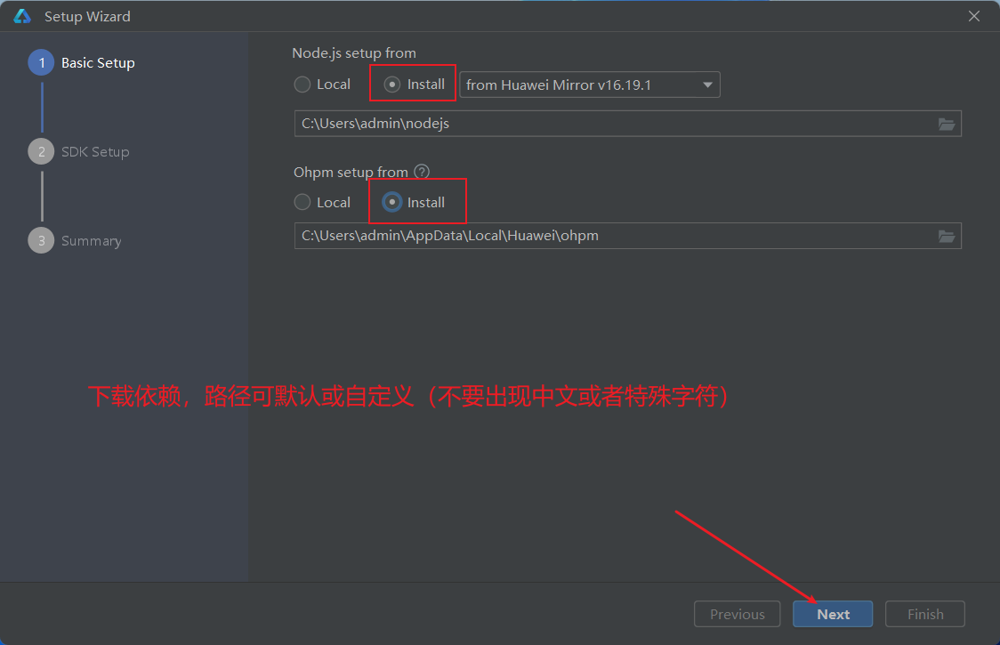
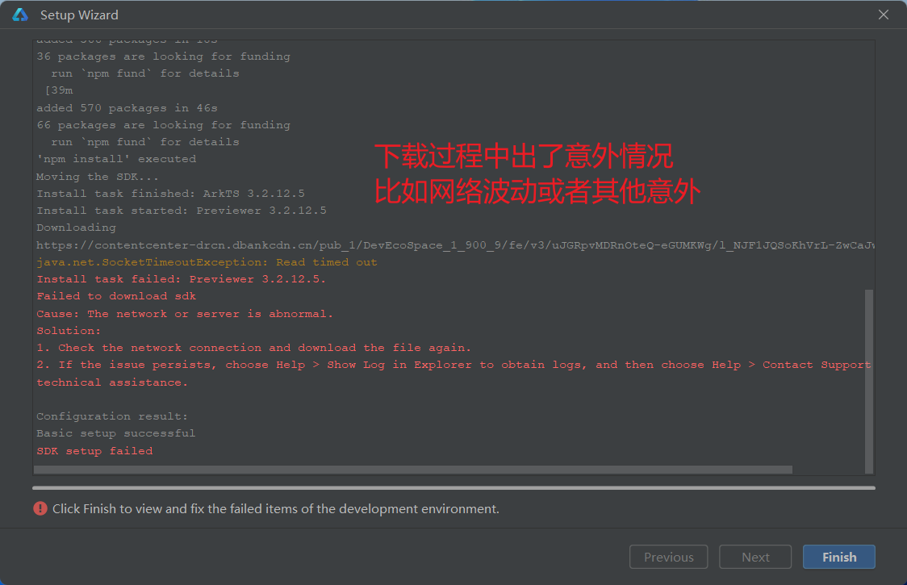

# 02：环境搭建

# DevEco Studio3.1版本（23年11-21编写教程时最新版）

> 此文档为安装DevEco Studio过程演示。
>
> 也可参考官方网站指导教程：链接如下。
>
> 
>
> https://developer.harmonyos.com/cn/docs/documentation/doc-guides-V3/deveco_overview-0000001053582387-V3?catalogVersion=V3

# 开发工具下载安装

> 要求电脑内存8G以上，建议16+。如需视频指导安装过程，可点击下方超链接。
>
> **[环境搭建_指导视频](https://www.bilibili.com/video/BV1pb4y1g75m?p=3)**

## 下载安装包

1. 进入官网点击下载

> https://developer.harmonyos.com/cn/develop/deveco-studio/

解压并安装

1. 一路next进行安装

## 下载相关依赖：此后过程请不要使用校园网，需要确保网络稳定。很重要。

> 如果C盘空间足够。建议都默认。如果置顶路径。务必注意不要出现中文、特殊字符、花里胡哨东西

> 如下截图出现了警告信息，根据提示信息点击Finish按钮。

- 双击桌面图标启动软件，校验环境
- 

> 到此位置，安装完成，叉掉当前检测界面即可使用该编辑器。使用教程见课堂内容（**[环境搭建_指导视频](https://www.bilibili.com/video/BV1pb4y1g75m?p=3)**）。

# 卸载软件

> 安装失败原因很多人是因为网络不稳定。不要使用校园网（不稳定）或者内网（需要代理）。

如果安装失败，可以卸载重装。推荐好用的卸载软件：[geek-最好用的卸载工具.exe](https://mayw-teaching.feishu.cn/file/PzOSbHyZOoObtmxEAeKcxgZ3nhg?from=from_copylink) （6.3M）

# 开发者注册与个人实名认证

点击如下链接，参考文档指导，完成开发者注册与**个人**实名认证。（多种认证方式，任选其一。好像是银行卡认证效率最高，建议选择）

https://developer.huawei.com/consumer/cn/doc/start/registration-and-verification-0000001053628148?ha_linker=eyJ0cyI6MTY5NjkyMDE3ODQ3MiwiaWQiOiIwYjdmODYzNjY3OGE5ZWY2MWE4MjRlYjk2ZjMxNTg5YSJ9
