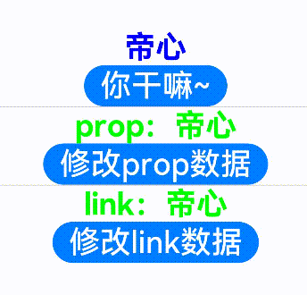
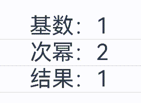

# 04：ArkTS语言

# 基础语法之变量声明+数据类型

- js：JavaScript
- ts：TypeScript
- ets: extend TypeScript


## 变量名要求：

- 变量名称可以包含数字和字母。
- 变量名不能以数字开头。
- 除了下划线 **_** 和美元 **$** 符号外，不能包含其他特殊字符，包括空格。
- 不能使用关键字和保留字（已经定义了特殊含义的单词）
- 见名知意

变量可以先声明后赋值，也可以声明的时候直接赋值（初始化）

## 数据类型

TypeScript支持一些基础的数据类型，如布尔型、数组、字符串等

### 数字

TypeScript里的所有数字都是浮点数，这些浮点数的类型是 `number`。除了支持十进制，还支持二进制、八进制、十六进制。

```JavaScript
// 数值类型
let num1: number = 18 //十进制
let num2: number = 0b10011 //ob 二进制
let num3: number = 0o1234567 // 0o 八进制
let num4: number = 0x123abcdef //0x 十六进制
```

### 字符串

TypeScript里使用 `string`表示文本数据类型， 可以使用双引号（ `"`）或单引号（`'`）表示字符串或者反引号（```）。

> *反引号中可以配合${}解析变量*

```JavaScript
// 字符串类型
let str1: string = 'HarmonyOS4.0'
let str2: string = "ArkTS"
let str3: string = `帝心今年${num1}岁了`   //tab上方飘号键盘...
```

### 布尔值

TypeScript中可以使用`boolean`来表示这个变量是布尔值，可以赋值为`true`或者`false`。

```JavaScript
// 布尔类型 true false
let stateOn: boolean = true
let stateOff: boolean = false
```

### 联合类型

联合类型（Union Types）表示取值可以为多种类型中的一种。

> 如果当下还没想好用哪个类型...

```JavaScript
let meiXiangHao: string | number |boolean
meiXiangHao = 'seven'
meiXiangHao = 7
meiXiangHao = true
```

### 数组

TypeScrip有两种方式可以定义数组。 

第一种方式是使用数组泛型，Array< 元素类型 >。

```JavaScript
// 数组
let course1: Array<string> = ['入门',"基础语法",`组件`]
```

第二种，可以在元素类型后面接上 []，表示由此类型元素组成的一个数组。

```JavaScript
let course2: string[] = ['动画',"网络",`存储`]
```

### 枚举

enum类型是对JavaScript标准数据类型的一个补充，使用枚举类型可以为一组数值赋予友好的名字。

```JavaScript
enum Color {Red, Green, Blue};
let c: Color = Color.Green;
```

### 元组

元组类型允许表示一个已知元素数量和类型的数组，各元素的类型不必相同。 比如，你可以定义一对值分别为 `string`和`number`类型的元组。

```JavaScript
let x: [string, number];
x = ['hello', 10]; // OK
x = [10, 'hello']; // Error
```

### Unknown

有时候，我们会想要为那些在编程阶段还不清楚类型的变量指定一个类型。这种情况下，我们不希望类型检查器对这些值进行检查而是直接让它们通过编译阶段的检查。那么我们可以使用unknown类型来标记这些变量。（同`any`）

```JavaScript
let notSure: unknown = 4;
notSure = 'maybe a string instead';
notSure = false;
```

### Void

当一个函数没有返回值时，你通常会见到其返回值类型是 void。

```JavaScript
function test(): void {
   console.log('This is function is void');
}
```

### Null 和 Undefined

TypeScript里，undefined和null两者各自有自己的类型分别叫做undefined和null。

```JavaScript
let u: undefined = undefined;
let n: null = null;
```

## 数据类型应用

```TypeScript
// todo:本套教程QQ交流群：324702418
// todo: 代码在线地址：https://gitee.com/mayuanwei

// 数值类型
let num1: number = 3.1415
let num2: number = 0b10100
let num3: number = 0o107
let num4: number = 0x012abcf
let num5: number = 10+ 5

// 字符串
let str1:string = 'HarmonyOS' + "ArkTS"
let str2:string = "HarmonyOS"
let str3:string = `圆周率：${num1}`

// 布尔boolean
let stateOn: boolean = true
let stateOff: boolean = false

// 数组 Array 索引值0
let names1:string[] = ['帝心','庄生']
let names2:Array<string> = ['帝心','庄生']

// 枚举类型
enum myColor{
  Red = 'red',
  Green ='green'
}
@Entry
@Component
struct DataType {
  pome:string = '劝君莫惜金缕衣 劝君惜取少年时'
  build() {
    Row() {
      Column() {
        Text(names1[1])
          .fontSize(50)
          .fontWeight(FontWeight.Bold)
          .fontColor(myColor.Red)
        Divider()
        if (stateOff){
          Text(num1.toString())
            .fontSize(50)
            .fontWeight(FontWeight.Bold)
        }else{
          Text(num2.toString())
            .fontSize(50)
            .fontWeight(FontWeight.Bold)
        }
        Divider()
        Text(this.pome)
      }
      .width('100%')
    }
    .height('100%')
  }
}
```

# 声明式UI描述

ArkTS以声明方式组合和扩展组件来描述应用程序的UI，同时还提供了基本的属性、事件和子组件配置方法，帮助开发者实现应用交互逻辑。

## 创建组件

根据组件构造方法的不同，创建组件包含有参数和无参数两种方式。

> 说明
>
> 创建组件时不需要new运算符。

## 无参数

如果组件的接口定义没有包含必选构造参数，则组件后面的“`()`”不需要配置任何内容。例如，`Divider`组件不包含构造参数：

```JavaScript
Column() {
  Text('item 1')
  Divider()
  Text('item 2')
}
```

## 有参数

如果组件的接口定义包含构造参数，则在组件后面的“`()`”配置相应参数。

- Image组件的必选参数src。
  - ```JavaScript
    Image('https://xyz/test.jpg')
    ```

> 官方说如果应用是网络图片地址。需要在`src/main/module.json5`中申请网络权限。方式如下。而实际上我们不申请，依旧可以用网络图片。哥们想不通。算一个小bug？
>
> ```JavaScript
> "requestPermissions": [
>   {
>     "name": "ohos.permission.INTERNET"
>   }
> ]
> ```

- Text组件的非必选参数content。

```JavaScript
// string类型的参数
Text('test')
// $r形式引入应用资源，可应用于多语言场景
Text($r('app.string.title_value'))
// 无参数形式
Text()
```

- 变量或表达式也可以用于参数赋值，其中表达式返回的结果类型必须满足参数类型要求。

例如，设置变量或表达式来构造Image和Text组件的参数。

```JavaScript
Image(this.imagePath)
Image('https://' + this.imageUrl)
Text(count: ${this.count})
```

## 配置属性

属性方法以“`.`”链式调用的方式配置系统组件的样式和其他属性，建议每个属性方法单独写一行。

- 配置Text组件的字体大小。

```JavaScript
Text('test')
  .fontSize(12)
```

- 配置组件的多个属性。

```JavaScript
Image('test.jpg')
  .alt('error.jpg')  
  .width(100)  
  .height(100)
```

- 除了直接传递常量参数外，还可以传递变量或表达式。

```JavaScript
Text('hello')
  .fontSize(this.size)
Image('test.jpg')
  .width(this.count % 2 === 0 ? 100 : 200)  
  .height(this.offset + 100)
  .objectFit(ImageFit.Cover)
```

- 对于系统组件，ArkUI还为其属性预定义了一些枚举类型供开发者调用，枚举类型可以作为参数传递，但必须满足参数类型要求。

例如，可以按以下方式配置Text组件的颜色和字体样式。

```JavaScript
Text('hello')
  .fontSize(20)
  .fontColor(Color.Red)
  .fontWeight(FontWeight.Bold)
```

## 配置事件

事件方法以“`.`”链式调用的方式配置系统组件支持的事件，建议每个事件方法单独写一行。

- 使用箭头函数配置组件的事件方法。

```JavaScript
Button('Click me')
  .onClick(() => {
    this.myText = 'ArkUI';
  })
```

- 使用匿名函数表达式配置组件的事件方法，要求使用bind，以确保函数体中的this指向当前组件。

```JavaScript
Button('add counter')
  .onClick(function(){
    this.counter += 2;
  }.bind(this))
```

- 使用组件的成员函数配置组件的事件方法。

```JavaScript
myClickHandler(): void {
  this.counter += 2;
}
...
Button('add counter')
  .onClick(this.myClickHandler.bind(this))
```

## 配置子组件

如果组件支持子组件配置，则需在尾随闭包"`{...}`"中为组件添加子组件的UI描述。`Column`、`Row`、`Stack`、`Grid`、`List`等组件都是容器组件。

- 以下是简单的`Column`组件配置子组件的示例。

```JavaScript
Column() {
  Text('Hello')
    .fontSize(100)
  Divider()
  Text(this.myText)
    .fontSize(100)
    .fontColor(Color.Red)
}
```

- 容器组件均支持子组件配置，可以实现相对复杂的多级嵌套。

```JavaScript
Column() {
  Row() {
    Image('test1.jpg')
      .width(100)
      .height(100)
    Button('click +1')
      .onClick(() => {
        console.info('+1 clicked!');
      })
  }
}
```

# 自定义组件

## 创建自定义组件

在ArkUI中，UI显示的内容均为组件，由框架直接提供的称为系统组件，由开发者定义的称为自定义组件。在进行 UI 界面开发时，通常不是简单的将系统组件进行组合使用，而是需要考虑代码可复用性、业务逻辑与UI分离，后续版本演进等因素。因此，将UI和部分业务逻辑封装成自定义组件是不可或缺的能力。

# 诗文学习案例效果图


自定义组件具有以下特点：

- 可组合：允许开发者组合使用系统组件、及其属性和方法。
- 可重用：自定义组件可以被其他组件重用，并作为不同的实例在不同的父组件或容器中使用。
- 数据驱动UI更新：通过状态变量的改变，来驱动UI的刷新。

### 自定义组件的基本用法

以下示例展示了自定义组件的基本用法。

```JavaScript
//src/main/ets/pages/CustomComponents.ets
// 创建自定义组件

@Component
struct itemComponent {
  // 自定义组件可以使用变量(都是私有化的) 传递参数
  content: string = '青山隐隐水迢迢，秋尽江南草未凋。'
  // 哪种情况可以驱动UI更新。@state
  @State isDone: boolean = false

  build() {
    //   必须有一个根组件。
    Row() {
      Image(this.isDone ? $r('app.media.todo_ok') : $r('app.media.todo_default'))
        .width(20)
        .height(20)
        .margin(15)
      Text(this.content)
        .decoration({ type: this.isDone ? TextDecorationType.LineThrough : TextDecorationType.None })
    }
    .backgroundColor(Color.Pink)
    .borderRadius(25)
    .margin({
      top: 15
    })
    .onClick(() => {
      this.isDone = !this.isDone
    })
  }
}
```

`itemComponent `可以在其他自定义组件中的`build()`函数中多次创建，实现自定义组件的重用。

```JavaScript
@Entry
@Component
struct CustomComponents {
  @State message: string = '诗词学习'

  build() {
    Row() {
      Column() {
        Text(this.message)
          .fontSize(50)
          .fontWeight(FontWeight.Bold)

        itemComponent()
        itemComponent({ content: '二十四桥明月夜，玉人何处教吹箫？' })
        itemComponent({ content: '荷尽已无擎雨盖，菊残犹有傲霜枝。' })
        itemComponent({ content: '一年好景君须记，最是橙黄橘绿时。' })
      }
      .width('100%')
    }
    .height('100%')
  }
}
```

要完全理解上面的示例，需要了解自定义组件的以下概念定义，本文将在后面的小节中介绍：

### 自定义组件的基本结构

- struct：自定义组件基于struct实现，`struct `+ 自`定义`组件名 + `{...}`的组合构成自定义组件，不能有继承关系。对于struct的实例化，可以省略new。

> 说明：自定义组件名、类名、函数名不能和系统组件名相同。

- @Component：@Component装饰器仅能装饰struct关键字声明的数据结构。struct被@Component装饰后具备组件化的能力，需要实现build方法描述UI，一个struct只能被一个@Component装饰。

> 说明：从API version 9开始，该装饰器支持在ArkTS卡片中使用。

```JavaScript
@Component
struct MyComponent {
}
```

- build()函数：build()函数用于定义自定义组件的声明式UI描述，自定义组件必须定义build()函数。

```JavaScript
@Component
struct MyComponent {
  build() {
  }
}
```

- @Entry：@Entry装饰的自定义组件将作为UI页面的入口。在单个UI页面中，最多可以使用@Entry装饰一个自定义组件。@Entry可以接受一个可选的[LocalStorage](https://developer.harmonyos.com/cn/docs/documentation/doc-guides-V3/arkts-localstorage-0000001524537149-V3)的参数。

> 说明：从API version 9开始，该装饰器支持在ArkTS卡片中使用。

```JavaScript
@Entry
@Component
struct MyComponent {
}
```

### 成员函数/变量

自定义组件除了必须要实现`build()`函数外，还可以实现其他成员函数，成员函数具有以下约束：

- 不支持静态函数。
- 成员函数的访问是私有的。

自定义组件可以包含成员变量，成员变量具有以下约束：

- 不支持静态成员变量。
- 所有成员变量都是私有的，变量的访问规则与成员函数的访问规则相同。
- 自定义组件的成员变量本地初始化有些是可选的，有些是必选的。具体是否需要本地初始化，是否需要从父组件通过参数传递初始化子组件的成员变量，请[状态管理](https://developer.harmonyos.com/cn/docs/documentation/doc-guides-V3/arkts-state-management-overview-0000001524537145-V3)。

### 自定义组件的参数规定

从上文的示例中，我们已经了解到，可以在`build`方法或者[@Builder](https://developer.harmonyos.com/cn/docs/documentation/doc-guides-V3/arkts-builder-0000001524176981-V3)装饰的函数里创建自定义组件，在创建自定义组件的过程中，根据装饰器的规则来初始化自定义组件的参数。

```JavaScript
@Component
struct MyComponent {
  private countDownFrom: number = 0;
  private color: Color = Color.Blue;

  build() {
  }
}

@Entry
@Component
struct ParentComponent {
  private someColor: Color = Color.Pink;

  build() {
    Column() {
      // 创建MyComponent实例，并将创建MyComponent成员变量countDownFrom初始化为10，将成员变量color初始化为this.someColor
      MyComponent({ countDownFrom: 10, color: this.someColor })
    }
  }
}
```

### build()函数

所有声明在`build()`函数的语言，我们统称为UI描述，UI描述需要遵循以下规则：

- @Entry装饰的自定义组件，其build()函数下的根节点唯一且必要，且必须为容器组件，其中ForEach禁止作为根节点。
  -  @Component装饰的自定义组件，其build()函数下的根节点唯一且必要，可以为非容器组件，其中ForEach禁止作为根节点。

```JavaScript
@Entry
@Component
struct MyComponent {
  build() {
    // 根节点唯一且必要，必须为容器组件
    Row() {
      ChildComponent()
    }
  }
}

@Component
struct ChildComponent {
  build() {
    // 根节点唯一且必要，可为非容器组件
    Image('test.jpg')
  }
}
```

- 不允许声明本地变量，反例如下。

```JavaScript
build() {
  // 反例：不允许声明本地变量
  let a: number = 1;
}
```

- 不允许在UI描述里直接使用console.info，但允许在方法或者函数里使用，反例如下。

```JavaScript
build() {
  // 反例：不允许console.info
  console.info('print debug log');
}
```

- 不允许创建本地的作用域，反例如下。

```JavaScript
build() {
  // 反例：不允许本地作用域
  {
    ...
  }
}
```

- 不允许调用没有用@Builder装饰的方法，允许系统组件的参数是TS方法的返回值。

```JavaScript
@Component
struct ParentComponent {
  doSomeCalculations() {
  }

  calcTextValue(): string {
    return 'Hello World';
  }

  @Builder doSomeRender() {
    Text(Hello World)
  }

  build() {
    Column() {
      // 反例：不能调用没有用@Builder装饰的方法
      this.doSomeCalculations();
      // 正例：可以调用
      this.doSomeRender();
      // 正例：参数可以为调用TS方法的返回值
      Text(this.calcTextValue())
    }
  }
}
```

- 不允许switch语法，如果需要使用条件判断，请使用if。反例如下。

```JavaScript
build() {
  Column() {
    // 反例：不允许使用switch语法
    switch (expression) {
      case 1:
        Text('...')
        break;
      case 2:
        Image('...')
        break;
      default:
        Text('...')
        break;
    }
  }
}
```

- 不允许使用表达式，反例如下。

```JavaScript
build() {
  Column() {
    // 反例：不允许使用表达式
    (this.aVar > 10) ? Text('...') : Image('...')
  }
}
```

### 自定义组件通用样式

自定义组件通过“`.`”链式调用的形式设置通用样式。

```JavaScript
@Component
struct MyComponent2 {
  build() {
    Button(Hello World)
  }
}

@Entry
@Component
struct MyComponent {
  build() {
    Row() {
      MyComponent2()
        .width(200)
        .height(300)
        .backgroundColor(Color.Red)
    }
  }
}
```

> 说明
>
> ArkUI给自定义组件设置样式时，相当于给MyComponent2套了一个不可见的容器组件，而这些样式是设置在容器组件上的，而非直接设置给MyComponent2的Button组件。通过渲染结果我们可以很清楚的看到，背景颜色红色并没有直接生效在Button上，而是生效在Button所处的开发者不可见的容器组件上。

# @Builder装饰器：自定义组件构建函数

前面章节介绍了如何创建一个自定义组件。该自定义组件内部UI结构固定，仅与使用方进行数据传递。ArkUI还提供了一种更轻量的UI元素复用机制`@Builder`，`@Builder`所装饰的函数遵循`build()`函数语法规则，开发者可以将重复使用的UI元素抽象成一个方法，在build方法里调用。

为了简化语言，我们将@Builder装饰的函数也称为“自定义构建函数”。

> 说明
>
> 从API version 9开始，该装饰器支持在ArkTS卡片中使用。

## 案例


### 组件内自定义构建函数

```JavaScript
/*
 * 组件内：自定义构建函数
 * */
@Entry
@Component
struct BuilderUI {
  @State message: string = '@Builder'
  @State isDone: boolean = false

  build() {
    Row() {
      Column() {
        Text(this.message)
          .fontSize(50)
          .fontWeight(FontWeight.Bold)
        this.item('劝君莫惜金缕衣 劝君惜取少年时' )
      }
      .width('100%')
    }
    .height('100%')
  }

  @Builder item(content: string) {
    Row() {
      Image( this.isDone  ? $r('app.media.todo_ok') : $r('app.media.todo_default'))
        .width(20)
        .height(20)
        .margin(15)
      Text(content)
        .decoration({ type: this.isDone  ? TextDecorationType.LineThrough : TextDecorationType.None })
    }
    .width('100%')
    .backgroundColor(Color.Pink)
    .borderRadius(25)
    .margin({
      top: 15
    })
    .onClick(() => {
      this.isDone = !this.isDone
    })
  }
}
```

### 组件外自定义构建函数

```JavaScript
/*
 * 组件外：自定义构建函数
 *    需要function关键字
 * */
@Entry
@Component
struct BuilderUI {
  @State message: string = '@Builder'
  @State isDone: boolean = false

  build() {
    Row() {
      Column() {
        Text(this.message)
          .fontSize(50)
          .fontWeight(FontWeight.Bold)
        item('劝君莫惜金缕衣 劝君惜取少年时')
      }
      .width('100%')
    }
    .height('100%')
  }
}

@Builder function  item(content: string) {
  Row() {
    Image( this.isDone  ? $r('app.media.todo_ok') : $r('app.media.todo_default'))
      .width(20)
      .height(20)
      .margin(15)
    Text(content)
      .decoration({ type: this.isDone  ? TextDecorationType.LineThrough : TextDecorationType.None })
  }
  .width('100%')
  .backgroundColor(Color.Pink)
  .borderRadius(25)
  .margin({
    top: 15
  })
  .onClick(() => {
    this.isDone = !this.isDone
  })
}
```

## 装饰器使用说明

### 自定义组件内自定义构建函数

定义的语法：

```JavaScript
@Builder MyBuilderFunction({ ... })
```

使用方法：

```JavaScript
this.MyBuilderFunction({ ... })
```

- 允许在自定义组件内定义一个或多个`@Builder`方法，该方法被认为是该组件的私有、特殊类型的成员函数。
- 自定义构建函数可以在所属组件的`build方`法和其他自定义构建函数中调用，但不允许在组件外调用。
- 在自定义函数体中，this指代当前所属组件，组件的状态变量可以在自定义构建函数内访问。建议通过this访问自定义组件的状态变量而不是参数传递。

### 全局自定义构建函数

定义的语法：

```JavaScript
@Builder function MyGlobalBuilderFunction({ ... })
```

使用方法：

```JavaScript
MyGlobalBuilderFunction()
```

- 全局的自定义构建函数可以被整个应用获取，不允许使用`this`和`bind`方法。
- 如果不涉及组件状态变化，建议使用全局的自定义构建方法。

## 参数传递规则

自定义构建函数的参数传递有[按值传递](https://developer.harmonyos.com/cn/docs/documentation/doc-guides-V3/arkts-builder-0000001524176981-V3#section163841721135012)和[按引用传递](https://developer.harmonyos.com/cn/docs/documentation/doc-guides-V3/arkts-builder-0000001524176981-V3#section1522464044212)两种，均需遵守以下规则：

- 参数的类型必须与参数声明的类型一致，不允许`undefined`、`null`和返回`undefined`、`null`的表达式。
- 在自定义构建函数内部，不允许改变参数值。如果需要改变参数值，且同步回调用点，建议使用[@Link](https://developer.harmonyos.com/cn/docs/documentation/doc-guides-V3/arkts-link-0000001524297305-V3)。
- @Builder内UI语法遵循[UI语法规则](https://developer.harmonyos.com/cn/docs/documentation/doc-guides-V3/arkts-create-custom-components-0000001473537046-V3#section1150911733811)。

### 按引用传递参数(不作重点讲解，感兴趣官网文档自行了解)

按引用传递参数时，传递的参数可为状态变量，且状态变量的改变会引起`@Builder`方法内的UI刷新。ArkUI提供`$$`作为按引用传递参数的范式。

### 按值传递参数(不作重点讲解，感兴趣官网文档自行了解)

调用`@Builder`装饰的函数默认按值传递。当传递的参数为状态变量时，状态变量的改变不会引起`@Builder`方法内的UI刷新。所以当使用状态变量的时候，推荐使用[按引用传递](https://developer.harmonyos.com/cn/docs/documentation/doc-guides-V3/arkts-builder-0000001524176981-V3#section1522464044212)。

# @Styles装饰器：定义组件重用样式


```JavaScript
/*
 * 自定义样式函数
 * */
@Entry
@Component
struct StylesFun {
  @State message: string = '@Styles'
  // 内部通用样式函数
  @Styles commonStyle(){
    .width(200)
    .height(100)
    .backgroundColor(Color.Gray)
  }

  build() {
    Row() {
      Column({space:20}) {
        Text(this.message).commonStyle().fontSize(40)
        Button().commonStyle()
        Image('').commonStyle()
        Row(){}.commonStyle()
      }
      .width('100%')
    }
    .height('100%')
  }
}
// 外部通用样式函数
@Styles function  commonStyle(){
    .width(250)
    .height(50)
    .backgroundColor(Color.Gray)
}
```

如果每个组件的样式都需要单独设置，在开发过程中会出现大量代码在进行重复样式设置，虽然可以复制粘贴，但为了代码简洁性和后续方便维护，我们推出了可以提炼公共样式进行复用的装饰器@Styles。

@Styles装饰器可以将多条样式设置提炼成一个方法，直接在组件声明的位置调用。通过@Styles装饰器可以快速定义并复用自定义样式。用于快速定义并复用自定义样式。

> 说明
>
> 从API version 9开始，该装饰器支持在ArkTS卡片中使用。

## 装饰器使用说明

- 当前@Styles仅支持通用属性和通用事件。
- @Styles方法不支持参数，反例如下。

```JavaScript
// 反例： @Styles不支持参数
@Styles function globalFancy (value: number) {
  .width(value)
}
```

- @Styles可以定义在组件内或全局，在全局定义时需在方法名前面添加function关键字，组件内定义时则不需要添加function关键字。

```JavaScript
// 全局
@Styles function functionName() { ... }

// 在组件内
@Component
struct FancyUse {
  @Styles fancy() {
    .height(100)
  }
}
```

- 定义在组件内的@Styles可以通过this访问组件的常量和状态变量，并可以在@Styles里通过事件来改变状态变量的值，示例如下：

```JavaScript
@Component
struct FancyUse {
  @State heightValue: number = 100
  @Styles fancy() {
    .height(this.heightValue)
    .backgroundColor(Color.Yellow)
    .onClick(() => {
      this.heightValue = 200
    })
  }
}
```

- 组件内@Styles的优先级高于全局@Styles。
- 框架优先找当前组件内的@Styles，如果找不到，则会全局查找。

## 使用场景

以下示例中演示了组件内@Styles和全局@Styles的用法。

```JavaScript
// 定义在全局的@Styles封装的样式
@Styles function globalFancy  () {
  .width(150)
  .height(100)
  .backgroundColor(Color.Pink)
}

@Entry
@Component
struct FancyUse {
  @State heightValue: number = 100
  // 定义在组件内的@Styles封装的样式
  @Styles fancy() {
    .width(200)
    .height(this.heightValue)
    .backgroundColor(Color.Yellow)
    .onClick(() => {
      this.heightValue = 200
    })
  }

  build() {
    Column({ space: 10 }) {
      // 使用全局的@Styles封装的样式
      Text('FancyA')
        .globalFancy ()
        .fontSize(30)
      // 使用组件内的@Styles封装的样式
      Text('FancyB')
        .fancy()
        .fontSize(30)
    }
  }
}
```

# @Extend装饰器：定义扩展组件样式

在前文的示例中，可以使用@Styles用于样式的扩展，在@Styles的基础上，我们提供了@Extend，用于扩展原生组件样式。

> 说明
>
> 从API version 9开始，该装饰器支持在ArkTS卡片中使用。

## 装饰器使用说明

### 语法

```JavaScript
@Extend(UIComponentName) function functionName { ... }
```

### 使用规则

- 和@Styles不同，@Extend仅支持定义在全局，不支持在组件内部定义。
- 和@Styles不同，@Extend支持封装指定的组件的私有属性和私有事件和预定义相同组件的@Extend的方法。

```JavaScript
// @Extend(Text)可以支持Text的私有属性fontColor
@Extend(Text) function fancy () {
  .fontColor(Color.Red)
}
// superFancyText可以调用预定义的fancy
@Extend(Text) function superFancyText(size:number) {
    .fontSize(size)
    .fancy()
}
```

- 和@Styles不同，@Extend装饰的方法支持参数，开发者可以在调用时传递参数，调用遵循TS方法传值调用。

```JavaScript
// xxx.ets
@Extend(Text) function fancy (fontSize: number) {
  .fontColor(Color.Red)
  .fontSize(fontSize)
}

@Entry
@Component
struct FancyUse {
  build() {
    Row({ space: 10 }) {
      Text('Fancy')
        .fancy(16)
      Text('Fancy')
        .fancy(24)
    }
  }
}
```

- @Extend装饰的方法的参数可以为function，作为Event事件的句柄。

```JavaScript
@Extend(Text) function makeMeClick(onClick: () => void) {
  .backgroundColor(Color.Blue)
  .onClick(onClick)
}

@Entry
@Component
struct FancyUse {
  @State label: string = 'Hello World';

  onClickHandler() {
    this.label = 'Hello ArkUI';
  }

  build() {
    Row({ space: 10 }) {
      Text(`${this.label}`)
        .makeMeClick(this.onClickHandler.bind(this))
    }
  }
}
```

@Extend的参数可以为状态变量，当状态变量改变时，UI可以正常的被刷新渲染。

```JavaScript
@Extend(Text) function fancy (fontSize: number) {
  .fontColor(Color.Red)
  .fontSize(fontSize)
}

@Entry
@Component
struct FancyUse {
  @State fontSizeValue: number = 20
  build() {
    Row({ space: 10 }) {
      Text('Fancy')
        .fancy(this.fontSizeValue)
        .onClick(() => {
          this.fontSizeValue = 30
        })
    }
  }
}
```

### 使用场景

- 以下示例声明了3个Text组件，每个Text组件均设置了fontStyle、fontWeight和backgroundColor样式。

```JavaScript
@Entry
@Component
struct FancyUse {
  @State label: string = 'Hello World'

  build() {
    Row({ space: 10 }) {
      Text(`${this.label}`)
        .fontStyle(FontStyle.Italic)
        .fontWeight(100)
        .backgroundColor(Color.Blue)
      Text(`${this.label}`)
        .fontStyle(FontStyle.Italic)
        .fontWeight(200)
        .backgroundColor(Color.Pink)
      Text(`${this.label}`)
        .fontStyle(FontStyle.Italic)
        .fontWeight(300)
        .backgroundColor(Color.Orange)
    }.margin('20%')
  }
}
```

- @Extend将样式组合复用，示例如下。

```JavaScript
@Extend(Text) function fancyText(weightValue: number, color: Color) {
  .fontStyle(FontStyle.Italic)
  .fontWeight(weightValue)
  .backgroundColor(color)
}
```

- 通过@Extend组合样式后，使得代码更加简洁，增强可读性。

```JavaScript
@Entry
@Component
struct FancyUse {
  @State label: string = 'Hello World'

  build() {
    Row({ space: 10 }) {
      Text(${this.label})
        .fancyText(100, Color.Blue)
      Text(${this.label})
        .fancyText(200, Color.Pink)
      Text(${this.label})
        .fancyText(300, Color.Orange)
    }.margin('20%')
  }
}
```

## 课堂代码

```JavaScript
@Entry
@Component
struct ExtendFun {
  @State message: string = '@Extend'
  @State count:number = 0
  build() {
    Row() {
      Column() {
        Text(this.message)
          .fontSize(50)
          .fontWeight(FontWeight.Bold)
        Divider()
        Text('HarmonyOS4.0').sizeColor(40,Color.Blue)
        Text('一键三联').sizeColor(40,'red')
        Text('下次一定').textStyle(20,'#ababab')
        Text('你干嘛~').textStyle(50,Color.Pink)

        Button(this.count.toString()).btnStyle( ()=>{
          this.count++
        } )
      }
      .width('100%')
    }
    .height('100%')
  }
}
@Extend(Text) function sizeColor(fs: number,fc:Color|string) {
  .fontSize(fs)
  .fontColor(fc)
}


@Extend(Text) function textStyle(fs: number,fc:Color|string) {
  .sizeColor(fs,fc)
  .fontStyle(FontStyle.Italic)
  .fontWeight(FontWeight.Bold)
}

@Extend(Button) function btnStyle(click:()=>void){
  .fontSize(40)
  .width(150)
  .height(50)
  .onClick(() => {
    click()
  })
}
```

# stateStyles：多态样式

@Styles和@Extend仅仅应用于静态页面的样式复用，stateStyles可以依据组件的内部状态的不同，快速设置不同样式。这就是我们本章要介绍的内容stateStyles（又称为：多态样式）。

## **概述**

stateStyles是属性方法，可以根据UI内部状态来设置样式，类似于css伪类，但语法不同。ArkUI提供以下四种状态：

- focused：获焦态。
- normal：正常态。
- pressed：按压态。
- disabled：不可用态。

## **使用场景**


下面的示例展示了stateStyles最基本的使用场景。Button处于第一个组件，默认获焦，生效focused指定的红色样式。按压时显示为pressed态指定的蓝色。如果在Button前再放一个组件，使其不处于获焦态，就会生效normal态的绿色。

```JavaScript
/*
 * stateStyles()其实是一个属性方法。属性为一个对象（多个状态为键，状态样式为对应的值）
 * 第一个元素默认获焦
 * - focused：获焦态。
  - normal：正常态。
  - pressed：按压态。
  - disabled：不可用态。
 * */
@Entry
@Component
struct StateStylesFun {
  @State message: string = 'stateStyles属性方法'

  build() {
    Row() {
      Column() {
        // Button('哥们，我先来的。焦点在我这呢。')
        // 临时加个输入框，获焦效果更明显
        TextInput()
          .border({ color: Color.Orange, width: 2 })
          .margin(20)
        Button(this.message)
          .fontSize(50)
          .fontWeight(FontWeight.Bold)
          .stateStyles({
            focused: {
              .backgroundColor(Color.Red)
            },
            normal: {
              .backgroundColor(Color.Green)
            },
            pressed: {
              .backgroundColor(Color.Blue)
            }
          })
      }
      .width('100%')
    }
    .height('100%')
  }
}
```

[stateStyles：多态样式-基本语法-学习ArkTS语言-入门-HarmonyOS应用开发](https://developer.harmonyos.com/cn/docs/documentation/doc-guides-V3/arkts-statestyles-0000001482592098-V3)

# 状态管理


- @State：@State装饰的变量拥有其所属组件的状态，可以作为其子组件单向和双向同步的数据源。当其数值改变时，会引起相关组件的渲染刷新。
- @Prop：@Prop装饰的变量可以和父组件建立单向同步关系，@Prop装饰的变量是可变的，但修改不会同步回父组件。
- @Link：@Link装饰的变量和父组件构建双向同步关系的状态变量，父组件会接受来自@Link装饰的变量的修改的同步，父组件的更新也会同步给@Link装饰的变量。
- @Provide/@Consume：@Provide/@Consume装饰的变量用于跨组件层级（多层组件）同步状态变量，可以不需要通过参数命名机制传递，通过alias（别名）或者属性名绑定。
- @Observed：@Observed装饰class，需要观察多层嵌套场景的class需要被@Observed装饰。单独使用@Observed没有任何作用，需要和@ObjectLink、@Prop连用。
- @ObjectLink：@ObjectLink装饰的变量接收@Observed装饰的class的实例，应用于观察多层嵌套场景，和父组件的数据源构建双向同步。

## @State 与@Prop 和 @State  与  @Link

- 驱动build()更新
- @State   @Prop (`this.`进行传参)
- @State   @Link(传参使用$)



```JavaScript
@Entry
@Component
struct StateManagement {
  // @State 必须初始化
  @State name: string = '帝心'

  build() {
    Row() {
      Column() {
        Text(this.name).StateManagement_textSty()
        Button('摸一摸').StateManagement_btnStyle(() => {
          this.name = this.name === '帝心' ? '庄生' : '帝心'
        })
        Divider()
        StateManagement_prop({ content_prop: this.name })
        Divider()
        // 撕裂感！痛！！！ bug
        // StateManagement_link({content_link : this.name})
        //   如果是state < --- > link 参数传递时，使用$变量名进行传递
        StateManagement_link({ content_link: $name })
      }
      .width('100%')
    }
    .height('100%')
  }
}

// 存放一个 @Prop 装饰的状态数据。方便父子组件之间进行数据传递和同步  State ----> prop
@Component
struct StateManagement_prop {
  @Prop content_prop: string

  build() {
    Column() {
      Text('prop:' + this.content_prop).StateManagement_textSty()
      Button('修改prop数据').StateManagement_btnStyle(() => {
        this.content_prop = 'HarmonyOS4.0'
      })
    }
  }
}

// 存放 link 数据
@Component
struct StateManagement_link {
  @Link content_link: string

  build() {
    Column() {
      Text('link:' + this.content_link).StateManagement_textSty()
      Button('修改link数据').StateManagement_btnStyle(() => {
        this.content_link = '全网最细'
      })
    }
  }
}

// 同样的样式记得复用 text
@Extend(Text) function StateManagement_textSty() {
  .fontSize(30)
  .fontWeight(FontWeight.Bold)
  .fontColor(Color.Green)
}

// button样式
@Extend(Button) function StateManagement_btnStyle(click: Function) {
  .fontSize(30)
  .onClick(() => {
    click()
  })
}
```

## @Provide装饰器和@Consume装饰器：与后代组件双向同步

@Provide和@Consume，应用于与后代组件的双向数据同步，应用于状态数据在多个层级之间传递的场景。不同于上文提到的父子组件之间通过命名参数机制传递，@Provide和@Consume摆脱参数传递机制的束缚，实现跨层级传递。

其中@Provide装饰的变量是在祖先节点中，可以理解为被“提供”给后代的状态变量。@Consume装饰的变量是在后代组件中，去“消费（绑定）”祖先节点提供的变量。

@Provide/@Consume装饰的状态变量有以下特性：

- @Provide装饰的状态变量自动对其所有后代组件可用，即该变量被“provide”给他的后代组件。由此可见，@Provide的方便之处在于，开发者不需要多次在组件之间传递变量。
- 后代通过使用@Consume去获取@Provide提供的变量，建立在@Provide和@Consume之间的双向数据同步，与@State/@Link不同的是，前者可以在多层级的父子组件之间传递。
- @Provide和@Consume可以通过相同的变量名或者相同的变量别名绑定，变量类型必须相同。

@Provide和@Consume通过相同的变量名或者相同的变量别名绑定时，@Provide修饰的变量和@Consume修饰的变量是一对多的关系。不允许在同一个自定义组件内，包括其子组件中声明**多个同名或者同别名的**@Provide装饰的变量。


```JavaScript
@Entry
@Component
struct ProvideConsume {
  @Provide('theshy') wechat: string = '微信公众号'

  build() {
    Row() {
      Column({ space: 20 }) {
        Text(this.wechat).ProvideConsume_textStyle()
          .onClick(() => {
            this.wechat = '不多讲故事'
          })
        Divider()
        // 父调用子。
        ProvideConsume_son()
      }.width('100%')
    }.height('100%')
  }
}

@Component
struct ProvideConsume_son {
  build() {
    Column({ space: 20 }) {
      Text('子组件的布局内容:').ProvideConsume_textStyle()
      Divider()
      // 调用孙组件
      ProvideConsume_sun()
    }
  }
}

@Component
struct ProvideConsume_sun {
  @Consume('theshy') study: string

  build() {
    Column() {
      Text('孙:' + this.study).ProvideConsume_textStyle()
        .onClick(() => {
          this.study = 'HarmonyOS4.0'
        })
    }
  }
}

@Extend(Text) function ProvideConsume_textStyle() {
  .fontSize(30)
  .fontWeight(700)
}
```

## @Watch装饰器：状态变量更改通知



@Watch应用于对状态变量的监听。如果开发者需要关注某个状态变量的值是否改变，可以使用@Watch为状态变量设置回调函数。

@Watch用于监听状态变量的变化，当状态变量变化时，@Watch的回调方法将被调用。@Watch在ArkUI框架内部判断数值有无更新使用的是严格相等（===），遵循严格相等规范。当在严格相等为false的情况下，就会触发@Watch的回调。

### **装饰器说明**

| **@Watch补充变量装饰器** | **说明**                                                     |
| ------------------------ | ------------------------------------------------------------ |
| 装饰器参数               | 必填。常量字符串，字符串需要有引号。是(string) => void自定义成员函数的方法的引用。 |
| 可装饰的自定义组件变量   | 可监听所有装饰器装饰的状态变量。不允许监听常规变量。         |
| 装饰器的顺序             | 建议@State、@Prop、@Link等装饰器在@Watch装饰器之前。         |

### **语法说明**

| **类型**                                | **说明**                                                     |
| --------------------------------------- | ------------------------------------------------------------ |
| (changedPropertyName? : string) => void | 该函数是自定义组件的成员函数，changedPropertyName是被watch的属性名。在多个状态变量绑定同一个@Watch的回调方法的时候，可以通过changedPropertyName进行不同的逻辑处理将属性名作为字符串输入参数，不返回任何内容。 |

### **观察变化和行为表现**

1. 当观察到状态变量的变化（包括双向绑定的AppStorage和LocalStorage中对应的key发生的变化）的时候，对应的@Watch的回调方法将被触发；
2. @Watch方法在自定义组件的属性变更之后同步执行；
3. 如果在@Watch的方法里改变了其他的状态变量，也会引起状态变更和@Watch的执行；
4. 在第一次初始化的时候，@Watch装饰的方法不会被调用，即认为初始化不是状态变量的改变。只有在后续状态改变时，才会调用@Watch回调方法。

### **限制条件**

- 建议开发者避免无限循环。循环可能是因为在@Watch的回调方法里直接或者间接地修改了同一个状态变量引起的。为了避免循环的产生，建议不要在@Watch的回调方法里修改当前装饰的状态变量；
- 开发者应关注性能，属性值更新函数会延迟组件的重新渲染（具体请见上面的行为表现），因此，回调函数应仅执行快速运算；
- 不建议在@Watch函数中调用async await，因为@Watch设计的用途是为了快速的计算，异步行为可能会导致重新渲染速度的性能问题。

### 案例：简单次幂计算器

```JavaScript
/*
 * @Watch 修饰  状态数据
 *  函数中，不要不要不要修改被监视的状态变量。 我们要操作的是其他的业务逻辑
 * */
@Entry
@Component
struct WatchDct {
  @State @Watch('change') count: number = 1
  @State @Watch('change') pow: number = 2
  @State res: number = 1

  change() {
    // this.count = this.count + 2  无限循环
    this.res = Math.pow(this.count, this.pow)
  }

  build() {
    Row() {
      Column() {
        Text('基数：' + this.count)
          .fontSize(50)
          .onClick(() => {
            this.count++
          })

        Divider()
        Text(`次幂：${this.pow}`)
          .fontSize(50)
          .onClick(() => {
            this.pow++
          })

        Divider()
        Text("结果：" + this.res)
          .fontSize(50)
      }
      .width('100%')
    }
    .height('100%')
  }
}
```

# 渲染控制

## [if/else：条件渲染](https://developer.harmonyos.com/cn/docs/documentation/doc-guides-V3/arkts-rendering-control-ifelse-0000001524177637-V3)

- 支持if、else和else if语句。
- if、else if后跟随的条件语句可以使用状态变量。
- 允许在容器组件内使用，通过条件渲染语句构建不同的子组件。
- 当if、else if后跟随的状态判断中使用的状态变量值变化时，条件渲染语句会进行更新
- 条件可以包括Typescript表达式。

```JavaScript
if(条件表达式){
  组件内容1
}else{
  组件内容2
}
```

### 案例：学习鸿蒙前后对比


```JavaScript
/*
 * 分支渲染
 * */
@Entry
@Component
struct Branch {
  @State isStudy: boolean = false

  build() {
    Row() {
      Column() {
        Button('toggle').fontSize(50).margin({ top: 20 })
          .onClick(() => {
            this.isStudy = !this.isStudy
          })
        if (this.isStudy) {
          Branch_Comp({ content: '学习鸿蒙之前', src: $r("app.media.beforeDixin") })
        } else {
          Branch_Comp({ content: '学习鸿蒙之后', src: $r("app.media.afterDixin") })
        }
      }
      .width('100%')
    }
    .height('100%')
  }
}

@Component
struct Branch_Comp {
  content: string
  src: Resource

  build() {
    Column() {
      Text(this.content)
        .fontSize(50)
        .margin({ top: 30 })
      Image(this.src)
        .objectFit(ImageFit.Auto)
    }
  }
}
```

### 作业：逢七过小游戏


## ForEach：循环渲染

ForEach接口基于数组类型数据来进行循环渲染，需要与容器组件配合使用，且接口返回的组件应当是允许包含在ForEach父容器组件中的子组件。例如，ListItem组件要求ForEach的父容器组件必须为[List组件](https://developer.harmonyos.com/cn/docs/documentation/doc-references-V3/ts-container-list-0000001477981213-V3)。

### **接口描述**

```JavaScript
ForEach(
  arr: Array,
  itemGenerator: (item: Array, index?: number) => void,
  keyGenerator?: (item: Array, index?: number): string => string
)
```

| **参数名**    | **参数类型**                          | **必填** | **参数描述**                                                 |
| ------------- | ------------------------------------- | -------- | ------------------------------------------------------------ |
| arr           | Array                                 | 是       | 数据源，为Array类型的数组。**说明**：- 可以设置为空数组，此时不会创建子组件。- 可以设置返回值为数组类型的函数，例如arr.slice(1, 3)，但设置的函数不应改变包括数组本身在内的任何状态变量，例如不应使用Array.splice(),Array.sort()或Array.reverse()这些会改变原数组的函数。 |
| itemGenerator | (item: any, index?: number) => void   | 是       | 组件生成函数。- 为数组中的每个元素创建对应的组件。- item参数：arr数组中的数据项。- index参数（可选）：arr数组中的数据项索引。**说明**：- 组件的类型必须是ForEach的父容器所允许的。例如，ListItem组件要求ForEach的父容器组件必须为List组件。 |
| keyGenerator  | (item: any, index?: number) => string | 否       | 键值生成函数。- 为数据源arr的每个数组项生成唯一且持久的键值。函数返回值为开发者自定义的键值生成规则。- item参数：arr数组中的数据项。- index参数（可选）：arr数组中的数据项索引。**说明**：- 如果函数缺省，框架默认的键值生成函数为`(item: T, index: number) => { return index + '__' + JSON.stringify(index); }`- 键值生成函数不应改变任何组件状态。 |

- ForEach的itemGenerator函数可以包含if/else条件渲染逻辑。另外，也可以在if/else条件渲染语句中使用ForEach组件。
- **键值生成函数。返回值要确保唯一！！！很重要。有开发经验的人看文档即可理解。零基础小白，先简单记忆。后期能力增强后逐渐理解。**

### 课堂案例

```JavaScript
 @State product: string[] = ['PC', '问界汽车', "平板", `手环`]
```


```JavaScript
/*
 * 循环渲染:
 *  语法+键值生成函数
 * */
@Entry
@Component
struct Loop {
  @State product: string[] = ['PC', '问界汽车', "平板", `手环`]
  // @State product:string[] = ['PC','问界汽车',"平板",'PC',`手环`]

  build() {
    Row() {
      Column() {
        Text('循环渲染数据')
          .fontSize(50)
          .fontWeight(FontWeight.Bold)
        Divider()
        ForEach(this.product, (item) => {
          Row() {
            Text(item).fontSize(30)
          }
        }, (item) => {
          return item
        })
      }
      .width('100%')
    }
    .height('100%')
  }
}
```

对象数组

```JavaScript
@State  harmony_dixin:object[] = [
  {
    id:'001',
    title:'helloworld',
    content:'入门代码编写'
  },
  {
    id:'002',
    title:'跳转',
    content:'多种语言页面跳转'
  },
  {
    id:'003',
    title:'ArkTS语言',
    content:'详细学习arkts语法内容'
  },
]
```

### 作业：使用渲染控制完成前文案例


## LazyForEach：数据懒加载(用法同上，自行学习)

LazyForEach从提供的数据源中按需迭代数据，并在每次迭代过程中创建相应的组件。当LazyForEach在滚动容器中使用了，框架会根据滚动容器可视区域按需创建组件，当组件滑出可视区域外时，框架会进行组件销毁回收以降低内存占用。

# 生命周期

## 应用生命周期

src/main/ets/entryability/EntryAbility.ts

```JavaScript
// Create状态，在UIAbility实例创建时触发，系统会调用onCreate回调。可以在onCreate回调中进行相关初始化操作。
onCreate(want, launchParam) {
  //例如用户打开电池管理应用，在应用加载过程中，在UI页面可见之前，可以在onCreate回调中读取当前系统的电量情况，用于后续的UI页面展示。
}

// 可以在onWindowStageCreate回调中，设置UI页面加载、设置WindowStage的事件订阅。
onWindowStageCreate(windowStage: window.WindowStage) {
  // 在onWindowStageCreate(windowStage)中通过loadContent接口设置应用要加载的页面
  windowStage.loadContent('pages/Index', (err, data) => {
  });
}
// onBackground回调，在UIAbility的UI页面完全不可见之后，即UIAbility切换至后台时候触发。
// 可以在onBackground回调中释放UI页面不可见时无用的资源，或者在此回调中执行较为耗时的操作，例如状态保存等。
onBackground() {
  // 当地图应用切换到后台状态，可以在onBackground回调中停止定位功能，以节省系统的资源消耗。
}
// onForeground回调，在UIAbility的UI页面可见之前，即UIAbility切换至前台时触发。
// 可以在onForeground回调中申请系统需要的资源，或者重新申请在onBackground中释放的资源。
onForeground() {
}
// 在UIAbility实例销毁之前，则会先进入onWindowStageDestroy回调，我们可以在该回调中释放UI页面资源。
onWindowStageDestroy() {
}
// 在UIAbility销毁时触发。可以在onDestroy回调中进行系统资源的释放、数据的保存等操作。
onDestroy() {
}
```

## 页面和自定义组件生命周期

页面生命周期，即被@Entry装饰的组件生命周期，提供以下生命周期接口：

- [onPageShow](https://developer.harmonyos.com/cn/docs/documentation/doc-references-V3/arkts-custom-component-lifecycle-0000001482395076-V3#ZH-CN_TOPIC_0000001523488850__onpageshow)：页面每次显示时触发。
- [onPageHide](https://developer.harmonyos.com/cn/docs/documentation/doc-references-V3/arkts-custom-component-lifecycle-0000001482395076-V3#ZH-CN_TOPIC_0000001523488850__onpagehide)：页面每次隐藏时触发一次。
- [onBackPress](https://developer.harmonyos.com/cn/docs/documentation/doc-references-V3/arkts-custom-component-lifecycle-0000001482395076-V3#ZH-CN_TOPIC_0000001523488850__onbackpress)：当用户点击返回按钮时触发。（是手机下方的返回按钮，不是页面的路由返回）

组件生命周期，即一般用@Component装饰的自定义组件的生命周期，提供以下生命周期接口：

- [aboutToAppear](https://developer.harmonyos.com/cn/docs/documentation/doc-references-V3/arkts-custom-component-lifecycle-0000001482395076-V3#ZH-CN_TOPIC_0000001523488850__abouttoappear)：组件即将出现时回调该接口，具体时机为在创建自定义组件的新实例后，在执行其build()函数之前执行。
- [aboutToDisappear](https://developer.harmonyos.com/cn/docs/documentation/doc-references-V3/arkts-custom-component-lifecycle-0000001482395076-V3#ZH-CN_TOPIC_0000001523488850__abouttodisappear)：在自定义组件即将析构销毁时执行。

## 数据传递

页面跳转，使用路由传递。

```JavaScript
//pages/LifeCycle1
router.pushUrl({
  url: 'pages/LifeCycle2',
  params: {
    name : 'HarmonyOS4.0',
    age : 20
  }
})
//pages/LifeCycle2
let name = router.getParams()['name']
```

应用间数据数据共享：***预览器不行***

```JavaScript
// 应用下
AppStorage.SetOrCreate('appName','诗词学习')
// 应用下某个需要用到的页面
let appName =  AppStorage.Get('appName') as string
```

# 基础部分完整案例：TodoList待办列表

```JavaScript
'看WBG0-3T1',
'录制课程',
'HarmonyOS4.0开发',
'等观众催更'
```


- 创建页面，提供（空）数组容器。
- 页面加载前装载数组（组件生命周期）
- 遍历数组（forEach）
  - 子组件中数据传递（组件间的参数传递）
  - 如何省略参数？
- 子组件模块化
  - > 每次声明数据类型都说要小写，会有坑。总是忘记带大家踩坑。本次案例记得踩类型大小写的坑。
- 数据模型化
- 常量封装
- 入口类修改应用启动首页
- 真机运行

## TodoList主页面

```JavaScript
// 导入数据模型
import DataModel from '../viewModel/DataModel.'
// 导入封装在外部的子组件
import TodoItem from '../view/TodoItem'

@Entry
@Component
struct TodoList {
  @State message: string = 'HarmonyOS4.0'
  // 准备一个空数组
  private totalTasks: string[] = []

  aboutToAppear() {
    // DataModel为封装好的数据模型。需导入使用
    this.totalTasks = DataModel.getData()
  }

  build() {
    Row() {
      Column({space : 20}) {
        Text(this.message)
          .fontSize(50)
          .fontWeight(FontWeight.Bold)
        Divider()
        //   遍历数据源 JSON.stringify(xxx) 将xxx序列化成字符串
        ForEach(this.totalTasks, (item) => {
          TodoItem({ content: item })
        }, item => JSON.stringify(item))
      }
      .width('100%')
    }
    .height('100%')
    .backgroundColor('#ddd')
  }
}
```

## 封装模块化数据模型

```JavaScript
export class DataModel {
  // 准备私有化变量存放数据
  private tasks: string[] = [
    '看WBG0-3T1',
    '录制课程',
    'HarmonyOS4.0开发',
    '等观众催更'
  ]

  //   提供数据的方法
  getData(): Array<string> {
    return this.tasks
  }
}

//向外暴露该类的对象
export  default new DataModel()
```

## 封装外部子组件

```JavaScript
@Component
export default struct TodoItem {
  @State isDone: boolean = false
  // ? 表示可省略传参
  private content?: string

  build() {
    Row({space:10}) {
      if (this.isDone) {
        Image($r('app.media.todo_ok')).TodoItem_img()
      } else {
        Image($r('app.media.todo_default')).TodoItem_img()
      }
      Text(this.content)
        .fontSize(20)
        .decoration({ type: this.isDone ? TextDecorationType.LineThrough : TextDecorationType.None })
        .opacity(this.isDone ? 0.5 : 1)
    }
    .TodoItem_row()
    .onClick(() => {
      this.isDone = !this.isDone
    })
  }
}
// 一行容器样式
@Extend(Row) function TodoItem_row(){
  .borderRadius(25)
  .backgroundColor(Color.White)
  .width('90%')
  .height(50)
}

// 图片样式
@Extend(Image) function TodoItem_img(){
  .objectFit(ImageFit.Contain)
  .width(30)
  .height(30)
  .margin(20)
}
```

## 封装常量数据

```JavaScript
// 哥们要举一反三哦。不能一比一抄代码哦。哥们要掌握的是逻辑哦。
```

> 好吧，既然说了帝心哥们全网最细。那就给你提供一个思路和模板。

```JavaScript
/*
 * 常量数据文件 ：江湖规矩
 *  1. 属性设置为静态只读 static readonly
 *  2. 属性名全大写
 * */
export default class CommonConstant {
  // 主页背景颜色 方便替换主页背景颜色
  static readonly INDEX_BGC: string = '#ddd'

  //   数据模型中的数组数据封装，方便修改
  static readonly TASKS: string[] = [
    '看WBG0-3T1',
    '录制课程',
    'HarmonyOS4.0开发',
    '等观众催更'
  ]
}
```

# 观众寄语

> 如果你已跟学跟练到此处，那么基础语法已算入门。便有能力查看官方文档自我提升，亦可去官网的学习路径去看鸿蒙第一课，不至于看不懂官方课程了。为小有所成的自己点个赞吧。加鸡腿哦。
>
> 身在沟渠也要心向明月啊，一起努力，最高处见。