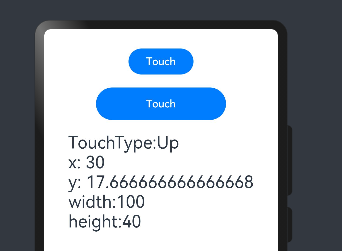
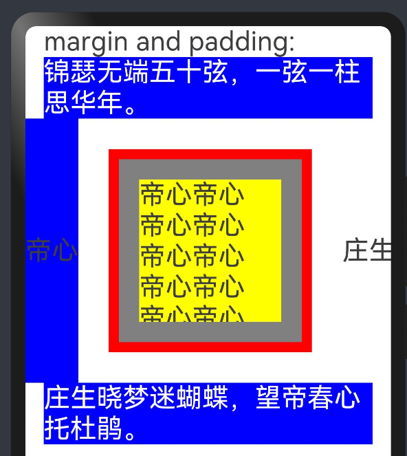
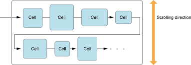
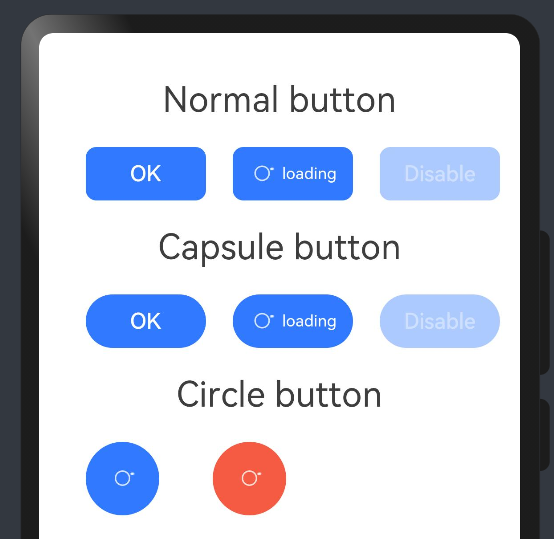

# 05：组件


组件是构建页面的核心，每个组件通过对数据和方法的简单封装，实现独立的可视、可交互功能单元。组件之间相互独立，随取随用，也可以在需求相同的地方重复使用。

本章主要讲述基于`ArkTS`的声明式开发范式的相关组件。让大家能够了解常用组件的功能，使用组件进行UI界面的搭建，熟悉组件的核心属性和事件等。

# 组件通用信息

## 通用事件

- 点击事件

组件被点击时触发的事件。

```JavaScript
// 点击动作触发该回调
onClick(event: (event?: ClickEvent) => void)
```


```JavaScript
// src/main/ets/pages/common/Click.ets
@Entry
@Component
struct ClickExample {
  @State text: string = ''

  build() {
    Column() {
      Row({ space: 20 }) {
        Button('Click', {type: ButtonType.Normal}).width(100).height(50)
          .onClick((event: ClickEvent) => {
            this.text = 'Click Point:' + '\n  screenX:' + event.screenX + '\n  screenY:' + event.screenY
            + '\n  x:' + event.x + '\n  y:' + event.y + '\ntarget:' + '\n  width:'
            + event.target.area.width + '\n  height:' + event.target.area.height + '\ntimestamp' + event.timestamp;
          })
        Button('Click', {type: ButtonType.Normal}).width(200).height(50)
          .onClick((event: ClickEvent) => {
            this.text = 'Click Point:' + '\n  screenX:' + event.screenX + '\n  screenY:' + event.screenY
            + '\n  x:' + event.x + '\n  y:' + event.y + '\ntarget:' + '\n  width:'
            + event.target.area.width + '\n  height:' + event.target.area.height + '\ntimestamp' + event.timestamp;
          }).margin({top: 20})
      }.margin(0)

      Text(this.text).margin(15).fontSize(26)
    }.width('100%').alignItems(HorizontalAlign.Start)
  }
}
```

- 触摸事件

当手指在组件上按下、滑动、抬起时触发。

```JavaScript
// 手指触摸动作触发该回调
onTouch(event: (event?: TouchEvent) => void)
```



```JavaScript
// src/main/ets/pages/common/Touch.ets
@Entry
@Component
struct TouchExample {
  @State text: string = ''
  @State eventType: string = ''

  build() {
    Column() {
      Button('Touch').height(40).width(100)
        .onTouch((event: TouchEvent) => {
          if (event.type === TouchType.Down) {
            this.eventType = 'Down'
          }
          if (event.type === TouchType.Up) {
            this.eventType = 'Up'
          }
          if (event.type === TouchType.Move) {
            this.eventType = 'Move'
          }
          this.text = 'TouchType:' + this.eventType + '\nx: '
          + event.touches[0].x + '\n' + 'y: ' + event.touches[0].y + '\nwidth:'
          + event.target.area.width + '\nheight:' + event.target.area.height
        })
      Button('Touch').height(50).width(200).margin(20)
        .onTouch((event: TouchEvent) => {
          if (event.type === TouchType.Down) {
            this.eventType = 'Down'
          }
          if (event.type === TouchType.Up) {
            this.eventType = 'Up'
          }
          if (event.type === TouchType.Move) {
            this.eventType = 'Move'
          }
          this.text = 'TouchType:' + this.eventType + '\nx: '
          + event.touches[0].x + '\n' + 'y: ' + event.touches[0].y + '\nwidth:'
          + event.target.area.width + '\nheight:' + event.target.area.height
        })
      Text(this.text).fontSize(26)
    }.width('100%').padding(30)
  }
}
```

- 按键事件

按键事件指组件与键盘、遥控器等按键设备交互时触发的事件（仅适用于所有可获焦组件，例如 Button）。

```JavaScript
// 绑定该方法的组件获焦后，按键动作触发该回调
onKeyEvent(event: (event?: KeyEvent) => void)
```


```JavaScript
// src/main/ets/pages/common/KeyEvent.ets
@Entry
@Component
struct KeyEventExample {
  @State text: string = ''
  @State eventType: string = ''

  build() {
    Column() {
      Button('KeyEvent')
        .onKeyEvent((event: KeyEvent) => {
          if (event.type === KeyType.Down) {
            this.eventType = 'Down'
          }
          if (event.type === KeyType.Up) {
            this.eventType = 'Up'
          }
          this.text = 'KeyType:' + this.eventType + '\nkeyCode:' + event.keyCode + '\nkeyText:' + event.keyText
        })
      Text(this.text).padding(15).fontSize(26)
    }.height(300).width('100%').padding(35)
  }
}
```

## 通用属性

- 尺寸设置

用于设置组件的宽高、边距。




```JavaScript
// src/main/ets/pages/common/Width.ets
// common/Width.ets
@Entry
@Component
struct WidthExample {
  build() {
    Column() {
      Text("margin and padding:").fontSize(26).fontColor(0x3E3E3E).width('90%')

      Text("锦瑟无端五十弦，一弦一柱思华年。").fontSize(26).fontColor(0xFFFFFF).width('90%').backgroundColor(Color.Blue)

      Row() {
        Row() {
          Text("帝心").fontSize(26).fontColor(0x3E3E3E)
        }
        .height(260)
        .backgroundColor(Color.Blue)

        // width: 200, height: 200, padding: 10, margin: 20
        Row() {
          Row() {
            Text("帝心帝心帝心帝心帝心帝心帝心帝心帝心帝心").fontSize(26).fontColor(0x3E3E3E).width('90%')
          }
          .width('100%')
          .height('100%')
          .backgroundColor(Color.Yellow)
        }
        .width(200)
        .height(200)
        .padding(20)
        .margin(30)
        .border({width: 10, color: Color.Red})
        .backgroundColor(Color.Gray)

        Row() {
          Text("庄生").fontSize(26).fontColor(0x3E3E3E)
        }
      }

      Text("庄生晓梦迷蝴蝶，望帝春心托杜鹃。").fontSize(26).fontColor(0xFFFFFF).width('90%').backgroundColor(Color.Blue)
    }
  }
}
```

- 位置设置

设置组件的对齐方式、布局方向和显示位置。



align: 设置元素内容在元素绘制区域内的对齐方式。

direction: 设置元素水平方向的布局。


```JavaScript
// src/main/ets/pages/common/Position.ets
@Entry
@Component
struct PositionExample {
  build() {
    Column() {
      Column({ space: 10 }) {
        // 元素内容<元素宽高，设置内容在元素内的对齐方式
        Text("align:").fontSize(26).fontColor(0x3E3E3E).width('90%')
        Stack() {
          Text('First').height('65%').backgroundColor(0xD2B48C)
          Text('Second').backgroundColor(0xF5DEB3).opacity(0.9)
        }.width('90%').height(50).margin({ top: 5 }).backgroundColor(0xFFE4C4)
        .align(Alignment.TopStart)

        // 父容器设置direction为Direction.Ltr，子元素从左到右排列
        Text('direction').fontSize(26).fontColor(0x3E3E3E).width('90%')
        Row() {
          Text('1').height(50).width('25%').fontSize(16).backgroundColor(0xF5DEB3)
          Text('2').height(50).width('25%').fontSize(16).backgroundColor(0xD2B48C)
          Text('3').height(50).width('25%').fontSize(16).backgroundColor(0xF5DEB3)
          Text('4').height(50).width('25%').fontSize(16).backgroundColor(0xD2B48C)
        }
        .width('90%')
        .direction(Direction.Ltr)

        // 设置子组件左上角相对于父组件左上角的偏移位置
        Text('position').fontSize(26).fontColor(0x3E3E3E).width('90%')
        Row() {
          Text('1').size({ width: '30%', height: '50' }).backgroundColor(0xdeb887).border({ width: 1 }).fontSize(16)
          Text('2 position(30, 10)')
            .size({ width: '60%', height: '30' })
            .backgroundColor(0xbbb2cb)
            .border({ width: 1 })
            .fontSize(16)
            .align(Alignment.Start)
            .position({ x: 30, y: 10 })
          Text('3').size({ width: '45%', height: '50' }).backgroundColor(0xdeb887).border({ width: 1 }).fontSize(16)
          Text('4 position(50%, 70%)')
            .size({ width: '50%', height: '50' })
            .backgroundColor(0xbbb2cb)
            .border({ width: 1 })
            .fontSize(16)
            .position({ x: '50%', y: '70%' })
        }.width('90%').height(100).border({ width: 1, style: BorderStyle.Dashed })

        // 相对于起点偏移，其中x为最终定位点距离起点水平方向间距，x>0往左，反之向右。
        // y为最终定位点距离起点垂直方向间距，y>0向上，反之向下
        Text('markAnchor').fontSize(26).fontColor(0x3E3E3E).width('90%')
        Stack({ alignContent: Alignment.TopStart }) {
          Row()
            .size({ width: '100', height: '100' })
            .backgroundColor(0xdeb887)
          Text('1')
            .size({ width: 25, height: 25 })
            .backgroundColor(Color.Green)
            .markAnchor({ x: 25, y: 25 })
          Text('2')
            .size({ width: 25, height: 25 })
            .backgroundColor(Color.Yellow)
            .markAnchor({ x: -100, y: -25 })
          Text('3')
            .size({ width: 25, height: 25 })
            .backgroundColor(Color.Gray)
            .markAnchor({ x: 25, y: -25 })
        }.margin({ top: 25 }).border({ width: 1, style: BorderStyle.Dashed })

        // 相对定位，x>0向右偏移，反之向左，y>0向下偏移，反之向上
        Text('offset').fontSize(26).fontColor(0x3E3E3E).width('90%')
        Row() {
          Text('1').size({ width: '15%', height: '50' }).backgroundColor(0xdeb887).border({ width: 1 }).fontSize(16)
          Text('2  offset(15, 30)')
            .size({ width: 120, height: '50' })
            .backgroundColor(0xbbb2cb)
            .border({ width: 1 })
            .fontSize(16)
            .align(Alignment.Start)
            .offset({ x: 15, y: 30 })
          Text('3').size({ width: '15%', height: '50' }).backgroundColor(0xdeb887).border({ width: 1 }).fontSize(16)
          Text('4 offset(-10%, 20%)')
            .size({ width: 100, height: '50' })
            .backgroundColor(0xbbb2cb)
            .border({ width: 1 })
            .fontSize(16)
            .offset({ x: '-5%', y: '20%' })
        }.width('90%').height(100).border({ width: 1, style: BorderStyle.Dashed })
      }
    }
    .width('100%').margin({ top: 5 })
  }
}
```

# 基础组件

## Button

按钮组件，可快速创建不同样式的按钮。

方法1： `Button(options?: {type?: ButtonType, stateEffect?: boolean})`

方法2： `Button(label?: ResourceStr, options?: { type?: ButtonType, stateEffect?: boolean })`

使用文本内容创建相应的按钮组件，此时Button无法包含子组件。



```JavaScript
// src/main/ets/pages/basic/Button.etx
@Entry
@Component
struct ButtonExample {
  build() {
    Column({ space: 20 }) {
      Text('Normal button').fontSize(9).fontColor(0x3E3E3E).fontSize(26)
      Row({ space: 20 }) {
        Button('OK', { type: ButtonType.Normal, stateEffect: true }).borderRadius(8).backgroundColor(0x317aff).width(90)
        Button({ type: ButtonType.Normal, stateEffect: true }) {
          Row() {
            LoadingProgress().width(20).height(20).margin({ left: 12 }).color(0xFFFFFF)
            Text('loading').fontSize(12).fontColor(0xffffff).margin({ left: 5, right: 12 })
          }
        }.borderRadius(8).backgroundColor(0x317aff).width(90).height(40)

        Button('Disable', { type: ButtonType.Normal, stateEffect: false }).opacity(0.4)
          .borderRadius(8).backgroundColor(0x317aff).width(90)
      }

      Text('Capsule button').fontSize(9).fontColor(0x3E3E3E).fontSize(26)
      Row({ space: 20 }) {
        Button('OK', { type: ButtonType.Capsule, stateEffect: true }).backgroundColor(0x317aff).width(90)
        Button({ type: ButtonType.Capsule, stateEffect: true }) {
          Row() {
            LoadingProgress().width(20).height(20).margin({ left: 12 }).color(0xFFFFFF)
            Text('loading').fontSize(12).fontColor(0xffffff).margin({ left: 5, right: 12 })
          }.width(90).height(40)
        }.backgroundColor(0x317aff)

        Button('Disable', { type: ButtonType.Capsule, stateEffect: false }).opacity(0.4)
          .backgroundColor(0x317aff).width(90)
      }

      Text('Circle button').fontSize(9).fontColor(0x3E3E3E).fontSize(26)
      Row({ space: 20 }) {
        Button({ type: ButtonType.Circle, stateEffect: true }) {
          LoadingProgress().width(20).height(20).color(0xFFFFFF)
        }.width(55).height(55).backgroundColor(0x317aff)

        Button({ type: ButtonType.Circle, stateEffect: true }) {
          LoadingProgress().width(20).height(20).color(0xFFFFFF)
        }.width(55).height(55).margin({ left: 20 }).backgroundColor(0xF55A42)
      }.align(Alignment.Start).width('100%')
    }.height(400).padding({ left: 35, right: 35, top: 35 })
  }
}
```

## Checkbox

提供多选框组件，通常用于某选项的打开或关闭。

```JavaScript
Checkbox(options?: {name?: string, group?: string })
```


```JavaScript
// src/main/ets/pages/basic/Checkbox.ets
@Entry
@Component
struct CheckboxExample {
  @State checked: Object = {dx: true, zs: false}

  build() {
    Column({ space: 10 }) {
      Text("checkbox:\n" + JSON.stringify(this.checked)).fontSize(26).fontColor(0x3E3E3E).width('90%')
      Row() {
        Checkbox({name: 'dx',  group: 'checkboxGroup1'})
          .select(true)
          .selectedColor(0xed6f21)
          .onChange((value: boolean) => {
            console.info('帝心 change is: '+ value)
            this.checked = {...this.checked, dx: value}
          })
        Text('帝心').fontSize(14).lineHeight(20).fontColor('#182431').fontWeight(500)

        Checkbox({name: 'zs',  group: 'checkboxGroup2'})
          .select(false)
          .selectedColor(0x39a2db)
          .onChange((value: boolean) => {
            console.info('庄生 change is: '+ value)
            this.checked = {...this.checked, zs: value}
          })
        Text('庄生').fontSize(14).lineHeight(20).fontColor('#182431').fontWeight(500)
      }

      // 全选按钮
      Text("checkbox group:\n帝心的特点有哪些").fontSize(26).fontColor(0x3E3E3E).width('90%')
      Row() {
        CheckboxGroup({ group: 'checkboxGroup' })
          .selectedColor('#007DFF')
          .onChange((itemName: CheckboxGroupResult) => {
            console.info("checkbox group content" + JSON.stringify(itemName))
          })
        Text('Select All').fontSize(14).lineHeight(20).fontColor('#182431').fontWeight(500)
      }

      // 选项1
      Row() {
        Checkbox({ name: 'checkbox1', group: 'checkboxGroup' })
          .selectedColor('#007DFF')
          .onChange((value: boolean) => {
            console.info('Checkbox1 change is: ' + value)
          })
        Text('真诚').fontSize(14).lineHeight(20).fontColor('#182431').fontWeight(500)
      }.margin({ left: 36 })

      // 选项2
      Row() {
        Checkbox({ name: 'checkbox2', group: 'checkboxGroup' })
          .selectedColor('#007DFF')
          .onChange((value: boolean) => {
            console.info('Checkbox2 change is: ' + value)
          })
        Text('细').fontSize(14).lineHeight(20).fontColor('#182431').fontWeight(500)
      }.margin({ left: 36 })

      // 选项3
      Row() {
        Checkbox({ name: 'checkbox3', group: 'checkboxGroup' })
          .selectedColor('#007DFF')
          .onChange((value: boolean) => {
            console.info('Checkbox3 change is: ' + value)
          })
        Text('帅').fontSize(14).lineHeight(20).fontColor('#182431').fontWeight(500)
      }.margin({ left: 36 })
    }
    .margin(20)
  }
}
```

## DatePicker

日期选择器组件，用于根据指定日期范围创建日期滑动选择器。

```JavaScript
// 根据指定范围的Date创建可以选择日期的滑动选择器。
DatePicker(options?: {start?: Date, end?: Date, selected?: Date})

// 选择日期时触发该事件。
onChange(callback: (value: DatePickerResult) => void)
```


```JavaScript
// src/main/ets/pages/basic/DatePicker.ets
@Entry
@Component
struct DatePickerExample {
  @State isLunar: boolean = false
  private selectedDate: Date = new Date('2021-08-08')

  build() {
    Column() {
      Button('切换 阳历/农历')
        .margin({ top: 30, bottom: 30 })
        .onClick(() => {
          this.isLunar = !this.isLunar
        })
      DatePicker({
        start: new Date('1970-1-1'),
        end: new Date('2100-1-1'),
        selected: this.selectedDate
      })
        .lunar(this.isLunar)
        .onChange((value: DatePickerResult) => {
          this.selectedDate.setFullYear(value.year, value.month, value.day)
          console.info('select current date is: ' + JSON.stringify(value))
        })

    }.width('100%')
  }
}
```

## Navigation

一般作为Page页面的根容器，通过属性设置来展示页面的标题栏、工具栏、导航栏等。


```JavaScript
// src/main/ets/pages/basic/Navigation.ets
@Entry
@Component
struct NavigationExample {
  @State currentIndex: number = 0
  @State bars: Array<{ text: string, subtitle: string, num: number, img: Resource, content: Resource }> = [
    {
      text: '点赞',
      subtitle: '帝心又细又长',
      num: 0,
      img: $r('app.media.navigation_0'),
      content: $r('app.media.navigation_page0')
    },
    {
      text: '投币',
      subtitle: '全网最新',
      num: 1,
      img: $r('app.media.navigation_1'),
      content: $r('app.media.navigation_page1')
    },
    {
      text: '收藏',
      subtitle: '求三连',
      num: 2,
      img: $r('app.media.navigation_2'),
      content: $r('app.media.navigation_page2')
    }
  ]

  @Builder NavigationTitle() {
    Column() {
      Text(this.bars[this.currentIndex].text)
        .fontColor('#182431')
        .fontSize(30)
        .lineHeight(41)
        .fontWeight(700)
      Text(this.bars[this.currentIndex].subtitle)
        .fontColor('#182431')
        .fontSize(14)
        .lineHeight(19)
        .opacity(0.4)
        .margin({ top: 2, bottom: 20 })
    }.alignItems(HorizontalAlign.Start)
  }

  @Builder NavigationToolbar() {
    Row() {
      ForEach(this.bars, (item, index) => {
        Column() {
          Image(item.img)
            .width(50)
            .height(50)
            .opacity(this.currentIndex == item.num ? 1 : 0.6)
            .border(this.currentIndex == item.num ? {width: 2, color: '#0000AA'} : {width: 0})

          Text(item.text)
            .fontColor(this.currentIndex == item.num ? '#007DFF' : '#182431')
            .fontSize(22)
            .lineHeight(24)
            .fontWeight(500)
            .margin({ top: 3 })
        }.width(104).height(136)
        .onClick(() => {
          this.currentIndex = item.num
        })
      })
    }.margin({ left: 24 })
  }

  build() {
    Column() {
      Navigation() {
        Scroll() {
          Column({ space: 10 }) {
            Image(this.bars[this.currentIndex].content).width('90%').objectFit(ImageFit.Contain)
            Image(this.bars[this.currentIndex].content).width('90%').objectFit(ImageFit.Contain)
            Image(this.bars[this.currentIndex].content).width('90%').objectFit(ImageFit.Contain)
            Image(this.bars[this.currentIndex].content).width('90%').objectFit(ImageFit.Contain)
            Image(this.bars[this.currentIndex].content).width('90%').objectFit(ImageFit.Contain)
          }
        }.scrollable(ScrollDirection.Vertical).height('80%')
      }
      .title(this.NavigationTitle)
      .titleMode(NavigationTitleMode.Free)
      .toolBar(this.NavigationToolbar)
      .hideTitleBar(false)
      .hideToolBar(false)
    }
    .width('100%')
    .height('100%')
    .backgroundColor('#F1F3F5')
  }
}
```

# 容器组件

## Column/Row/Flex


```JavaScript
// src/main/ets/pages/Column.ets
@Entry
@Component
struct ColumnExample {
  build() {
    Column({ space: 10 }) {
      Column() {
        Column().width('50%').height(30).backgroundColor(Color.Blue)
        Column().width('60%').height(30).backgroundColor(Color.Gray)
      }
      .width('90%')
      .height(100)
      .border({width: 1, color: Color.Red})
      .alignItems(HorizontalAlign.Start)
      .justifyContent(FlexAlign.SpaceAround)

      Row() {
        Row().width('30%').height(70).backgroundColor(Color.Blue)
        Row().width('40%').height(90).backgroundColor(Color.Gray)
      }
      .width('90%')
      .height(100)
      .border({width: 1, color: Color.Red})
      .alignItems(VerticalAlign.Center)
      .justifyContent(FlexAlign.SpaceAround)


      Flex({
        direction: FlexDirection.Row,
        justifyContent: FlexAlign.Start,
        alignItems: ItemAlign.End,
        wrap: FlexWrap.Wrap,
        alignContent: FlexAlign.End
      }) {
        Text('1').width('5%').height(50).backgroundColor(0xF5DEB3)
        Text('2').width('20%').height(60).backgroundColor(0xD2B48C)
        Text('3').width('30%').height(70).backgroundColor(0xF5DEB3)
        Text('4').width('15%').height(55).backgroundColor(0xD2B48C)
        Text('5').width('20%').height(60).backgroundColor(0xD2B48C)
        Text('6').width('30%').height(70).backgroundColor(0xF5DEB3)
        Text('7').width('15%').height(55).backgroundColor(0xD2B48C)
      }
      .height(160)
      .width('90%')
      .backgroundColor(0xAFEEEE)
    }
    .margin(20)
  }
}
```

# 实战案例：健康饮食（布局版）


```JavaScript
// src/main/ets/pages/Index.ets
import router from '@ohos.router'
@Entry
@Component
struct Index {
  onPageShow() {
    setTimeout(() => {
      router.pushUrl({url: 'pages/Home'})
    }, 1000)
  }
  build() {
    Flex({
      direction: FlexDirection.Column,
      alignItems: ItemAlign.Center,
      justifyContent: FlexAlign.Center
    }) {
      Image($r('app.media.logo'))
        .width(100)
        .height(100)

      Text('健康饮食')
        .fontSize(26)
        .fontColor(Color.White)
        .margin({top: 300})

      Text('健康的生活来自均衡的饮食')
        .fontSize(16)
        .fontColor(Color.White)
        .margin({top: 10})
    }
      .height('100%')
      .width('100%')
      .backgroundColor('#99ff99')
  }
}
// src/main/ets/pages/Home.ets
import router from '@ohos.router'
import { FoodInfo } from '../model/DataModels'
@Entry
@Component
struct Home {
  @State currentTabIndex: number = 0
  build() {
    Tabs() {
      TabContent() {
        Foods()
      }
      .tabBar(this.bar('主页', $r('app.media.ic_bottom_home'), 0))
      TabContent() {
        Column({ space: 10 }) {

          Text("敬请期待第二季").fontSize(26).fontColor(0x3E3E3E)
          Text("实战开发教程，会实现全部功能。").fontSize(18).fontColor(0x3E3E3E)
        }
        .padding(30)
        .alignItems(HorizontalAlign.Center)
      }
      .tabBar(this.bar('记录', $r('app.media.ic_bottom_record'), 1))
    }
    .barPosition(BarPosition.End)
    .onChange((index) => {
      this.currentTabIndex = index
    })
  }

  @Builder
  bar(name: string, icon: Resource, index: number) {
    Flex({
      direction: FlexDirection.Column,
      alignItems: ItemAlign.Center,
      justifyContent: FlexAlign.Center
    }) {
      Image(icon)
        .width(24)
        .height(24)
        .fillColor(this.currentTabIndex === index ? '#55ff55' : '')
      Text(name).fontSize(11).fontColor(0x3E3E3E).margin(10).fontColor(this.currentTabIndex === index ? '#55ff55' : '')
    }
  }
}

@Component
struct Foods {
  @State currentTabIndex: number = 0
  private categories: Array<{id: number, name: string}> =
    [{id: 1, name: '蔬菜'},{id: 2, name: '水果'},{id: 3, name: '坚果'},{id: 4, name: '海鲜'}]
  private foods: Array<FoodInfo> = [
    {
      id: 0,
      name: '番茄',
      kk: 15,
      category: 1,
      img: $r('app.media.tomato'),
      rl: 0,
      yy: 0,
      zf: 0
    },
    {
      id: 1,
      name: '核桃',
      kk: 646,
      category: 3,
      img: $r('app.media.walnut'),
      rl: 0,
      yy: 0,
      zf: 0
    },
    {
      id: 2,
      name: '黄瓜',
      kk: 16,
      category: 2,
      img: $r('app.media.cucumber'),
      rl: 0,
      yy: 0,
      zf: 0
    },
    {
      id: 3,
      name: '蓝莓',
      kk: 57,
      category: 2,
      img: $r('app.media.blueberry'),
      rl: 0,
      yy: 0,
      zf: 0
    },
    {
      id: 4,
      name: '螃蟹',
      kk: 97,
      category: 4,
      img: $r('app.media.crab'),
      rl: 0,
      yy: 0,
      zf: 0
    },
    {
      id: 5,
      name: '冰淇淋',
      kk: 150,
      category: 5,
      img: $r('app.media.icecream'),
      rl: 0,
      yy: 0,
      zf: 0
    },
    {
      id: 6,
      name: '洋葱',
      kk: 40,
      category: 1,
      img: $r('app.media.onion'),
      rl: 0,
      yy: 0,
      zf: 0
    },
    {
      id: 7,
      name: '蘑菇',
      kk: 20,
      category: 1,
      img: $r('app.media.mushroom'),
      rl: 0,
      yy: 0,
      zf: 0
    },
    {
      id: 8,
      name: '猕猴桃',
      kk: 61,
      category: 2,
      img: $r('app.media.kiwi'),
      rl: 0,
      yy: 0,
      zf: 0
    },
    {
      id: 9,
      name: '火龙果',
      kk: 55,
      category: 2,
      img: $r('app.media.pitaya'),
      rl: 0,
      yy: 0,
      zf: 0
    },
    {
      id: 10,
      name: '草莓',
      kk: 32,
      category: 2,
      img: $r('app.media.strawberry'),
      rl: 0,
      yy: 0,
      zf: 0
    },
    {
      id: 11,
      name: '牛油果',
      kk: 171,
      category: 2,
      img: $r('app.media.avocado'),
      rl: 0,
      yy: 0,
      zf: 0
    },
  ]
  build() {
    Tabs() {
      TabContent() {
        Grid() {
          ForEach(this.foods, (item, index) => {
            GridItem() {
              FoodItem({food: item})
            }
          })
        }
        .columnsTemplate('1fr 1fr')
        .rowsGap(10)
        .columnsGap(10)
      }
      .tabBar(this.bar('所有', 0))

      ForEach(this.categories, (item, index) => {
        TabContent() {
          Grid() {
            ForEach(this.foods.filter(food => food.category === this.currentTabIndex), (item, index) => {
              GridItem() {
                FoodItem({food: item})
              }
            })
          }
          .columnsTemplate('1fr 1fr')
          .rowsGap(10)
          .columnsGap(10)
        }
        .tabBar(this.bar(item.name, item.id))
      })
    }
    .width('90%')
    .padding({bottom: 20})
    .onChange((index) => {
      this.currentTabIndex = index
    })
  }

  @Builder
  bar(name: string, index: number) {
    Flex({
      direction: FlexDirection.Column,
      alignItems: ItemAlign.Center,
      justifyContent: FlexAlign.Center
    }) {
      Text(name).fontSize(this.currentTabIndex === index ? 20 : 14).fontColor(0x3E3E3E).margin(10)
    }
  }
}

@Component
struct FoodItem {
  private food: FoodInfo
  build() {
    Column() {
      Image(this.food.img).width('100%').height(152).backgroundColor('#f1f3f5').objectFit(ImageFit.Contain)
      Row() {
        Text(this.food.name).fontSize(16).fontColor(0x3E3E3E)
        Blank()
        Text(this.food.kk + ' 千卡').fontSize(16).fontColor(0x3E3E3E)
      }
      .width('100%')
      .height(32)
      .backgroundColor('#e5e5e5')
      .padding({left: 12, right: 12})
    }
    .clip(new Rect({width: '100%', height: '100%', radius: 6}))
    .onClick(() => {
      console.log(JSON.stringify(this.food))
      router.pushUrl({
        url: 'pages/Detail',
        params: {
          foodInfo: this.food
        }
      })
    })
  }
}
// src/main/ets/pages/Detail.ets
import router from '@ohos.router'
import { FoodInfo } from '../model/DataModels'
@Entry
@Component
struct Detail {
  private foodInfo = (router.getParams() as {foodInfo: FoodInfo}).foodInfo
  // private foodInfo = {"id":0,"name":"番茄","kk":15,"category":1,"img":{"id":16777232,"type":20000,"params":[],"bundleName":"com.example.healthydiet","moduleName":"entry"},"rl":0,"yy":0,"zf":0}

  build() {
    Column() {
      PageTitle()
      FoodImage({foodInfo: this.foodInfo})
      Content({foodInfo: this.foodInfo})
    }
    .height('100%')
    .backgroundColor('#dedede')
  }
}

@Component
struct PageTitle {
  build() {
    Row() {
      Image($r('app.media.back'))
        .width(20)
        .height(20)
        .margin({right: 5})
        .onClick(() => {
          router.back()
        })
      Text('食物详情').fontSize(26).fontColor(0x3E3E3E)
    }
    .width('100%')
    .margin({top: 8})
    .padding({left: 20})
    .justifyContent(FlexAlign.Start)
  }
}

@Component
struct FoodImage {
  private foodInfo: FoodInfo
  build() {
    Stack() {
      Image(this.foodInfo.img)
        .objectFit(ImageFit.Contain)
      Text(this.foodInfo.name).fontSize(26).fontColor(0x3E3E3E).width('90%').position({x: 10, y: 230})
    }
    .height(300)
  }
}

@Component
struct Content {
  private foodInfo: FoodInfo
  build() {
    Column() {
      this.LineContent('#ffaaaa', '热量', this.foodInfo.rl, '千卡')
      this.LineContent('#aaffaa', '营养元素', this.foodInfo.rl, '克')
      this.LineContent('#aaaaff', '脂肪', this.foodInfo.zf, '克')
    }
    .width('90%')
    .margin({top: 20, bottom: 20})
    .padding(20)
    .borderRadius(10)
    .backgroundColor(Color.White)
  }

  @Builder
  LineContent(color: ResourceColor, name: string, count: number, unit: string) {
    Row() {
      Circle({width: 6, height: 6})
        .margin({right: 12})
        .fill(color)
      Text(name).fontSize(22).fontColor(0x3E3E3E)
      Blank()
      Text(count + ' ' + unit).fontSize(22).fontColor(0x3E3E3E)
    }
    .width('100%')
    .margin(10)
    .padding({left: 10, right: 10})
  }
}
// src/main/ets/model/DataModels.ets
export class FoodInfo {
  id: number = 0;
  name: string = ''
  img: Resource | null = null;
  category: number = 0;
  kk: number = 0;
  rl: number = 0;
  yy: number = 0;
  zf: number = 0;
}
```

> 配套代码见gitee
