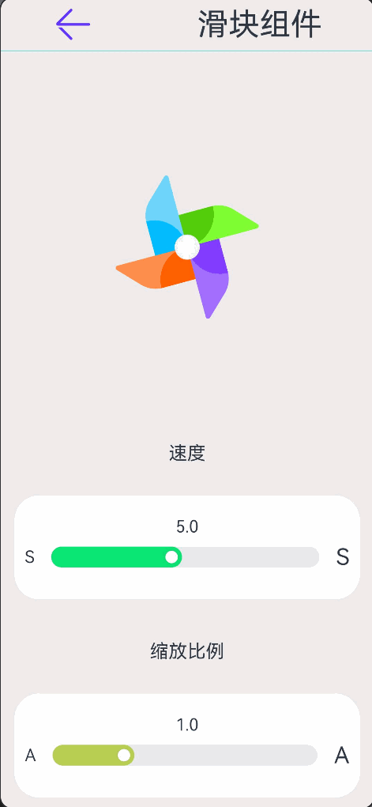

# ArkUI组件学习

## Slider滑块组件

滑动条组件，通常用于快速调节设置值，如音量调节、亮度调节等应用场景。

### 接口

```typescript
Slider(options?: SliderOptions)
```

### SliderOptions对象说明

> 详细内容请参考官方文档，此处只以代码展示

```typescript
  Slider({
        min:0,
        max:100,
        value:40,
        step:10,
        // 滑块在外面 || 里面
        // style:SliderStyle.OutSet,
        style:SliderStyle.InSet,
        // 横向 或者  纵向
        direction:Axis.Horizontal,
        // direction:Axis.Vertical,
        // 是否反向滑动
        reverse:false
      })
        .width('90%')
        .showTips(true)   // 滑动时候展示百分比
        .blockColor('#ffe2109c')    // 滑块颜色
        // 改变滑块时 会获取当前滑块值  60%的时候好像有点异常 但是无伤大雅
        .onChange((value) => {
          this.sliderVal1 = value
        })
```

### 案例：风车效果



```typescript
import { router } from '@kit.ArkUI'
import { RouterParm } from '../../model/MyRouterInfo'
import TopTitle from '../../view/TopTitle'

@Entry
@Component
struct SliderPage {
  pageName: string = (router.getParams() as RouterParm)?.pageName || '滑块组件'
  @State message: string = this.pageName
  // 初始化风车旋转角度
  @State angle: number = 0
  // 初始化缩放倍数
  @State imageSize: number = 1
  //默认初始化速度
  @State speed: number = 5
  // 定时器timmer
  private interval: number = 0

  // 页面加载，定时修改旋转速度
  onPageShow(): void {
    // 避免定时器重复。先清空
    clearInterval(this.interval)
    this.interval = setInterval(() => {
      this.angle += this.speed
    }, 15)
  }

  build() {
    Column({ space: 30 }) {
      TopTitle({ message: this.message })
      Blank()
      // 添加风车
      Image($rawfile('windmill.png'))
        .windmillStyle(this.angle,this.imageSize)


      Blank()
      // 速度面版
      SliderPanels({
        title: '速度',
        // 父子双向数据联动
        sliderVal: this.speed,
        mark: 'S',
        options: {
          min: 1,
          max: 10,
          step: 1,
          value: this.speed,
          style: SliderStyle.InSet
        },
        selectedColor: '#ff0be775'
      })

      // 缩放面版Panels
      SliderPanels({
        title: '缩放比例',
        // 父子双向数据联动
        sliderVal: this.imageSize,
        mark: 'A',
        options: {
          min: .5,
          max: 2.5,
          step: .1,
          value: this.imageSize,
          style: SliderStyle.InSet
        },
        selectedColor: '#ffb8cf54'
      })
    }
    .width('100%')
    .height('100%')
    .backgroundColor($r('app.color.theme_color'))
  }
}

@Component
struct SliderPanels {
  title: string = '面板标题'
  @Link sliderVal: number
  //滑块左右的标记提示
  mark: string = 'S'
  // 滑块SliderOptions
  options: SliderOptions = {
    value: this.sliderVal,
    min: 1,
    max: 10,
    step: 1,
    style: SliderStyle.InSet
  }
  // 滑块颜色
  selectedColor: string = '#ff0be775'

  build() {
    // 面版Panels
    Column({ space: 20 }) {
      Text(this.title)
        .fontSize(18)
      Column() {
        // 变成字符串，保留一位小数
        Text(this.sliderVal.toFixed(1))
        Row({ space: 10 }) {
          Text(this.mark)
            .fontSize(16)
          // 滑块组件
          Slider(this.options)
            .selectedColor(this.selectedColor)
            .layoutWeight(1)
            .onChange((value: number) => {
              this.sliderVal = value
            })
          Text(this.mark)
            .fontSize(22)
        }
      }
      .justifyContent(FlexAlign.Center)
      .backgroundColor(Color.White)
      .borderRadius(24)
      .height(100)
      .width('98%')
      .padding({
        left: 10,
        right: 10
      })
      .margin({
        top: 10,
        bottom: 10
      })
    }
    .width('100%')
    .padding({
      left: 10,
      right: 10
    })
    .alignItems(HorizontalAlign.Center)
    .justifyContent(FlexAlign.Center)
  }
}


@Extend(Image)
function windmillStyle(angleVal:number,scaleVal:number){
  .width(150)
  .height(150)
  .objectFit(ImageFit.Contain)//   沿着Z轴旋转
  .rotate({
    z: 1,
    angle: angleVal
  })// 缩放值
  .scale({
    x: scaleVal,
    y: scaleVal
  })
}
```

