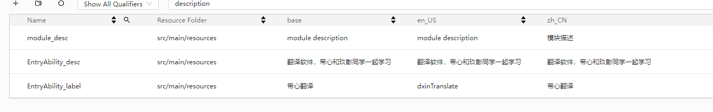

# 实战：帝心翻译 `DxinTranslate`
> 翻译软件，基于NEXT


>  东北某大学的 玖璋同学 在编写该程序时遇到一些bug，联系到 帝心。遂，本项目为帮助其解决bug而录制。
>
>本项目基于 NEXT 版本开发，考虑到录制视频时，众多网友还没有 NEXT 权限。
> 所以基于4.0IDE,API9版本进行编写笔记+视频录制。
> 

* 项目目录
```
├──entry/src/main/ets                // 代码区
│  ├──common
│  │  └── Constants.ets               // 常量类
│  ├──entryability
│  │  └── EntryAbility.ets            // 程序入口类
│  ├──fun
│  │  └── getData.ets                 // 获取数据的函数
│  ├──model
│  │  └── Data.ets                    // 数据模型类
│  ├──pages
│  │  └── IndexPage.ets               // 帝心翻译 程序入口页
│  │  └── LanguageChoice.ets          // 语言选择 页面
│  ├──view
│  │  ├── History.ets                 // 翻译历史 组件
│  │  └── Languageltem.ets            //目标语言选择每一项 组件
│  │  └── Translate.ets               //翻译布局 组件
└──entry/src/main/resources           // 资源文件
```

## 1. 项目介绍

本项目为翻译app，可切换语种进行翻译。可升级扩展为多中接口翻译（`百度翻译`/`天行数据`/`聚合数据`/`个人搭建服务端`等）。

## 2. 项目创建和基本配置


### 配置国际化资源


---
### 配置app图标+名称+网络权限


* 配置图标和名称后，效果如下：


---
### 配置app主题色和主要文本颜色
> 在 `src/main/resources/base/element/color.json` 文件中追加配置项。

> 本项目页面数量少，公用数据不多。如果是商用app。则很有必要进行配置。


---

## 3. 页面开发
> 由于代码量大健康，不在此赘述。请移步本网站右上角gitee进行查看。
看在免费公益为大学生提供教程的份上，不要吝啬你的start呦。

### 项目首页


---
### 语言选择页面


---

### 真机运行效果


## 4. NEXT版本迁移
> 只要正经写代码，不要到处any。需要对象就去new。当个正经人。迁移成本就很低甚至零成本。

> 配合视频观看如何迁移