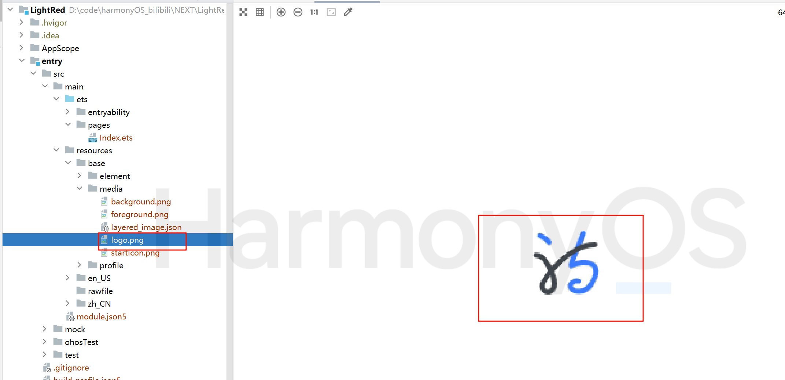
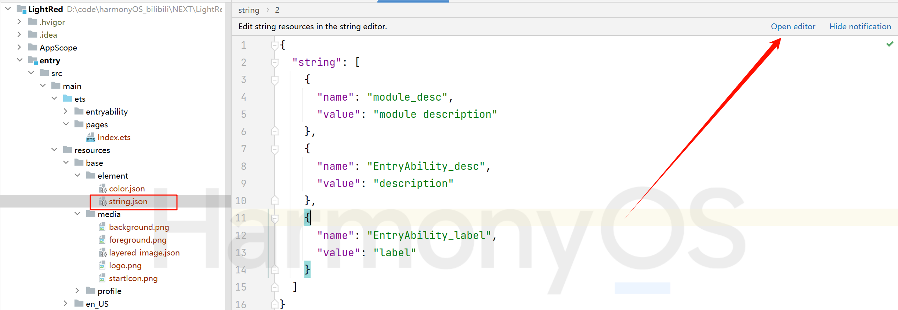
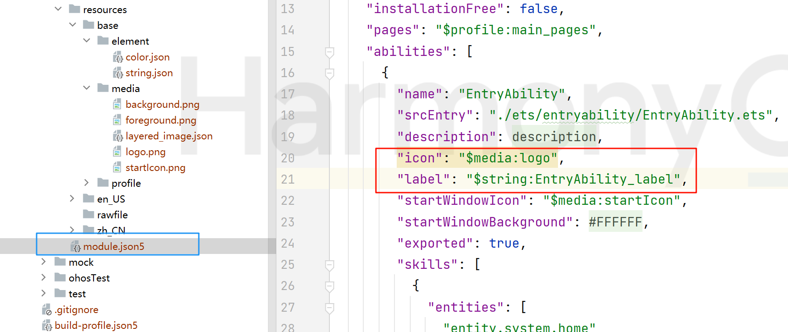

#实战： 何浅红 `LightRed`
>  本项目基于next版本开发。

## 项目介绍
本项目取名`何浅红`，出自李清照的《鹧鸪天·桂花》诗文中的：`何须浅碧深红色，自是花中第一流`。由此可知，该应用是一个诗词主题的app。

旨在使用最新的鸿蒙技术结合传统的诗词文化，是开发者热爱并推广鸿蒙生态，是用户领略诗词歌赋的魅力。

基本功能和技术点：

* 页面UI布局和路由跳转

* 网络请求和数据处理

* 模块化开发和封装抽取

* ...

## 源码下载

> 本网站右上角gitee


## 环境搭建
>  本案例代码可运行于next版本和API9版本。

### 软件要求
* DevEco Studio版本：DevEco Studio NEXT Developer Preview1及以上。
* HarmonyOS SDK版本：HarmonyOS NEXT Developer Preview1 SDK及以上。

### 硬件要求
* 设备类型：华为手机。
* HarmonyOS系统：HarmonyOS NEXT Developer Preview1及以上。

### 环境搭建

> 官网下载IDE，进行相关配置。有next的用next。如在24年6月之前看到本笔记。未获得next权限的。可使用4.0编辑器API9开发。

> 不会安装环境的不要来学这个实践项目


---


## (何浅红)开发


### 创建项目和基本配置

#### 创建项目


#### 配置app图标和名称

* 图标

> 准备一个logo作为app的图标。存放到`src/main/resources/base/media`目录下。
>
>去[阿里巴巴矢量图标库](https://www.iconfont.cn/)下载适合自己app的图标。或者自己P图，第三方网站制作。均可。



* 名称
 > 进入 `src/main/resources/base/element/string.json` 配置国际化字符串资源。设置app名称和其他所需字符串。



* 修改 `src/main/module.json5` 配置文件，使图标和名称生效。
> 安装到手机上或者模拟器运行时的效果。预览器看不到效果。


---

#### 配置颜色资源
> 在 `src/main/resources/base/element/color.json` 中app页面中可能共用的颜色值。
>
> 方便修改多个页面相同的颜色取值时，只修改配置文件。页面中引用该颜色值自动变化。提高维护效率。
> 
> 例如,app的主题色，标题文本颜色等。在后续的扩展中该文件会配置的更多。
>
> 其实，在开发app之前，应该是先有UI设计图。美工提供好设计稿，所有的数据都提前给好了。按照设计稿配置该文件。编码过程中直接应用颜色资源即可。
> 
> 因为本app是授课过程记录，边开发边设计，哪来的设计稿。
```
{
  "color": [
    {
      "name": "start_window_background",
      "value": "#FFFFFF"
    },
    {
      "name": "app_theme",
      "value": "#FFF5E5F2"
    },
    {
      "name": "title",
      "value": "#ff8f4242"
    }
  ]
}
```
---
#### 配置网络权限
> 该app需要从网络上提供的免费API接口 `https://api.apiopen.top/api/sentences` 通过http请求获取诗词。必然用到网络权限。
>
> 在 `src/main/module.json5` 文件中申请网络权限。下面贴出申请网络权限关键代码。追加在该文件最后即可。
```
"requestPermissions": [{
    "name": "ohos.permission.INTERNET"
    }]
```

---
### 编写 `Index.ets` 开屏页
> 在当前开屏页会使用到相关资源。自行准备。如下：
>   * 开屏时显示图片`loading.jpg`
>   * 抽取到外部的自定义组件（涉及导入到处）
>   * 生命周期函数`aboutToAppear()`中，路由跳转的其他页面资源

```
import router from '@ohos.router'
import LogoAndTitle from '../viewComp/LogoAndTitle'

@Entry
@Component
struct Index {
  // 生命周期函数
  aboutToAppear(){
  //   单次定时器
    setTimeout(() => {
      // 开屏界面不会再跳转回来。没必要保存路由到栈内存。栈内存最多有32个路由。
      router.replaceUrl({
        url: "pages/Show"
      })
    },3000)
  }

  build() {
    Column({space:40}) {
      Image($rawfile('loading.jpg'))
        .height('75%')

      LogoAndTitle()

      Text($r('app.string.Name_from'))
        .fontColor($r('app.color.title'))
    }
    .width('100%')
    .height('100%')
    .backgroundColor($r('app.color.app_theme'))
  }
}
```
#### 补充自定义组件LogoAndTitle
* > 在 `src/main/ets` 目录下创建子级目录：`viewComp`:
    > 该目录下存放页面文件所需要的所有自定义组件。
* > 在`src/main/ets/viewComp` 目录下补充`index.ets`调用的自定义组件`LogoAndTitle.ets`
```
// 固定的组件，在多个页面用。一行：logo和标题
//  向外暴露 export default
@Component
export default struct LogoAndTitle {
  @State message: Resource = $r('app.string.Title')
  build() {
    Row({space:40}){
      Image($r('app.media.logo'))
        .width(40)
      Text(this.message)
        .fontSize(30)
        .fontColor($r('app.color.title'))
    }
    .margin({top:5})
    .height('7%')
  }
}
```
#### 补充路由跳转的目标页面资源（新建show页面）
* > 右键新建show页面过程省略。

### 开屏页`Index.ets`预览效果


---

### 编写`Show.ets` 页面
* > 该页面为主要展示页面。抽取了自定义组件到`viewComp`目录下。后续步骤补齐。
```
import LogoAndTitle from '../viewComp/LogoAndTitle'
import ShowCenter from '../viewComp/ShowCenter'

@Entry
@Component
struct PoemMain {
  build() {
    Column({ space: 30 }) {
      // 顶部
      LogoAndTitle()
      // 中心区域
      ShowCenter()
    }
    .showPageStyle()
  }
}

@Extend(Column)
function showPageStyle() {
  .width('100%')
  .height('100%')
  .backgroundColor($r('app.color.app_theme'))
}
```
---
### 补充自定义组件`ShowCenter`
* > 该组件是页面中心区域。
```
// show页面的中心主要展示数据区域。
import http from '@ohos.net.http'
import { fromToAuthorAndSubject } from '../fun/Utils'
import Poem from '../model/Poem'
import ShowPoem from './ShowPoem'
import ShowRecommend from './ShowRecommend'
import ConstantsData from '../constants/ConstantsData'

@Component
export default struct ShowCenter {
  @State poem: Poem = new Poem('何须浅碧深红色，自是花中第一流', '李清照', '桂花')

  aboutToAppear() {
    setInterval(() => {
      let p = http.createHttp().request(ConstantsData.getPoemAPI)
      p.then((data) => {
        // 获取的作者和《题目》
        let from: string = JSON.parse(`${data.result}`).result.from
        // todo: 解析出作者和题目
        this.poem.author = fromToAuthorAndSubject(from)[0]
        this.poem.subject = fromToAuthorAndSubject(from)[1]
        // 获取诗句内容
        this.poem.content = JSON.parse(`${data.result}`).result.name
      })
    }, 3000)
  }

  //自定义构建组件的函数：我是个函数。但是可以呈现组件效果。
  @Builder
  tabTitle(str: string, colorVal: string | Color) {
    Column({ space: 5 }) {
      Text(str).fontSize(20).fontColor(colorVal)
      Divider().width(60).strokeWidth(3).color(colorVal)
    }
  }

  build() {
    //   中间显式两部分可以切换视图的tab栏效果
    Tabs({ barPosition: BarPosition.Start }) {
      // 网络获取诗词
      TabContent() {
        ShowPoem({ poem: this.poem })
      }.tabBar(this.tabTitle('随机诗词', '#ff60e38a'))

      // todo:帝心老师推荐自己喜欢的内容给你
      TabContent() {
        ShowRecommend()
      }.tabBar(this.tabTitle('帝心推荐', Color.Orange))
    }
    .tabsStyle() // 配合barPosition设置tab栏上右下左位置
  }
}

@Extend(Tabs)
function tabsStyle() {
  //   中间显式两部分可以切换视图的tab栏效果
  .height('80%')
  .margin({
    top: -10
  })
  .vertical(false)
}
```
#### 补充自定义组件`ShowCenter`中使用到的类Poem
* > 在  `src/main/ets/model` 目录下新建`Poem.ets`
```
// 诗词类
export default  class Poem {
  content: string
  author: string
  subject: string

  constructor(content: string, author: string, subject: string) {
    this.content = content
    this.author = author
    this.subject = subject
  }
}
```
#### 补充自定义组件`ShowCenter`中使用到的业务函数：fromToAuthorAndSubject()
*  > 在  `src/main/ets/fun` 目录下新建`Utils.ets`
```
// 准备一个功能函数。你给我一个字符串。我给你拆分，截取。返回一个数组。[作者，题目]
export  function  fromToAuthorAndSubject(from:string) :string[]{
  // 李清照《桂花》         ['李清照','桂花》']
  // todo： 有时候获取的作者或者题目是空的。那就用 || 短路一下，给个默认值
  let author :string =  from.split('《')[0] || '帝心'   //'李清照'
  let temp :string = from.split('《')[1]  || '细的雅痞'   //  '桂花》'
  // 截取目标字符串。多种方式。
  // let subject:string = temp.substring(0,temp.length-1)    //'桂花'
  let subject:string = temp.substring(0,temp.indexOf('》'))    //'桂花'
  return [author,subject]
}
```

#### 补充自定义组件`ShowCenter`中使用到的常量数据：ConstantsData
* > 在  `src/main/ets/constants` 目录下新建`ConstantsData.ets`
```
// 常量数据文件。app用到的不方便放到color/string的数据拎出来

// 设计为静态的只读的常量数据：可以在其他地方引入的适合，直接类名.属性名
export default class ConstantsData {
  // 获取诗词的网络接口
  static readonly getPoemAPI: string = 'https://api.apiopen.top/api/sentences'
  //帝心推荐的诗词内容。
  static readonly recommendPoem: Array<string> = [
    '日拱一卒无有尽，功不唐捐终入海',
    '何事人间频乞食? 此心已是负彩霞',
    '峨眉山月半轮秋，影入平羌江水流',
    '进可欺身压正太，退可提臀迎众基',
    '天生我才必有用，千金散尽还复来',
    '洛阳亲友如相问，我在郑州送外卖',
    '垂杨紫陌洛城东,今年花胜去年红',
    '劝君莫负艳阳天，学习鸿蒙趁少年',
    '何须浅碧深红色，自是花中第一流',
    '玲珑骰子安红豆，入骨相思知不知',
    '只愿君心似我心，定不负相思意',
    '衣带渐宽终不悔，为伊消得人憔悴',
    '渐行渐远渐无书，水阔鱼沉何处问',
    '日日思君不见君，共饮长江水',
    '去年花里逢君别，今日花开已一年',
    '我今因病魂颠倒，唯梦闲人不梦君',
    '孤灯不明思欲绝，卷帷望月空长叹',
    '相思一夜梅花发，忽到窗前疑是君',
    '今宵剩把银釭照，犹恐相逢是梦中',
    '相思本是无凭语，莫向花笺费泪行'
  ]
}
```

---
### 补充自定义组件`ShowPoem`
*  > `src/main/ets/viewComp`下补充`ShowPoem.ets`自定义组件
```
import Poem from '../model/Poem'

@Component
export default struct ShowPoem {
  @Prop poem:Poem

  build() {
    Row({ space: 30 }) {
      Row() {
        Text(this.poem.author)
          .textStyle()
      }
      .authorArea()

      Row({ space: 30 }) {
        Text(this.poem.content)
          .textStyle()
          .height('100%')
        Text(this.poem.subject)
          .textStyle()
      }
      .height('100%')
      .alignItems(VerticalAlign.Top)
    }
    .poemArea()
  }
}

@Extend(Text)
function textStyle() {
  .fontSize(20)
  .width(20)
}

@Extend(Row)
function authorArea() {
  .width(20)
  .height('100%')
  .alignItems(VerticalAlign.Bottom)
}

@Extend(Row)
function poemArea() {
  .width('80%')
  .height('96%')
  .backgroundColor('#ffb9f1cb')
  .padding(30)
  .borderRadius(10)
  .justifyContent(FlexAlign.SpaceBetween)
}

```

### 补充自定义组件`ShowRecommend`
* > `src/main/ets/viewComp`下补充`ShowRecommend.ets`自定义组件
```
import ConstantsData from '../constants/ConstantsData'

@Component
export default struct ShowRecommend {
  recommendPoem: string [] = ConstantsData.recommendPoem

  build() {
    List({ space: 15 }) {
      ForEach(this.recommendPoem, (item: string, index: number) => {
        ListItem() {
          Column({ space: 10 }) {
            Text(item)
              .fontSize(18)
              .fontColor(index % 2 == 0 ? '#ffe06d6d' : '#ffe934f6')
            Divider()
              .width('80%')
          }
        }
        .width('100%')
        .height('50')
      })
    }
    .recomStyle()
  }
}

@Extend(List)
function recomStyle() {
  .width('90%')
  .height('96%')
  .backgroundColor('#fff1d7d7')
  .padding(5)
  .borderRadius(10)
  .alignListItem(ListItemAlign.Center)
}

```

---
### 运行效果
