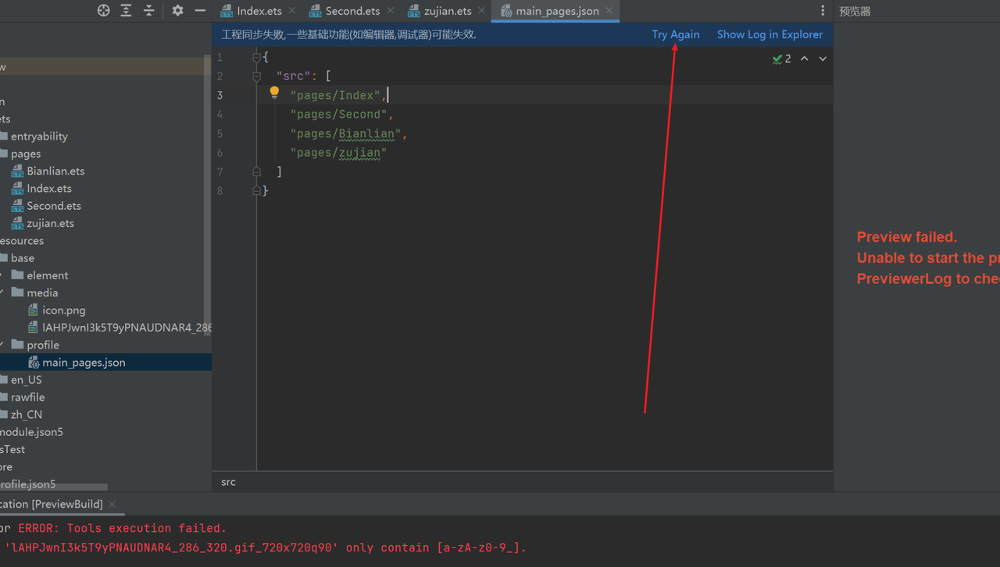
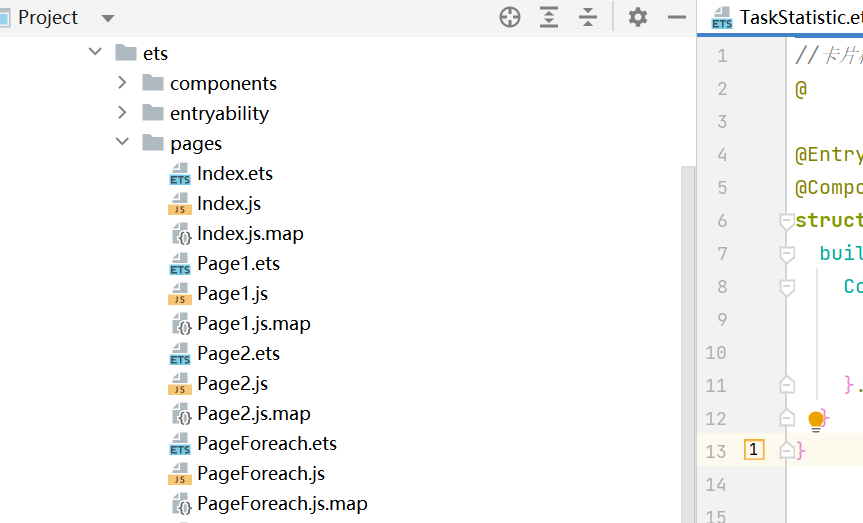
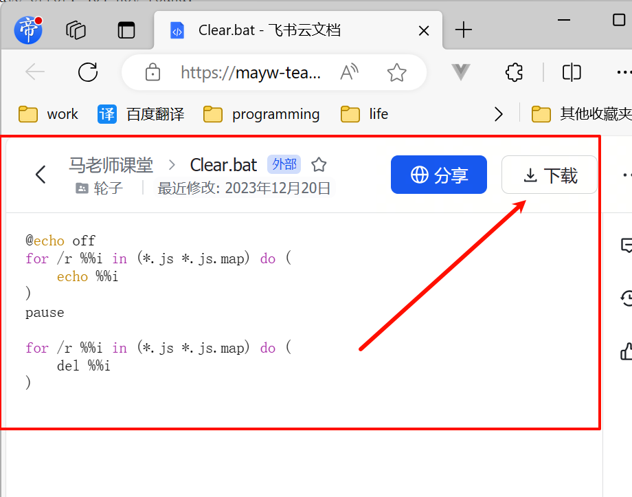

# 01：常见bug与解决方案
> 本文总结鸿蒙常见bug和解决方案，呼吁大家共同维护。

>文章内容有参考网络、公众号、小破站等分享。旨在学习交流，不构商业盈利。如有侵权，请告知，立删。

## 0、编辑器问题
### 0.1 项目同步失败，预览报错
编辑区域会提示工程同步失败，点击重试！
  


### 0.2 项目目录自动生成js和map文件
在3.1版本的DevEco Studio中，项目目录自动生成了js和map文件。会导住项目运行失败。比较遗憾的是，使用3.1版本的朋友，几乎都遇到过这个问题。如图：


解决办法：
* 手动删除js和map文件即可。但是要注意的是，需要删除干净无遗漏。比如`entryability`目录下的也要删除。另外，有些朋友在删除的时候，会手误删掉`ets`文件。这种属于笨比。

* 有人好心人提供了脚本文件。[点击下载](https://mayw-teaching.feishu.cn/file/IHvkbYhAJo96Z2xqIiccdIV4ncf?from=from_copylink)，放在根目录下双击运行，即可自动化删除。



* 建议大家安装[安装4.0编辑器](https://contentcenter-vali-drcn.dbankcdn.cn/pvt_2/DeveloperAlliance_package_901_9/9a/v3/HBD3TfhiT_GFqeX44Qcwtg/devecostudio-windows-4.0.0.600.zip?HW-CC-KV=V1&HW-CC-Date=20231027T004333Z&HW-CC-Expire=315360000&HW-CC-Sign=279824A013505EFC063997614DC1B6AB1C3A2EE5AC48CEF15DDB3E1F79DA435A)，因为4.0版本已经解决了这个问题。如果您有next权限或者等next权限全面放开后，安装最新版本的编辑器。


### 0.3 删除文件后其他页面预览报错

页面文件删除后，并不会在路由配置文件中自动删除其配置文件。启动时会发现路由找到不到文件。所以预览报错。  
去路由配置文件中删除其路由即可。

### 0.4 状态变量数据改变无法驱动UI更新的问题
  变量类型要小写！！！
  

---

## 1、console.log打印日志问题

### 1.1 情况1：字符串较长，打印不出来。

  当使用console.log打印较长的字符串时，会出现打印不出来的问题：
```javascript
var longString:string = "帝心被网友戏称鸿蒙之父。据说细的雅痞，热爱阅读和运动。但是忙于谋生，只能低头牛马。做鸿蒙教程只是为了分享，也是为了帮助更多的大学生。对于开发者而言，教程可能过于简单。但是很多大学生刚接触编程，需要很细很细的讲解，甚至需要带着大家踩坑。然后才能从中学会。否则一个笑笑的bug。可能就把眼神清澈的大学生难死了。帝心被网友戏称鸿蒙之父。据说细的雅痞，热爱阅读和运动。但是忙于谋生，只能低头牛马。做鸿蒙教程只是为了分享，也是为了帮助更多的大学生。对于开发者而言，教程可能过于简单。但是很多大学生刚接触编程，需要很细很细的讲解，甚至需要带着大家踩坑。然后才能从中学会。否则一个笑笑的bug。可能就把眼神清澈的大学生难死了。帝心被网友戏称鸿蒙之父。据说细的雅痞，热爱阅读和运动。但是忙于谋生，只能低头牛马。做鸿蒙教程只是为了分享，也是为了帮助更多的大学生。对于开发者而言，教程可能过于简单。但是很多大学生刚接触编程，需要很细很细的讲解，甚至需要带着大家踩坑。然后才能从中学会。否则一个笑笑的bug。可能就把眼神清澈的大学生难死了。";

console.log("打印长字符串：",longString)
```
  这个问题通常会在网络请求打印json字符串时遇到。根据官方的说法是为了管理内存，经过测试这个长度的极限是1353。目前参考up解决方案是把字符串截断分开打印，开发者们可以直接复制到项目中使用，如有更好的解决方案，请反馈给帝心，后续也会考虑开发第三方包给大家使用。

- 解决方案：
```javascript
YLog(content:string){
    console.log("长度验证:",content.length)
    const maxSize = 1000
    if(content.length <= maxSize){
      //直接打印
      console.log(content)
    }else {
      while (content.length > maxSize){
        let logContent = content.substring(0,maxSize)
        //内容超长，分段打印
        console.log(logContent)
        content = content.replace(logContent,"")
      }
      console.log(content)
    }
  }
```


### 1.2 情况2：字符串中遇到反引号即截断不打印

在网络请求的时候，如果返回的json字符串中包含反引号，那么打印的时候会截断不打印。

 解决方案待定：这会没空去写代码解决。等有空了再来修改文档。给出代码。

---

## 2、Tabs关闭切换动画

- 问题描述

在点击Tabs切换页面时会有一个滑动的动画，参考公众号up主幽蓝君的说话，IOS开发者不习惯这种效果，而且tabbar图标总是要等到动画结束之后才切换，非常像延迟卡顿。如幽蓝君提供的下图所示：


- 问题解决
给Tabs加上一个动画时间后可以完美解决：
```javascript
.animationDuration(1)
```


## 3、获取屏幕尺寸

虽然鸿蒙的组件一般情况下会把屏幕自动撑满，但是有些时候还是需要使用屏幕的尺寸，方法如下：

```javascript
import display from '@ohos.display';


@State screen_width:number = display.getDefaultDisplaySync().width
@State screen_height:number = display.getDefaultDisplaySync().height

```

需要注意的是这个方法在预览器里是获取不到的，需要模拟器或真机，而且这样获取到的单位是px，在开发中默认的单位是vp，需要使用px2vp()转换一下：
```javascript
@State screen_width:number =  px2vp(display.getDefaultDisplaySync().width) 
@State screen_height:number =  px2vp(display.getDefaultDisplaySync().height)
```


