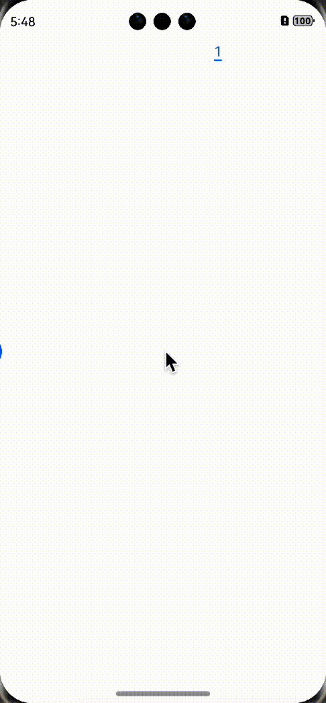

# 02：鸿蒙开发小技巧

> 本文主要介绍在鸿蒙开发中，一些小技巧，以供参考。呼吁大家群策群力。

## 1. 仿B站嵌套滑动
> 本案例基于`next`预览器，使用`next`语法。
> 
> 仿B站嵌套滑动，实现上下滑动时，顶部tab栏在搜索框卷起后有吸顶效果。

### **效果预览：**


在`next`版本中，`List`组件的`nestedScroll`属性中，需要一个`NestedScrollOptions`对象，用来设置向前向后两个方向上的嵌套滚动模式，实现与父组件的滚动联动。

### **`List`属性：**

| 名称                     | 参数类型              | 描述                                                         |
| ------------------------ | --------------------- | ------------------------------------------------------------ |
| `nestedScroll`（API10+） | `NestedScrollOptions` | 嵌套滚动选项。设置向前向后两个方向上的嵌套滚动模式，实现与父组件的滚动联动。 |

`NestedScrollOptions`参数为一个配置对象，说明说下：

| **名称**         | **类型**           | **必填** | **描述**                                 |
| ---------------- | ------------------ | -------- | ---------------------------------------- |
| `scrollForward`  | `NestedScrollMode` | 是       | 可滚动组件往末尾端滚动时的嵌套滚动选项。 |
| `scrollBackward` | `NestedScrollMode` | 是       | 可滚动组件往起始端滚动时的嵌套滚动选项。 |

由上表可知，`scrollForward` 属性和 `scrollBackward` 属性的类型均为  `NestedScrollMode` 枚举。该枚举类型控制父子级联动的效果。

| 名称           | 描述                                                         |
| -------------- | ------------------------------------------------------------ |
| `SELF_ONLY`    | 只自身滚动，不与父组件联动。                                 |
| `SELF_FIRST`   | 自身先滚动，自身滚动到边缘以后父组件滚动。父组件滚动到边缘以后，如果父组件有边缘效果，则父组件触发边缘效果，否则子组件触发边缘效果。 |
| `PARENT_FIRST` | 父组件先滚动，父组件滚动到边缘以后自身滚动。自身滚动到边缘后，如果有边缘效果，会触发自身的边缘效果，否则触发父组件的边缘效果。 |
| `PARALLEL`     | 自身和父组件同时滚动，自身和父组件都到达边缘以后，如果自身有边缘效果，则自身触发边缘效果，否则父组件触发边缘效果。 |

### `List`组件的`nestedScroll`呈现吸顶效果

```javascript
List({ space: 10 }) {
 //...
}
.nestedScroll({
  scrollForward: NestedScrollMode.PARENT_FIRST,
  scrollBackward: NestedScrollMode.PARENT_FIRST
})
```

### 整体案例代码
```javascript
/*
 * 嵌套滚动：类似于哔哩哔哩吸顶效果。【来源于十年码农】
 * */
@Entry
@Component
struct NestedScroll {
  @State tabs: string[] = ['直播', '推荐', '热门', '动画', '影视', '拜年纪', '盛典', '国创']
  @State videos: string[] = []
  @State currentIndex: number = 2

  @Builder
  tabBarItem(name: string, index: number) {
    Row() {
      Text(name).fontSize(20)
        .fontColor(this.currentIndex === index ? Color.Blue : Color.Gray)
    }.width(60).justifyContent(FlexAlign.Center)
  }

  aboutToAppear() {
    for (let index = 0; index < 20; index++) {
      this.videos.push(`第${index + 1}个内容`)
    }
  }

  build() {
    Scroll() {
      Column() {
        Row() {
          Text('仿B站吸顶').fontSize(20)
          Blank()
          TextInput({ placeholder: '你曾经搜索过的...' }).width('40%')
          Blank()
        }
        .width("100%").height(50).backgroundColor(Color.Orange)

        Tabs({ index: 2 }) {
          ForEach(
            this.tabs, (tab: string, index: number) => {
            TabContent() {
              List({ space: 10 }) {
                ForEach(this.videos, (item: string) => {
                  ListItem() {
                    Text(item)
                      .textAlign(TextAlign.Center)
                  }
                  .width('80%')
                  .height('20%')
                  .backgroundColor('#bbb250')
                  .borderRadius(10)
                })
              }
              .lanes(2)
              .alignListItem(ListItemAlign.Center)
              .width("100%")
              .height("100%")
              .nestedScroll({
                scrollForward: NestedScrollMode.PARENT_FIRST,
                scrollBackward: NestedScrollMode.PARENT_FIRST
              })
            }
            .tabBar(this.tabBarItem(tab, index))
          })
        }
        .barMode(BarMode.Scrollable)
        .onChange((index: number) => this.currentIndex = index)
      }
    }
    .width('100%')
    .height('100%')
    .scrollBar(BarState.Off)
  }
}
```

---
## 2. 获取屏幕尺寸

虽然鸿蒙的组件一般情况下会把屏幕自动撑满，但是有些时候还是需要使用屏幕的尺寸，方法如下：

```javascript
import display from '@ohos.display';


@State screen_width:number = display.getDefaultDisplaySync().width
@State screen_height:number = display.getDefaultDisplaySync().height

```

需要注意的是这个方法在预览器里是获取不到的，需要模拟器或真机，而且这样获取到的单位是px，在开发中默认的单位是vp，需要使用px2vp()转换一下：
```javascript
@State screen_width:number =  px2vp(display.getDefaultDisplaySync().width) 
@State screen_height:number =  px2vp(display.getDefaultDisplaySync().height)
```

---
## 3. 懒加载
> 本案例来源于微信公众号[《幽蓝君》](https://mp.weixin.qq.com/s/T0wTo8FbE74X2TKdkXMi7w)。他一个优质的公众号作家，文章很好，如有感兴趣的，可以关注。帝心借鉴其文章案例旨在分享学习技巧，非商用，如侵删。

懒加载是一种延迟加载技术，它允许在需要时才加载资源，如对象或数据，以提高系统性能和资源利用率。这样介绍比较抽象，举一个例子，当一个页面中加载大量图片时，下面分别是不使用懒加载和使用懒加载的效果：

不使用懒加载：



使用懒加载：


明显看出使用懒加载加载速度更快，用户体验更佳，因为懒加载是先加载屏幕中正在展示的数据。

在鸿蒙开发中，懒加载的使用方式一般是使用LazyForEach代替ForEach，但是**数据源不能是通常的数组了，而是IDataSource类型，并且需要实现相关接口**，下面是上文示例中的相关代码：
```
class WaterFlowDataSource implements IDataSource {

  private dataArray: Object[] = []
  private listeners: DataChangeListener[] = []
  constructor() {
    let data = getContext(this).resourceManager.getRawFileContent('images.json',(err,value)=> {
      let view: Uint8Array = new Uint8Array(value); // 使用Uint8Array读取arrayBuffer的数据
      let textDecoder: util.TextDecoder = util.TextDecoder.create(); // 调用util模块的TextDecoder类
      let res: string = textDecoder.decodeWithStream(view); // 对view解码
      let strArr:object[] = JSON.parse(res)

      for (let i = 0; i < strArr.length; i++) {
        this.dataArray.push(strArr[i])
      }
      this.notifyDataReload()
    })

  }

  // 获取索引对应的数据
  public getData(index: number): Object {
    return this.dataArray[index]
  }

  // 通知控制器数据重新加载
  notifyDataReload(): void {
    this.listeners.forEach(listener => {
      listener.onDataReloaded()
    })
  }

  // 通知控制器数据增加
  notifyDataAdd(index: number): void {
    this.listeners.forEach(listener => {
      listener.onDataAdded(index)
    })
  }

  // 通知控制器数据变化
  notifyDataChange(index: number): void {
    this.listeners.forEach(listener => {
      listener.onDataChanged(index)

    })
  }

  // 通知控制器数据删除
  notifyDataDelete(index: number): void {
    this.listeners.forEach(listener => {
      listener.onDataDeleted(index)
    })
  }

  // 通知控制器数据位置变化
  notifyDataMove(from: number, to: number): void {

    this.listeners.forEach(listener => {
      listener.onDataMoved(from, to)
    })
  }

  // 获取数据总数
  public totalCount(): number {
    return this.dataArray.length
  }

  // 注册改变数据的控制器
  registerDataChangeListener(listener: DataChangeListener): void {
    if (this.listeners.indexOf(listener) < 0) {
      this.listeners.push(listener)
    }
  }

  // 注销改变数据的控制器
  unregisterDataChangeListener(listener: DataChangeListener): void {
    const pos = this.listeners.indexOf(listener)
    if (pos >= 0) {
      this.listeners.splice(pos, 1)
    }
  }

  // 增加数据
  public Add1stItem(): void {
    this.dataArray.splice(0, 0, this.dataArray.length)
    this.notifyDataAdd(0)
  }

  // 在数据尾部增加一个元素
  public AddLastItem(): void {
    this.dataArray.splice(this.dataArray.length, 0, this.dataArray.length)
    this.notifyDataAdd(this.dataArray.length-1)
  }

  // 在指定索引位置增加一个元素
  public AddItem(index: number): void {
    this.dataArray.splice(index, 0, this.dataArray.length)
    this.notifyDataAdd(index)
  }

  // 删除第一个元素
  public Delete1stItem(): void {
    this.dataArray.splice(0, 1)
    this.notifyDataDelete(0)
  }

  // 删除第二个元素
  public Delete2ndItem(): void {
    this.dataArray.splice(1, 1)
    this.notifyDataDelete(1)
  }

  // 删除最后一个元素
  public DeleteLastItem(): void {
    this.dataArray.splice(-1, 1)
    this.notifyDataDelete(this.dataArray.length)
  }

  // 重新加载数据
  public Reload(): void {
    this.dataArray.splice(1, 1)
    this.dataArray.splice(3, 2)
    this.notifyDataReload()
  }
}

class MyDataSource extends WaterFlowDataSource {
  private dataArray2: Object[] = [];

  public totalCount(): number {
    return this.dataArray2.length;
  }

  public getData(index: number): Object {
    return this.dataArray2[index];
  }

  public addData(index: number, data: Object): void {
    this.dataArray2.splice(index, 0, data);
    this.notifyDataAdd(index);
  }

  public pushData(data: Object): void {
    this.dataArray2.push(data);
    this.notifyDataAdd(this.dataArray2.length - 1);
  }
}
```

实现懒加载：
```
@State dataSource: WaterFlowDataSource = new WaterFlowDataSource()
```
```
Grid(){
          LazyForEach(this.dataSource,(item:object,index:number)=>{
            GridItem(){
              Image(this.imageURL + item['cover'])
                .width((this.screen_width - 10)/2)
                .height((this.screen_width - 10)/2)
            }

          })
        }
        .columnsTemplate('1fr 1fr')
        .columnsGap(10)
        .rowsGap(10)
        .width('100%')
        .height('100%')
```
