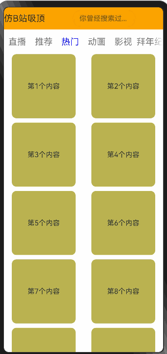

# 02：鸿蒙开发小技巧

> 本文主要介绍在鸿蒙开发中，一些小技巧，以供参考。呼吁大家群策群力。

## 1. 仿B站嵌套滑动
> 本案例基于`next`预览器，使用`next`语法。
> 
> 仿B站嵌套滑动，实现上下滑动时，顶部tab栏在搜索框卷起后有吸顶效果。

### **效果预览：**


在`next`版本中，`List`组件的`nestedScroll`属性中，需要一个`NestedScrollOptions`对象，用来设置向前向后两个方向上的嵌套滚动模式，实现与父组件的滚动联动。

### **`List`属性：**

| 名称                     | 参数类型              | 描述                                                         |
| ------------------------ | --------------------- | ------------------------------------------------------------ |
| `nestedScroll`（API10+） | `NestedScrollOptions` | 嵌套滚动选项。设置向前向后两个方向上的嵌套滚动模式，实现与父组件的滚动联动。 |

`NestedScrollOptions`参数为一个配置对象，说明说下：

| **名称**         | **类型**           | **必填** | **描述**                                 |
| ---------------- | ------------------ | -------- | ---------------------------------------- |
| `scrollForward`  | `NestedScrollMode` | 是       | 可滚动组件往末尾端滚动时的嵌套滚动选项。 |
| `scrollBackward` | `NestedScrollMode` | 是       | 可滚动组件往起始端滚动时的嵌套滚动选项。 |

由上表可知，`scrollForward` 属性和 `scrollBackward` 属性的类型均为  `NestedScrollMode` 枚举。该枚举类型控制父子级联动的效果。

| 名称           | 描述                                                         |
| -------------- | ------------------------------------------------------------ |
| `SELF_ONLY`    | 只自身滚动，不与父组件联动。                                 |
| `SELF_FIRST`   | 自身先滚动，自身滚动到边缘以后父组件滚动。父组件滚动到边缘以后，如果父组件有边缘效果，则父组件触发边缘效果，否则子组件触发边缘效果。 |
| `PARENT_FIRST` | 父组件先滚动，父组件滚动到边缘以后自身滚动。自身滚动到边缘后，如果有边缘效果，会触发自身的边缘效果，否则触发父组件的边缘效果。 |
| `PARALLEL`     | 自身和父组件同时滚动，自身和父组件都到达边缘以后，如果自身有边缘效果，则自身触发边缘效果，否则父组件触发边缘效果。 |

### `List`组件的`nestedScroll`呈现吸顶效果

```javascript
List({ space: 10 }) {
 //...
}
.nestedScroll({
  scrollForward: NestedScrollMode.PARENT_FIRST,
  scrollBackward: NestedScrollMode.PARENT_FIRST
})
```

### 整体案例代码
```javascript
/*
 * 嵌套滚动：类似于哔哩哔哩吸顶效果。【来源于十年码农】
 * */
@Entry
@Component
struct NestedScroll {
  @State tabs: string[] = ['直播', '推荐', '热门', '动画', '影视', '拜年纪', '盛典', '国创']
  @State videos: string[] = []
  @State currentIndex: number = 2

  @Builder
  tabBarItem(name: string, index: number) {
    Row() {
      Text(name).fontSize(20)
        .fontColor(this.currentIndex === index ? Color.Blue : Color.Gray)
    }.width(60).justifyContent(FlexAlign.Center)
  }

  aboutToAppear() {
    for (let index = 0; index < 20; index++) {
      this.videos.push(`第${index + 1}个内容`)
    }
  }

  build() {
    Scroll() {
      Column() {
        Row() {
          Text('仿B站吸顶').fontSize(20)
          Blank()
          TextInput({ placeholder: '你曾经搜索过的...' }).width('40%')
          Blank()
        }
        .width("100%").height(50).backgroundColor(Color.Orange)

        Tabs({ index: 2 }) {
          ForEach(
            this.tabs, (tab: string, index: number) => {
            TabContent() {
              List({ space: 10 }) {
                ForEach(this.videos, (item: string) => {
                  ListItem() {
                    Text(item)
                      .textAlign(TextAlign.Center)
                  }
                  .width('80%')
                  .height('20%')
                  .backgroundColor('#bbb250')
                  .borderRadius(10)
                })
              }
              .lanes(2)
              .alignListItem(ListItemAlign.Center)
              .width("100%")
              .height("100%")
              .nestedScroll({
                scrollForward: NestedScrollMode.PARENT_FIRST,
                scrollBackward: NestedScrollMode.PARENT_FIRST
              })
            }
            .tabBar(this.tabBarItem(tab, index))
          })
        }
        .barMode(BarMode.Scrollable)
        .onChange((index: number) => this.currentIndex = index)
      }
    }
    .width('100%')
    .height('100%')
    .scrollBar(BarState.Off)
  }
}
```