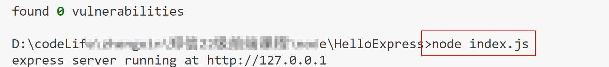
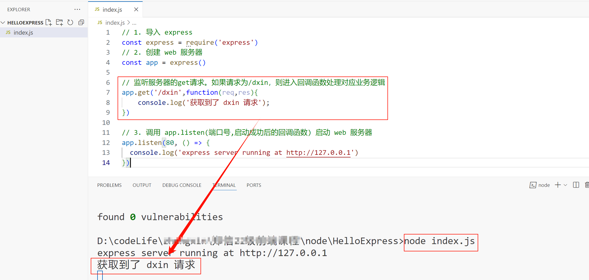

# node入门

> 整理node学习知识点

---

## express

###  1. 初识 Express
#### 1.1 Express 简介

1. 什么是 Express

官方给出的概念：Express 是基于 Node.js 平台，快速、开放、极简的 Web 开发框架。

通俗的理解：Express 的作用和 Node.js 内置的 http 模块类似，是专门用来创建 Web 服务器的。

Express 的本质：就是一个 npm 上的第三方包，提供了快速创建 Web 服务器的便捷方法。

Express 的中文官网： http://www.expressjs.com.cn/

---
 
2. 进一步理解 Express

思考：不使用 Express 能否创建 Web 服务器？

答案：能，使用 Node.js 提供的原生 http 模块即可。

思考：有了 http 内置模块，为什么还有用 Express？

答案：http 内置模块用起来很复杂，开发效率低；Express 是基于内置的 http 模块进一步封装出来的，能够极大的提高开发效率。

思考：http 内置模块与 Express 是什么关系？

答案：类似于浏览器中 Web API 和 jQuery 的关系。后者是基于前者进一步封装出来的。

---
3. Express 能做什么

对于前端程序员来说，最常见的两种服务器，分别是：

•	Web 网站服务器：专门对外提供 Web 网页资源的服务器。

•	API 接口服务器：专门对外提供 API 接口的服务器。

使用 Express，我们可以方便、快速的创建 Web 网站的服务器或 API 接口的服务器。

---

#### 1.2 Express 的基本使用 

1. 安装
> 先自行创建一个项目（目录）。不要有中文。例如HelloExpress

在项目所处的目录中，运行如下的终端命令，即可将 express 安装到项目中使用：

```bash
npm i express
```

也可指定版本号安装
```bash
npm i express@4.17.1
```
---
2. 创建基本的 Web 服务器
> 在项目目录下创建入口文件index.js（或者app.js）
```JavaScript
// 1. 导入 express
const express = require('express')
// 2. 创建 web 服务器
const app = express()
// 3. 调用 app.listen(端口号,启动成功后的回调函数) 启动 web 服务器
app.listen(80, () => {
  console.log('express server running at http://127.0.0.1')
})
```
---

3. 监听 GET 请求
通过 app.get() 方法，可以监听客户端的 GET 请求，具体的语法格式如下：

```JavaScript
// 参数1： 客户端请求的 URL 地址
// 参数2： 请求对应的处理函数
app.get('请求URL',function(req,res){/* 处理函数 */})
```

  示例：

  3.1 监听 `/dxin`的get请求。

  ```javascript
  // 1. 导入 express
  const express = require('express')
  // 2. 创建 web 服务器
  const app = express()

  // 监听服务器的get请求。如果请求为/dxin，则进入回调函数处理对应业务逻辑
  app.get('/dxin',function(req,res){
      console.log('获取到了 dxin 请求');
  })

  // 3. 调用 app.listen(端口号,启动成功后的回调函数) 启动 web 服务器
  app.listen(80, () => {
    console.log('express server running at http://127.0.0.1')
  })
  ```
  3.2 启动服务器：在入口文件index.js所在的cmd目录下，运行index.js文件。
  ```cmd
  node index.js
  ```
  启动成功，效果如下图所示：

    


  > 如果曾经安装nodemon，也可以使用nodemon运行该文件。避免频繁执行node命令
  ```cmd
  nodemon index.js
  ```

  3.3 浏览器端发送get请求：在地址栏输入`http://127.0.0.1/dxin`
  ```http
  http://127.0.0.1/dxin
  ```
  3.4 观察服务器端控制台输出：

  

---

4. 监听 POST 请求
通过 app.post() 方法，可以监听客户端的 POST 请求，具体的语法格式如下：
```JavaScript
// 参数1： 客户端请求的 URL 地址
// 参数2： 请求对应的处理函数
    // req: 请求对象(包含与请求相关的属性与方法)
    // res: 响应对象(包含与响应相关的属性与方法)

app.post('请求URL',function(req,res){/* 处理函数 */})
```

  示例：

  4.1 监听 `/dxin`的post请求。

  ```javascript
  // 1. 导入 express
  const express = require('express')
  // 2. 创建 web 服务器
  const app = express()

  // 监听服务器的post请求。如果请求为/dxin，则进入回调函数处理对应业务逻辑
  app.post('/dxin',function(req,res){
      console.log('获取到了 dxin 请求---post');
  })

  // 3. 调用 app.listen(端口号,启动成功后的回调函数) 启动 web 服务器
  app.listen(80, () => {
    console.log('express server running at http://127.0.0.1')
  })

  ```
  4.2 使用postman软件发送post请求，测试以上案例代码效果。如下图所示：
  

5. 监听所有请求
通过 app.all() 方法，可以监听所有的请求，具体的语法格式如下：
```JavaScript
// 参数1： 客户端请求的 URL 地址
// 参数2： 请求对应的处理函数
 
app.all('请求URL',function(req,res){/* 处理函数 */})
```
---

6. 把内容响应给客户端
通过 res.send() 方法，可以把处理好的内容，发送给客户端：
```JavaScript
app.get('/user', (req, res) => {
    // 调用 express 提供的 res.send() 方法，向客户端响应一个 JSON 对象
    res.send({ name: 'mage', age: 30, gender: '男' })
})
app.post('/user', (req, res) => {
    // 调用 express 提供的 res.send() 方法，向客户端响应一个 文本字符串
    res.send('请求成功')
}) 
```
7. 获取 URL 中携带的查询参数
通过 req.query 对象，可以访问到客户端通过查询字符串的形式，发送到服务器的参数：
```JavaScript
app.get('/', (req, res) => {
    // 通过 req.query 可以获取到客户端发送过来的 查询参数
    // 注意：默认情况下，req.query 是一个空对象
    // 客户端使用 ?name=mage&age=20 这种查询字符串的形式，发送到服务器的参数
    // 可以通过 req.query 对象访问到，例如
    //  req.query.name  req.query.age
    console.log(req.query)
})
```
 ---
8. 获取 URL 中的动态参数
通过 req.params 对象，可以访问到 URL 中，通过 : 匹配到的动态参数：
```JavaScript
 // URL地址中，可以通过 :参数名  的形式,匹配动态参数值
app.get('/user/:id', (req, res) => {
    // req.params 是通过 : 动态匹配到的 URL 参数，默认也是一个空对象
    console.log(req.params)
})
```
也可以获取多个动态参数。/user/:num/:abc
---
#### 1.3 托管静态资源
