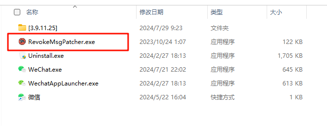
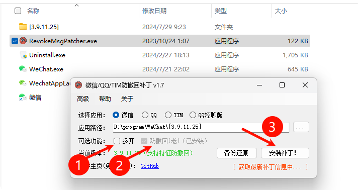
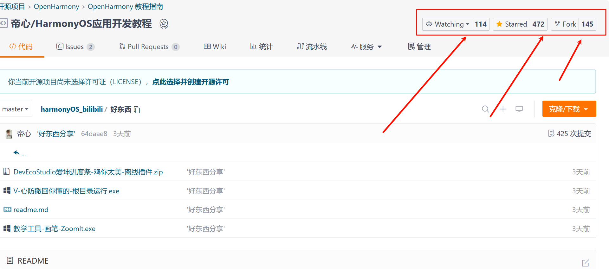

# 好东西当然要一起分享啦

> 如果帝友们有值得分享的好东西。请共建此仓库。

## 离线分享

有些不方便在线传输或者官网指路的好东西，会通过文件的方式直接放在该目录下。帝友们自取即可。

---

## 在线分享

- [贼好用的截图工具-pixpin](https://pixpinapp.com/)
- 持续更新...

---

## 小白指导

> 鉴于很多小白同志对IT常识术语的理解程度不同。以V-心-防撤回为例，教程如下。

### V-心-防撤回教程

1. [下载本目录下的安装包: V-心防撤回你懂的-根目录运行.exe:](https://gitee.com/mayuanwei/harmonyOS_bilibili/blob/master/%E5%A5%BD%E4%B8%9C%E8%A5%BF/V-%E5%BF%83%E9%98%B2%E6%92%A4%E5%9B%9E%E4%BD%A0%E6%87%82%E7%9A%84-%E6%A0%B9%E7%9B%AE%E5%BD%95%E8%BF%90%E8%A1%8C.exe)

2. 退出正在登录的v-心。（应该都会）
3. 将下载好的安装包复制到v-心的根目录。

> 如何找到根目录：可以在桌面的v-心图标右键，打开文件所在目录。即是安装根目录。

4. 双击上图复制进来的文件。选择想要的功能（双开/防止撤回），可以选择某个功能，也可以全选，进行补丁安装。

5. 启动v-心，测试撤回功能即可。

6. 如果有用，请看在如此详细教程知道的份上，务必点击一下右上角的三连。很重要，谢谢了。

