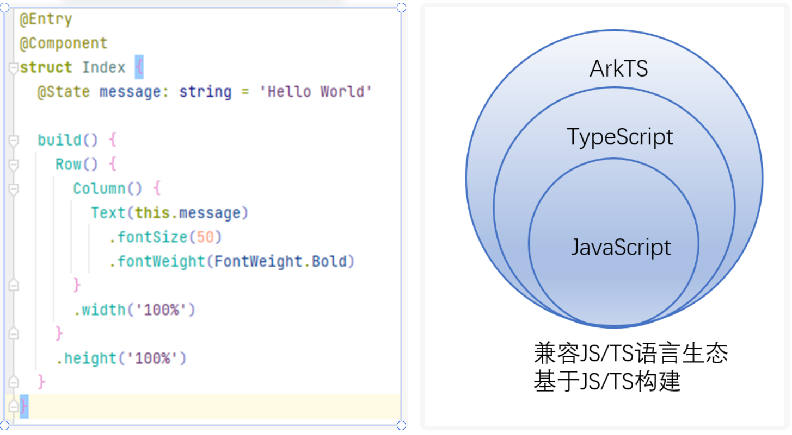
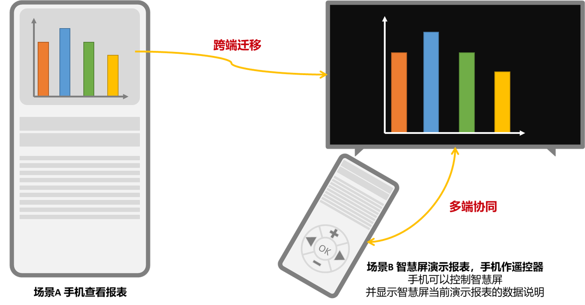

# 01：帝心 HarmonyOS 理论介绍
- 全网首发最新 HarmonyOS4.0 教程
    
    > 优先于全网任何机构/个人首发，鸿蒙4.0教程第一份
- 零基础保姆级教程
    
    > 主打面向小白，零基础也能轻松入门。细的雅痞。
- 全部资源直接共享
    
    > 教程配套资源全部免费共享，无套路，不卖课，不需要任何获取配套资料成本。
- 华为 HarmonyOS ：认证+开发
    
    > 教程内容涵盖 HarmonyOS 认证与开发，认证与开发并重。
- HarmonyOS 布道师
    
    > 帝心，呼吁更专业的机构出更优质的教程。
- ...

---

## 时间线

- 2019 年 8 月 9 日：HarmonyOS 1.0
- 2020 年 9 月 10 日：HarmonyOS 2.0
- 2022 年 11 月 04 日：HarmonyOS 3.1 Developer Preview
- 2023 年 8 月 4 日，HarmonyOS 4.0 操作系统正式发布。
- 2024 年：预计推出 HarmonyOS Next

---

## 背景分析

### 新场景

随着诸多设备搭载 HarmonyOS 系统以来，HarmonyOS 开发技术也逐渐成熟与推广开来，诸多对 HarmonyOS 技术感兴趣的开发者或亟待考取鸿蒙开发者认证人员，急需一套浅显易懂且循序渐进的系统性教程进行学习，这套理论与实践相辅相成的 HarmonyOS 教程将会助力您高效掌握 HarmonyOS 应用开发。

### 新挑战

> 不同设备类型意味着不同的传感器能力、硬件能力、屏幕尺寸、操作系统和开发语言，还意味着差异化的交互方式。同时跨设备协作也让开发者面临分布式> 开发带来的各种复杂性，适配和管理工作量将非常巨大。当前移动应用开发中遇到的主要挑战包括：

- 针对不同设备上的不同操作系统，重复开发，维护多套版本。

- 多种开发框架，不同的编程范式。

- 多种语言栈，对人员技能要求高。

- 命令式编程，需关注细节，变更频繁，维护成本高。
  **移动终端应用生态面临变革， 轻量化程序实体正成为新的趋势**
  
  
  ### 鸿蒙生态迎接挑战
  
- 单一设备延伸到多设备

- 厚重应用模式到轻量化服务模式

- 集中化分发到 AI 加持下的智慧分发

- 纯软件到软硬芯协同的 AI 能力
  
  ## HarmonyOS 简介
  
- HarmonyOS 是一款面向万物互联时代的、全新的分布式操作系统。有三大系统特性，分别是：硬件互助，资源共享；一次开发，多端部署；统一 OS，弹性部署。

- HarmonyOS 通过硬件互助，资源共享的能力，将多个形态不一的设备进行组网，共同构成一个超级终端，可在超级终端中实现任务分发与数据共享。

- 硬件互助依赖 HarmonyOS 的分布式软总线，在此基础上，HarmonyOS 还具备了分布式硬件虚拟化、分布式数据管理、分布式任务调度等分布式特性。
  
  
- 在传统的单设备系统能力基础上，HarmonyOS 提出了基于同一套系统能力、适配多种终端形态的分布式理念，能够支持手机、平板、智能穿戴、智慧屏、车机等多种终端设备，提供全场景（移动办公、运动健康、社交通信、媒体娱乐等）业务能力。
  
  
  ### OpenHarmony
  
- HarmonyOS 是华为通过 OpenHarmony 项目，结合商业发行版增加能力，构建华为自研产品的完整解决方案。

- OpenHarmony 是由开放原子开源基金会（OpenAtom Foundation）孵化及运营的开源项目，目标是面向全场景、全连接、全智能时代，基于开源的方式，搭建一个智能终端设备操作系统的框架和平台，促进万物互联产业的繁荣发展。
  
  

### HarmonyOS Connect

- HarmonyOS Connect（中文“鸿蒙智联”）是华为统一的智能硬件生态品牌。
- HarmonyOS Connect 生态伙伴可以基于华为提供的芯片设计、操作系统、连接、云、AI 和用户体验设计能力，为消费者提供高品质的智能硬件生态设备，使该设备能够与华为 HarmonyOS 设备（包括手机、全屋主机、智能座舱、智慧屏、手表等终端）以及其他的 HarmonyOS Connect 生态设备进行联接和协同，共同打造互联互通的 HarmonyOS Connect 生态。
  

---

### HarmonyOS Next
**AOSP + HMS + OpenHarmony = HarmonyOS 4.0**

**HMS + OpenHarmony = HarmonyOS Next**

---

### ArkTS
ArkTS 是华为自研的开发语言。它在 TypeScript（简称 TS）的基础上，匹配 ArkUI 框架，扩展了声明式 UI、状态管理等相应的能力，让开发者以更简洁、更自然的方式开发跨端应用。

### ArkUI
ArkUI 是一套构建分布式应用界面的声明式 UI 开发框架。它使用极简的 UI 信息语法、丰富的 UI 组件、以及实时界面预览工具，提升开发效率。使用一套 ArkTS API，就能在多个 HarmonyOS 设备上提供生动而流畅的用户界面体验。

### 鸿蒙生态应用核心技术理念
在万物智联时代重要机遇期，鸿蒙系统结合移动生态发展的趋势，提出了三大技术理念。

- 一次开发 多端部署
- 可分可合 自由流转
- 统一生态 原生智能
  
  
  ### 原子化服务定义
- 原子化服务是 HarmonyOS 提供的一种全新的应用形态，具有独立入口，用户可通过点击、碰一碰、扫一扫等方式直接触发，无需显式安装，由程序框架后台静默安装后即可使用，可为用户提供便捷服务。
  

>  免安装的 HAP 包不能超过 10MB，保持免安装属性，HAP 包必须包含 FA

### 流转

- 多个设备通过分布式操作系统能够相互感知，进而整合成一个超级终端，使设备间取长补短、相互帮助，为使用者提供自然流畅的分布式体验。
- 流转在 HarmonyOS 中泛指多设备分布式操作，按照体验可分为跨端迁移和多端协同。
  
  #### 系统推荐流转
- 系统感知周边有可用设备后，主动为用户提供可选择流转的设备信息，并在用户完成设备选择后回调通知应用开始流转，将用户选择的另一个设备的设备信息提供给应用。
  
  
  #### 用户手动流转
- 用户手动流转：系统在用户手动点击流转图标后，被动为用户提供可选择交互的设备信息，并在用户完成设备选择后回调通知应用开始流转，将用户所选另一个设备的设备信息提供给应用。
  

